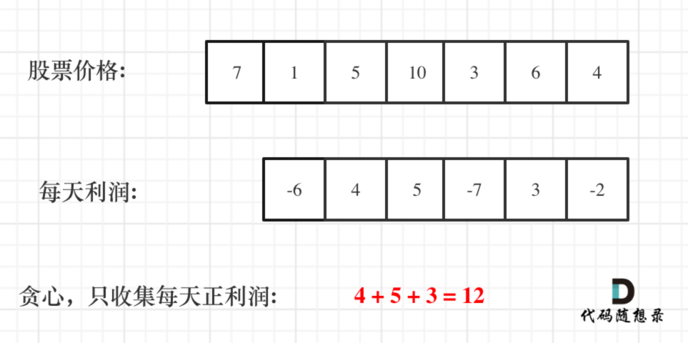

## 1.回溯算法

**<font color = skyBlue>回溯算法模板框架（抽象为树来解决）</font>**

```Java
回溯三部曲：
    1) 确定递归函数参数;
    2) 确定终止条件;
    3) 确定单层搜索逻辑。
模板框架：
    void backtracking(参数) {
        if (终止条件) {
            存放结果;
            return;
        }

        for (选择：本层集合中元素（树中节点孩子的数量就是集合的大小）) {
            处理节点;
            backtracking(路径，选择列表); // 递归
            回溯，撤销处理结果
        }
    }
```

### 1.1组合问题

**<font color=yellow>说明：将组合问题抽象为树结构时，问题转换为求符合要求的叶子节点。</font>**

#### 1.1.1 组合

**问题描述：给定两个整数 n 和 k，返回 1 ... n 中所有可能的 k 个数的组合。(n= 4,k=2)**


**代码实现：**

```java 
class Solution{
    List<List<Integer>> result = new ArrayList<>();
    LinkedList<Integer> path = new LinkedList<>();
    public List<List<Integer>> combine(int n,int k){
        combineHelper(n,k,1);
        return result;
    }
    
    /**
    每次从集合中选取元素，可选择的范围随着选择的进行而收缩，调整可选择的范围，就是要靠startIndex
    @param startIndex用来记录本层递归中，集合从哪里开始遍历
    */
    private void combineHelper(int n,int k, int startIndex){
        //终止条件
        if(path.size() == k){
            result.add(new ArrayList<>(path));
            return ;
        }
        for(int i = startIndex; i <= n-(k - path.size())+1;i++){
            path.add(i);
            combineHelper(n,k,i+1);
            path.removeLast();    //回溯，撤销处理的节点
        }
    }
}
```

#### 1.1.2 组合总和I

**问题描述：给定一个无重复元素的正整数数组 candidates 和一个正整数 target ，找出 candidates 中所有可以使数字和为目标数 target 的唯一组合【candidates 可以重复使用】**

**代码实现**

```java
class Solution{
     List<List<Integer>> result = new ArrayList<>();
     LinkedList<Integer> path = new LinkedList<>();
     public List<List<Integer>> combinationSum(int[] candidates, int target) {
         backTracking(candidates,target,0,0);
         return result;
    }
    private void backTracking(int[] candidates,int target,int startIndex,int sum){
        //递归出口
        if(sum == target){
            result.add(new ArrayList<>(path));
            return ;
        }
        //递归式
        for(int i = startIndex; i < candidates.length;i++){
            if(sum + candidates[i] > target){
                break;
            }
            path.add(candidates[i]);
            sum += candidates[i];
            backTracking(candidates,target,i,sum);
            //回溯
            path.removeLast();
            sum -= candidates[i];
        }
    } 
}
```

#### 1.1.3 组合总和II

**问题描述：给定一个数组 candidates 和一个目标数 target，找出 candidates 中所有可以使数字和为 target 的组合。[<font color = yellow>candidates 中的每个数字在每个组合中只能使用一次!</font>]**

**<font color = red>难点：如何去重？</font>**

```java
去重理解：同一树层上“使用过”的元素，不能重复使用；同一树枝上的都是一个组合内的元素，可以重复。
具体做法：使用used[i]数组做标识,在candidates[i] == candidates[i-1]时：
    若used[i-1] == true:说明同一树枝使用过candidates[i-1],属于同一组合，可以重复使用；
    若used[i-1] == false:说明同一层次使用过candidated[i-1],属于不同组合，不能重复使用，继续执行下一次循环。
```


**代码实现**

```java
class Solution{
    List<List<Integer>> lists = new ArrayList<>();
    Deque<Integer> path = new LinkedList<>();
    int sum = 0;
    public List<List<Integer>> combinationSum2(int[] candidates,int target){
        //为将重复数字放在一起，先进行排序
        Arrays.sort(candidates);
        //构建标志数组，辅助判断同层次节点是否已经遍历
        boolean[] flag = new boolean[candidates.length];
        backTracking(candidates,target,0,flag);
        return lists;
    }
    private void backTracking(int[] arr,int target,int index,boolean[] flag){
        if(sum == target){
            lists.add(new ArrayList<>(path));
            return;
        }
        for(int i = index; i < arr.length && arr[i] + sum <= target;i++){
            //若出现重复节点 & 同层的第一个节点已经被访问过了，直接跳过
            if(i > 0 && arr[i] == arr[i-1] && !flag[i-1]){
                continue;
            }
            flag[i] = true;
            sum += arr[i];
            path.add(arr[i]);
            //每个节点只能访问一次，从下一个节点开始访问
            backTracking(arr,target,i+1,flag);
            //回溯
            int temp = path.pop();
            flag[i] = false;
            sum -= temp;
        }
    }
}
```

#### 1.1.4  组合总和III

**问题描述：找出所有相加之和为n的k个数的组合。组合中只允许含有 1 - 9 的正整数，并且每种组合中不存在重复的数字。(n=4，k=2)**


**代码实现**

```java
class Solution {
    List<List<Integer>> result = new ArrayList<>();
    LinkedList<Integer> path = new LinkedList<>();
    public List<List<Integer>> combinationSum3(int k, int n) {
        backTracking(n,k,1,0);
        return result;
    }

    private void backTracking(int n,int k,int startIndex,int sum){
        //剪枝
        if(sum > n){
            return;
        }

        if(path.size() == k){
            if(sum == n){
                result.add(new ArrayList<>(path));
            }
            return ;
        }
        //递归过程
        for(int i = startIndex; i <= 9-(k-path.size())+1;i++){
            path.add(i);
            sum += i;
            backTracking(n,k,i+1,sum);
            //回溯
            path.removeLast();
            sum -= i;
        }
    }
}
```

#### 1.1.5 电话号码的字母组合

**问题描述：给定一个仅包含数字 2-9 的字符串，返回所有它能表示的字母组合。**


**代码实现**

```java 
class Solution {
    String[] letterMap = {" ","","abc","def","ghi","jkl","mno","pqrs","tuv","wxyz"};
    List<String> res;
    StringBuilder temp = new StringBuilder();
    public List<String> letterCombinations(String digits) {
        res = new ArrayList<>();
        if(digits == null || digits.length() == 0){
            return res;
        }
        //dfs处理
        backTracking(digits,0);
        return res;
    }
    public void backTracking(String digits,int index){
        //递归出口
        if(index == digits.length()){
            res.add(temp.toString());
            return ;
        }

        //获取某数字对应的字符集
        String str = letterMap[digits.charAt(index)-'0'];
        for(int i = 0; i < str.length();i++){
            temp.append(str.charAt(i));
            backTracking(digits,index+1);
            //回溯操作
            temp.deleteCharAt(temp.length()-1);
        }
    }
}
```

### 1.2排列问题

#### 1.2.1 全排列

**<font color = skyblue>题目链接：https://leetcode-cn.com/problems/permutations/</font>**

**问题描述：给定一个 没有重复 数字的序列，返回其所有可能的全排列。**


**代码实现**

```java
class Solution {
    List<List<Integer>> res = new ArrayList<>();
    Deque<Integer> path = new LinkedList<>();
    boolean[] used;
    public List<List<Integer>> permute(int[] nums) {
        Arrays.sort(nums);
        used = new boolean[nums.length];
        backTracking(nums);
        return res;
    }

    public void backTracking(int[] nums){
        //终止条件
        if(path.size() == nums.length){
            res.add(new ArrayList<>(path));
            return ;
        }

        //单层搜索逻辑
        for(int i = 0; i < nums.length;i++){
            //元素去重：
            if((i > 0 && nums[i] == nums[i-1] && !used[i-1]) ||used[i]){
                continue;
            }
            used[i] = true;
            path.addLast(nums[i]);
            backTracking(nums);
            path.removeLast();
            used[i] = false;
        }
    }
}
```

#### 1.2.2 全排列II

**问题描述：给定一个可包含重复数字的序列 nums ，按任意顺序 返回所有不重复的全排列。**


**解题思路: 同层去重 & DFS & 回溯 & 排序** 

```java
回溯三部曲：排列问题,不固定开始遍历位置，根据每层是否已经使用过相同元素（去重） & 该分支是否已经使用（使用过的元素不能重复使用）
	1.递归函数参数：数组nums & 全局的已使用元素标识数组used;
	2.终止条件:path.size() == nums.length;
	3.单层搜索逻辑：
        for(int i = 0; i < nums.size();i++){
            if( i > 0 && 同层重复 || 当前遍历元素已被使用){
                continue;
            }
            if(当前遍历元素未使用){
                //修改使用标识，加入path,继续dfs
                //回溯到上一层
            }
        }
```

**代码实现**

```java
class Solution {
    List<List<Integer>> res = new ArrayList<>();
    Deque<Integer> path = new LinkedList<>();
    boolean[] used;
    public List<List<Integer>> permute(int[] nums) {
        Arrays.sort(nums);
        used = new boolean[nums.length];
        backTracking(nums);
        return res;
    }

    public void backTracking(int[] nums){
        //终止条件
        if(path.size() == nums.length){
            res.add(new ArrayList<>(path));
            return ;
        }

        //单层搜索逻辑
        for(int i = 0; i < nums.length;i++){
            //元素去重：
            if((i > 0 && nums[i] == nums[i-1] && !used[i-1]) ||used[i]){
                continue;
            }
            used[i] = true;
            path.addLast(nums[i]);
            backTracking(nums);
            path.removeLast();
            used[i] = false;
        }
    }
}
```

### 1.3分割问题

**<font color=yellow>说明：将分割问题抽象为树结构时，问题转换为求符合要求的叶子节点。</font>**

#### 1.3.1 分割回文串

**问题描述：给定一个字符串 s，将 s 分割成一些子串，使每个子串都是回文串。返回 s 所有可能的分割方案。**


```java 
思路：
1.从头遍历分割点;
2.判断当前分割子串是否回文（双指针判断）;
3.回溯遍历并存储结果。
```

**代码实现**

```java 
class Solution {
    //存储结果
    List<List<String>> res = new ArrayList<>();
    //存储子串
    Deque<String> queue = new LinkedList<>();
    public List<List<String>> partition(String s) {
        backTracking(s,0);
        return res;
    }
    public void backTracking(String s,int startIndex){
        //递归出口
        if(startIndex == s.length()){
            res.add(new ArrayList<>(queue));
            return ;
        }
        //遍历逻辑
        for(int i = startIndex; i < s.length(); i++){
            if(isPalindrome(s,startIndex,i)){
                String str = s.substring(startIndex,i+1);
                queue.addLast(str);
            }else{
                continue;
            }
            //递归 + 回溯
            backTracking(s,i+1);
            queue.removeLast();
        }
    }
    
    //双指针判定回文
    private boolean isPalindrome(String s,int startIndex,int end){
        for(int i = startIndex,j = end; i < j ;i++,j--){
            if(s.charAt(i) != s.charAt(j)){
                return false;
            }
        }
        return true;
    }
}  
```

#### 1.3.2 复原IP地址

**问题描述：给定一个只包含数字的字符串，复原它并返回所有可能的 IP 地址格式。**

**有效的 IP 地址 正好由四个整数（每个整数位于 0 到 255 之间组成，且不能含有前导 0），整数之间用 '.' 分隔。**


**解题思路：**

```java 
从字符串首位开始判断[start,end]区间的子串所组成的数字是否合法,若合法则在其后添加"."并加入结果中;
判断子串是否合法：
    1）段位以0为开头的数字不合法
    2）段位里有非正整数字符不合法
    3）段位如果大于255了不合法
```

**代码实现**

```java
class Solution {
    List<String> res = new ArrayList<>();
    public List<String> restoreIpAddresses(String s) {
        if(s.length() > 12){
            return res;
        }
        backTracking(s,0,0);
        return res;
    }

    public void backTracking(String s,int startIndex,int pointNum){
        //递归终止条件
        if(pointNum == 3){
            if(isValid(s,startIndex,s.length()-1)){
                res.add(s);
            }
            return ;
        }
        
        //单层遍历逻辑
        for(int i = startIndex; i < s.length();i++){
            if(isValid(s,startIndex,i)){
                s = s.substring(0,i+1)+"."+s.substring(i+1);    //在符合条件的子串后添加"."
                pointNum++;
                backTracking(s,i+2,pointNum);
                //回溯
                pointNum--;
                s = s.substring(0,i+1)+s.substring(i+2);  	   //删除掉添加的"."
            }else{
                break;
            }
        }
    }

    //判断s在当前区间的子串是否合法
    private boolean  isValid(String s, int start,int end){
        if(start > end){
            return false;
        }

        //‘0’开头的数字不合法
        if(s.charAt(start)=='0' && start != end){
            return false;
        }
        //数字大于255不合法
        // int num = Integer.parseInt(s.substring(start,end+1));
        int num = 0;
        for(int i = start; i <= end;i++){
            num = num * 10 + (s.charAt(i)-'0');
            if(num > 255){
                return false;
            }
        }
        return true;
    }
}
```

### 1.4 子集问题

**<font color=yellow>说明：将"子集问题"抽象为树结构时，问题转换为求符合要求的所有节点（叶子 + 非叶子）。</font>**

#### 1.4.1 子集I

**问题描述：给定一组不含重复元素的整数数组 nums，返回该数组所有可能的子集（幂集）（以nums=[1,2,3]为例求解）**


**思路分析：回溯三部曲**

```java
1.递归函数参数：一维数组path收集子集元素，二维数组res存放结果集;
2.终止条件：集合元素遍历完,startIndex > nums.length;
3.单层搜索逻辑：
    1)收集元素;
    2)递归;
    3)回溯到上一层
```

**代码实现**

```java
class Solution {
    List<List<Integer>> res = new ArrayList<>();
    LinkedList<Integer> path = new LinkedList<>();
    public List<List<Integer>> subsets(int[] nums) {
        if(nums == null || nums.length == 0){
            res.add(new ArrayList<>());
            return res;
        }
        backTracking(nums,0);
        return res;
    }
    //DFS + 回溯
    public void backTracking(int[] nums,int startIndex){
        //遍历每个节点之前，把之前的节点记录下来
        res.add(new ArrayList<>(path));
        //终止条件
        for(int i = startIndex;i < nums.length;i++){
            path.add(nums[i]);
            backTracking(nums,i+1);
            path.removeLast();
        }
    }
}
```

#### 1.4.2 子集II

**<font color = skyblue>题目链接：https://leetcode-cn.com/problems/subsets-ii/</font>**

**问题描述：给定一个可能包含重复元素的整数数组 nums，返回该数组所有可能的子集（幂集）。**


**解题思路**

```java 
先排序，后去重【树层去重、树枝属于同一组合不去重】
    使用used[]标志数组,若nums[i] == nums[i-1]:
		1) 若 used[i-1] == true:属于同一树枝，不去重;
		2) 若 used[i-1] == false:属于同一树层，去重。
```

**代码实现**

```java
class Solution {
    List<List<Integer>> res = new ArrayList<>();
    Deque<Integer> path = new LinkedList<>();
    public List<List<Integer>> subsetsWithDup(int[] nums) {
        Arrays.sort(nums);
        boolean[] used = new boolean[nums.length];
        backTracking(nums,0,used);
        return res;
    }
    public void backTracking(int[] nums,int startIndex,boolean[] used){
        res.add(new ArrayList<>(path));
        //终止条件
        if(startIndex >= nums.length){
            return ;
        }

        //单层搜索逻辑
        for(int i = startIndex; i < nums.length;i++){
            //同一层元素去重
            if(i > 0 && nums[i] == nums[i-1] && !used[i-1]){
                continue;
            }
            path.addLast(nums[i]);
            used[i] = true;
            //遍历下一层
            backTracking(nums,i+1,used);
            //回溯
            used[i] = false;
            path.removeLast();
        }
    }
}
```

#### 1.4.3 递增子序列

**<font color = skyblue>题目链接：https://leetcode-cn.com/problems/increasing-subsequences/</font>**

**问题描述：给定一个整型数组, 你的任务是找到所有该数组的递增子序列<font color=red>[子序列不一定连续]</font>，递增子序列的长度至少是2。**


**解题思路：<font color = red>Set去重 + DFS + 回溯 </font>**

```Java
回溯三部曲：
    全局变量res存储结果,path存储符合条件的路径
	1.递归函数参数:数组nums,开始位置startIndex;
	2.终止条件：startIndex >= 2;[子序列长度至少为2]
	3.单层搜索逻辑：
        for(int i = startIndex; i < nums.length;i++){
            if(同一层重复 || 当前遍历元素 < path中最后一个元素){
            	继续遍历下一个元素
        	}
            //在set中添加本层已遍历元素，用于去重;
            //将元素添加到路径中
            //从下一个元素开始递归
            //回溯
        }
```

**代码实现**

```java
class Solution {
    List<List<Integer>> res = new ArrayList<>();
    Deque<Integer> path = new LinkedList<>();
    public List<List<Integer>> findSubsequences(int[] nums) {
        backTracking(nums,0);
        return res;
    }
    public void backTracking(int[] nums,int startIndex){
        //终止条件
        if(path.size() > 1){
            res.add(new ArrayList<>(path));
        }
        Set<Integer> useSet = new HashSet<>();
        //单层搜索逻辑
        for(int i = startIndex;i < nums.length;i++){
            //去重
            if((!path.isEmpty() && nums[i] < path.peekLast()) || useSet.contains(nums[i])){
                continue;
            }
            useSet.add(nums[i]);
            path.addLast(nums[i]);
            backTracking(nums,i+1);
            //回溯：set的作用范围在一层中，不会涉及下一层的操作，不用回溯
            path.removeLast();
        }         
    }
}
```

### 1.5 棋盘问题

#### 1.5.1 解数独

#### 1.5.2 N皇后问题

## 2. 贪心算法

**<font color = skyblue>贪心解题思路总结</font>**

****

```java
/**
本质：每一阶段选择局部最优解，从而达到全局最优
难点：如何通过局部最优解，推出整体最优解？
贪心算法解题步骤：
	1.将问题分解为若干个子问题；
	2.找出适合的贪心策略；
	3.求解每一个子问题的最优解；
	4.将局部最优解堆叠为全局最优解
*/
```

### 2.1 简单题目

#### 2.1.1  分发饼干

**<font color = skyblue>题目链接：https://leetcode-cn.com/problems/assign-cookies/</font>**

**问题描述：假设你是一位很棒的家长，想要给你的孩子们一些小饼干。但是，每个孩子最多只能给一块饼干。**

**对每个孩子 i，都有一个胃口值 g[i]，这是能让孩子们满足胃口的饼干的最小尺寸；并且每块饼干 j，都有一个尺寸 s[j] 。如果 s[j] >= g[i]，我们可以将这个饼干 j 分配给孩子 i ，这个孩子会得到满足。你的目标是尽可能满足越多数量的孩子，并输出这个最大数值。**

**解题思路**

```java 
使用贪心策略，先将饼干数组 & 小孩数组排序：
   	将大饼干喂给胃口尽可能大的孩子，即从后向前遍历小孩数组，统计满足条件的数量。
```


**代码实现**

```java 
class Solution {
    public int findContentChildren(int[] g, int[] s) {
        int res = 0;
        Arrays.sort(g);
        Arrays.sort(s);
        int index = s.length - 1;
        //对于从后向前遍历小孩的胃口大小，判断当前饼干大小是否满足胃口
        for(int i = g.length - 1; i >= 0; i--){
            //遍历饼干大小是否满足
            if(index >= 0 && g[i] <= s[index]){
                res++;
                index--;
            }
        }
        return res;
    }
}
```

#### 2.1.2 摆动序列

**<font color = skyblue>题目链接：https://leetcode-cn.com/problems/wiggle-subsequence/</font>**

**问题描述：给定一个整数序列，返回作为摆动序列的最长子序列的长度。 通过从原始序列中删除一些（也可以不删除）元素来获得子序列，剩下的元素保持其原始顺序**

**<font color = red>说明：如果连续数字之间的差严格地在正数和负数之间交替，则数字序列称为摆动序列</font>**

**解题思路：根据峰值变化判断是否为摆动序列**


**代码实现**

```java 
class Solution {
    public int wiggleMaxLength(int[] nums) {
        //贪心策略：从前到后遍历数组，越过不符合条件的元素即可
        if(nums.length <= 1){
            return nums.length;
        }
        int res = 1;
        int curDiff = 0;
        int preDiff = 0;
        for(int i = 0; i < nums.length-1;i++){
            curDiff = nums[i+1] - nums[i];
            if((curDiff > 0 && preDiff <= 0) || (curDiff < 0 && preDiff >= 0)){
                res++;
                preDiff = curDiff;
            }
        }
        return res;
    }
}
```

#### 2.1.3 柠檬水找零

**<font color = skyblue>题目链接：https://leetcode-cn.com/problems/lemonade-change/</font>**

**问题描述**

```markdown
在柠檬水摊上，每一杯柠檬水的售价为 5 美元。顾客排队购买你的产品，（按账单 bills 支付的顺序）一次购买一杯。
每位顾客只买一杯柠檬水，然后向你付 5 美元、10 美元或 20 美元。你必须给每个顾客正确找零，也就是说净交易是每位顾客向你支付 5 美元。
注意，一开始你手头没有任何零钱。

如果你能给每位顾客正确找零，返回 true ，否则返回 false 。
```

**解题思路**

```java 
记录三种面额的现有数量（five,ten,twen），并根据用户所给面额判断是否当前所拥有的面额是否够找零：
	1.bill == 5: five++即可;
	2.bill == 10: 判断five 是否大于 0 ,若是 five--,ten++;
	3.bill == 20: 判断ten > 0 且 five > 0 || five >= 3 || 返回false;
```

**代码实现**

```java
class Solution {
    public boolean lemonadeChange(int[] bills) {
        if(bills[0] != 5){
            return false;
        }
        int five = 0,ten = 0,twen = 0;
        for(int bill : bills){
            if(bill == 5){
                five++;
            }
            if(bill == 10){
                if(five <= 0){
                    return false;
                }
                five--;
                ten++;
            }
            if(bill == 20){
                if(ten > 0 && five > 0){
                    ten--;
                    five--;
                    twen++;
                }else if(five >= 3){
                    five -= 3;
                    twen++;
                }else{
                    return false;
                }
            }
        }
        return true;
    }
}
```

#### 2.1.4 K次取反后最大化的数组和

**<font color = skyblue>题目链接：https://leetcode-cn.com/problems/maximize-sum-of-array-after-k-negations/</font>**

**问题描述**

```java 
给定一个整数数组 A，我们只能用以下方法修改该数组：我们选择某个索引 i 并将 A[i] 替换为 -A[i]，然后总共重复这个过程 K 次。（我们可以多次选择同一个索引 i。）

以这种方式修改数组后，返回数组可能的最大和。
```

**解题思路**

```java
//难点：如何转变K次正负，让数组和达到最大？
1.先将原始数组排序;
2.从前向后遍历,将数组的前k个负数变为正数：
    若 k > 0 && nums[i] < 0：负数变为正数;
	若 k 已用完 || nums 全部是正数，退出循环;
3.对数组排序，并对数组的第一个元素反复进行正负转变;
4.求和即可。
```

**实现代码**

```java
class Solution {
    public int largestSumAfterKNegations(int[] nums, int k) {
        if(nums.length == 1){
            if( k%2== 0){
                return nums[0];
            }else{
                return -1 * nums[0];
            }
        }
        Arrays.sort(nums);
        //将nums按照绝对值从小到大排序
        for(int i = 0; i < nums.length;i++){
            if(k > 0 && nums[i] < 0){
                nums[i] = -1 * nums[i];
                k--;
            }else{
                break;
            }
        }
        Arrays.sort(nums);
        if(k!= 0 && k%2 != 0){
            nums[0] = -1 * nums[0];
        }
        return getSum(nums);
    }

    public int getSum(int[] nums){
        int sum = 0;
        for(int num : nums){
            sum += num;
        }
        return sum;
    }
}
```

#### 2.1.5 单调递增的数字

**<font color = skyblue>题目链接：https://leetcode-cn.com/problems/monotone-increasing-digits/</font>**

**问题描述**

```java
给定一个非负整数 N，找出小于或等于 N 的最大的整数，同时这个整数需要满足其各个位数上的数字是单调递增。
```

**解题思路**

```java 
将数字转换为字符串数组，从后向前遍历判断当前位与前一位的大小：
	若当前位小于前一位(即非递增),则将当前位-1,并按照贪心策略将该位置之后的所有字符串变为"9",最后通过 String.join("分隔符",拼接对象)转换为字符串.
```

**代码实现**

```java
class Solution {
    public int monotoneIncreasingDigits(int n) {
        String[] nStrs = String.valueOf(n).split("");
        int start =  nStrs.length;
        for(int i = nStrs.length -1; i > 0; i--){
            if(Integer.parseInt(nStrs[i-1]) > Integer.parseInt(nStrs[i])){
                nStrs[i-1] = String.valueOf(Integer.parseInt(nStrs[i-1]) - 1);
                start = i;
            }
        }

        //将start之后的位置全改为9
        for(int i = start; i < nStrs.length;i++){
            nStrs[i] = "9";
        }
        return Integer.parseInt(String.join("",nStrs));
    }
}
```

### 2.2 中等难度

#### 2.2.1 股票问题

##### 1.买卖股票的最佳时机II

**<font color = skyblue>题目链接：https://leetcode-cn.com/problems/best-time-to-buy-and-sell-stock-ii/</font>**

**问题描述**

```java
给定一个数组，它的第 i 个元素是一支给定股票第 i 天的价格。
设计一个算法来计算你所能获取的最大利润。你可以尽可能地完成更多的交易（多次买卖一支股票）。
```

**解题思路：贪心策略（有利润时就出售，否则不出售）**



**代码实现**

```java
class Solution {
    public int maxProfit(int[] prices) {
        int profit = 0;
        for(int i = prices.length-1;i > 0;i--){
            //贪心策略：若有盈利就出售，否则不出售
            profit += Math.max(prices[i]-prices[i-1],0);
        }
        return profit;
    }
}
```

##### 2.买卖股票的最佳时机含手续费

**<font color = skyblue>题目链接：https://leetcode-cn.com/problems/best-time-to-buy-and-sell-stock-with-transaction-fee/</font>**

**问题描述**

```java
给定一个整数数组 prices，其中第 i 个元素代表了第 i 天的股票价格 ；非负整数 fee 代表了交易股票的手续费用。你可以无限次地完成交易，但是你每笔交易都需要付手续费。如果你已经购买了一个股票，在卖出它之前你就不能再继续购买股票了。
返回获得利润的最大值。
```

**解题思路**

```Java
//解法1：贪心策略
获利主要有三种情况：
    情况一：收获利润的这一天并不是收获利润区间里的最后一天（不是真正的卖出，相当于持有股票），所以后面要继续收获利润。
    情况二：前一天是收获利润区间里的最后一天（相当于真正的卖出了），今天要重新记录最小价格了。
    情况三：不作操作，保持原有状态（买入，卖出，不买不卖）
//解法2：动态规划
```

**代码实现**

```java 
class Solution {
    public int maxProfit(int[] prices, int fee) {
        //1.解法1：贪心策略
        int profit = 0;
        int minPrice = prices[0] + fee;
        for(int i = 1; i < prices.length;i++){
            //寻找最小买入点
            if(prices[i] + fee < minPrice){
                minPrice = prices[i] + fee;
            }else if(prices[i] > minPrice){
                profit += prices[i] - minPrice;
                minPrice = prices[i];   //卖出当前买入不需要再计算手续费用
            }
        }
       //解法2：动态规划
        return profit;
    }
}
```


****

#### 2.2.2 分发糖果

#### 2.2.3 根据身高重建队列

### 2.3 困难题目

#### 2.3.1 最大子序和

#### 2.3.2 区间问题

##### 1.跳跃游戏

##### 2.跳跃游戏II

##### 3.用最少数量的箭引爆气球

##### 4.无重叠区间

##### 5.划分字母区间

##### 6.合并区间

#### 2.3.3 加油站

#### 2.3.4 监控二叉树

## 3. 动态规划

**<font color = skyBlue>动态规划解题思路总结</font>**

```java 
1.确定dp数组（dp table）以及下标的含义
2.确定递推公式
3.dp数组如何初始化
4.确定遍历顺序
5.举例推导dp数组
```

### 3.1  背包问题

### 3.2 股票问题

#### 3.2.1 买卖股票的最佳时机（买卖一次）

**<font color = skyblue>题目链接：https://leetcode-cn.com/problems/best-time-to-buy-and-sell-stock/</font>**

**问题描述**

```java
给定一个数组 prices ，它的第 i 个元素 prices[i] 表示一支给定股票第 i 天的价格。
你只能选择 某一天 买入这只股票，并选择在 未来的某一个不同的日子 卖出该股票。设计一个算法来计算你所能获取的最大利润。
返回你可以从这笔交易中获取的最大利润。如果你不能获取任何利润，返回 0 。
```

**解题思路**

```java 
/**
        dp[i][0]: 第i天持有股票时的现金数量;
            分两种情况：
                第i-1天持有股票,i天继续持有(dp[i-1][0];)
                第i-1天未持有,i天买入(-price[i])
        dp[i][1]: 第i天不持有股票时的现金数量;
            分两种情况：
                第i-1天未持有股票,i天继续未持有; dp[i-1][1];
                第i-1天持有,i天卖出 price[i]+dp[i-1][0]
*/
```

**代码实现**

```java 
class Solution {
    public int maxProfit(int[] prices) {
        //动态规划解法
         int profit = 0;
         int[] dp = new int[prices.length];
         dp[0] = prices[0];
         for(int i = 1; i < prices.length;i++){
            profit = Math.max(profit,prices[i]-dp[i-1]);
            dp[i] = Math.min(dp[i-1],prices[i]);
         }
         return profit;
    }
}
```

#### 3.2.2 买卖股票的最佳时机II（买卖多次）

**<font color = skyblue>题目链接：https://leetcode-cn.com/problems/best-time-to-buy-and-sell-stock-ii/</font>**

**问题描述**

```java
给定一个数组，它的第 i 个元素是一支给定股票第 i 天的价格。
设计一个算法来计算你所能获取的最大利润。你可以尽可能地完成更多的交易（多次买卖一支股票）。
注意：你不能同时参与多笔交易（你必须在再次购买前出售掉之前的股票）。
```

**解题思路**

```Java
由于可以多次买卖股票,第i天买入股票时,可能手中还有之前卖股票所获得的利润dp[i][0] = dp[i-1][1] - prices[i] 
```

**代码实现**

```

```


#### 3.2.3 买卖股票的最佳时机III（最多买卖两次）

#### 3.2.4 买卖股票的最佳时机IV（最多买卖K次）

#### 3.2.5 买卖股票的最佳时机含冷冻期(买卖多次，卖出有一天冷冻期)

#### 3.2.6 买卖股票的最佳时机含手续费(买卖多次，每次有手续费)

**<font color = skyblue>题目链接：https://leetcode-cn.com/problems/best-time-to-buy-and-sell-stock-with-transaction-fee/</font>**

**问题描述**

```Java
给定一个整数数组 prices，其中第 i 个元素代表了第 i 天的股票价格 ；非负整数 fee 代表了交易股票的手续费用。你可以无限次地完成交易，但是你每笔交易都需要付手续费。如果你已经购买了一个股票，在卖出它之前你就不能再继续购买股票了。返回获得利润的最大值。
```

**解题思路**

```

```

### 3.3 子序列问题

### 3.4 基础问题

## 4. 二叉树

### 4.1 遍历方式

### 4.2 属性问题

### 4.3 公共祖先问题

### 4.4 二叉树操作

## 5. 栈与队列

## 6. 链表

### 6.1 移除链表元素

**<font color = skyblue>题目链接：https://leetcode-cn.com/problems/remove-linked-list-elements/</font>**

**问题描述：删除链表中等于给定值 val 的所有节点。**

**解题思路：设置虚拟头节点，完成删除操作**

**代码实现**

```java
class Solution {
    public ListNode removeElements(ListNode head, int val) {
        //设置虚拟头节点
        ListNode sentail = new ListNode(0);
        sentail.next = head;
        //设置前驱节点 & 当前节点
        ListNode cur = head,pre = sentail;
        while(cur != null){
            if(cur.val == val){
                //删除cur
                pre.next = cur.next;
            }else{
                //后移前驱节点
                pre = cur;
            }
            cur = cur.next;
        }
        return sentail.next;
    }
}
```

### 6.2 翻转链表

**<font color = skyblue>题目链接：https://leetcode-cn.com/problems/reverse-linked-list/</font>**

**问题描述：翻转一个单链表**

**解题思路：头插法 & 递归**

**代码实现**

```java
class Solution {
    public ListNode reverseList(ListNode head) {
        //头插法 & 递归
        return reverse(null,head);
    
    }
    public ListNode reverse(ListNode pre,ListNode cur){
        //递归法
        if(cur == null){
            return pre;
        }
        ListNode temp  = null;
        temp = cur.next;         //保存下一个开始节点
        cur.next = pre;     //翻转
        //更新指针
        pre = cur;
        cur = temp;
        return reverse(pre,cur);
    }
}
```

### 6.3 两两交换链表中的节点

**<font color = skyblue>题目链接：https://leetcode-cn.com/problems/swap-nodes-in-pairs/</font>**

**问题描述**

```java 
给定一个链表，两两交换其中相邻的节点，并返回交换后的链表。你不能只是单纯的改变节点内部的值，而是需要实际的进行节点交换。
```

**解题思路：模拟交换**


**代码实现**

```java 
class Solution {
    public ListNode swapPairs(ListNode head) {
        //构造虚节点
        ListNode sential = new ListNode(0);
        sential.next = head;
        ListNode pre = sential;
        while(pre.next != null && pre.next.next != null){
            //记录下一个head节点
            ListNode temp = head.next.next;
            pre.next = head.next;
            head.next.next = head;
            head.next = temp;
            pre = head;
            head = head.next;
        }
        return sential.next;
    }
}
```

### 6.4 删除链表中的倒数第n个节点

**<font color = skyblue>题目链接：https://leetcode-cn.com/problems/remove-nth-node-from-end-of-list/</font>**

**问题描述：给你一个链表，删除链表的倒数第 n 个结点，并且返回链表的头结点。**


**解题思路：<font color = yellow>快慢指针</font>**

```java
设置快指针fast:先移动n个节点;
设置慢指针slow:当fast移动到第n个节点时，开始移动;
两者同时移动，直到fast到达末尾,删除slow当前节点即可。
```

**代码实现**

```java
class Solution {
    public ListNode removeNthFromEnd(ListNode head, int n) {
        ListNode sential = new ListNode(-1);
        sential.next = head;
        ListNode fast = sential,slow = sential;

        while(n-- >=0){
             fast = fast.next;
        }
        //slow 指向要删除节点的前一个节点
        while(fast != null){
            slow = slow.next;
            fast = fast.next;
        }
        //删除倒数第n个节点
        slow.next = slow.next.next;
        return sential.next;
    }
}
```

### 6.5 链表相交

**<font color = skyblue>题目链接：https://leetcode-cn.com/problems/intersection-of-two-linked-lists-lcci/submissions/</font>**

**问题描述**

```java
给你两个单链表的头节点 headA 和 headB ，请你找出并返回两个单链表相交的起始节点。如果两个链表没有交点，返回 null 。
```


**代码实现**

```java
    public ListNode getIntersectionNode(ListNode headA, ListNode headB) {
        //1.双指针法解决：两个指针同时遍历 & 判断两个链表的对应节点是否相同
        ListNode fast = headA,slow = headB;
        while(fast != slow){
            fast =  fast == null? headB : fast.next;
            slow =  slow == null? headA : slow.next;
        }
        return fast;
    }
}
```

### 6.6 环形链表

**<font color = skyblue>题目链接：https://leetcode-cn.com/problems/linked-list-cycle-ii/</font>**

**问题描述**

```java 
给定一个链表，返回链表开始入环的第一个节点。 如果链表无环，则返回 null。
为了表示给定链表中的环，使用整数 pos 来表示链表尾连接到链表中的位置（索引从 0 开始）。 如果 pos 是 -1，则在该链表中没有环。
说明：不允许修改给定的链表。
```

**解题思路**


```java
快慢指针：
    1.快指针以慢指针二倍的速度遍历链表，找到两者相遇节点;
	2.快/慢指针从开始位置遍历,另一个指针从当前相遇位置,逐个遍历,直到再次相遇（环的入口）
```

**代码实现**

```java
public class Solution {
    public ListNode detectCycle(ListNode head) {
        //解法：快慢指针实现
        ListNode fast = head,slow = head;
        while(fast != null && fast.next != null){
            slow = slow.next;
            fast = fast.next.next;
            if(fast == slow){
                fast = head;
                while(fast != slow){
                    fast = fast.next;
                    slow = slow.next;
                }
                return fast;
            }
        }
        return null;
    }
}
```

## 7. 数组 & 字符串

### 7.1 二分法

####  7.1.1二分查找

**<font color = skyblue>题目链接：https://leetcode-cn.com/problems/binary-search/</font>**

**问题描述**

```java 
给定一个 n 个元素有序的（升序）整型数组 nums 和一个目标值 target  ，写一个函数搜索 nums 中的 target，如果目标值存在返回下标，否则返回 -1。
```

**解题思路：分治思想**

```java 
mid = left + right / 2;
若 nums[mid] < target:在右半区间查找;
若 nums[mid] > target:在左半区间查找;
若 nums[mid] == target,返回mid;
未找到,返回-1
```

**代码实现**

```java
class Solution {
    public int search(int[] nums, int target) {
        //边界处理
        if(target < nums[0] || target >nums[nums.length-1]){
            return -1;
        }
        int left = 0,right = nums.length-1;
         while(left <= right){
            int mid = left + ((right - left) >> 1);
            if(nums[mid] == target){
                return mid;
            }else if(target < nums[mid]){
                right = mid - 1;
            }else if(target > nums[mid]){
                left = mid + 1;
            }
        }
        return -1;
    }
}
```

#### 7.1.2 搜索插入位置

**<font color = skyblue>题目链接：https://leetcode-cn.com/problems/search-insert-position/</font>**

**问题描述**

```java 
给定一个排序数组和一个目标值，在数组中找到目标值，并返回其索引。如果目标值不存在于数组中，返回它将会被按顺序插入的位置。
你可以假设数组中无重复元素。
```

**解题思路（二分法）**

```java 
插入位置可能有以下四种情况:
	1）目标值在数组所有元素之前
	2）目标值等于数组中某一个元素
	3）目标值插入数组中的位置
	4）目标值在数组所有元素之后
 //注意二分区间
 若[left,right]:则right = mid-1;
 若[left,right):则right = mid;
```


**实现代码**

```java 
class Solution {
    public int searchInsert(int[] nums, int target) {
        int n = nums.length;
        int low = 0,high = n-1;
        if(target < nums[low]){
            return 0;
        }
        if(target > nums[high]){
            return n;
        }
        while(low <= high){
            int mid = low + ((high-low)>>1);     //防止溢出
            if(nums[mid] > target){
                high = mid - 1;
            }else if(nums[mid] < target){
                low = mid + 1;
            }else{
                return mid;
            }
        }
        return high + 1;
    }
}
```

#### 7.1.3 在排序数组中查找元素的第一个和最后一个位置

**<font color = skyblue>题目链接：https://leetcode-cn.com/problems/find-first-and-last-position-of-element-in-sorted-array/</font>**

**问题描述**

```Java
给定一个按照升序排列的整数数组 nums，和一个目标值 target。找出给定目标值在数组中的开始位置和结束位置。如果数组中不存在目标值 target，返回 [-1, -1]。
进阶：你可以设计并实现时间复杂度为 O(log n) 的算法解决此问题吗？
```

**解题思路**

```java
分以下几种情况：
    情况一：target 在数组范围的右边或者左边，例如数组{3, 4, 5}，target为2或者数组{3, 4, 5},target为6，此时应该返回{-1, -1}
    情况二：target 在数组范围中，且数组中不存在target，例如数组{3,6,7},target为5，此时应该返回{-1, -1}
    情况三：target 在数组范围中，且数组中存在target，例如数组{3,6,7},target为6，此时应该返回{1, 1}
```

**代码实现**

```java
class Solution {
    public int[] searchRange(int[] nums, int target) {
        int index = binarySearch(nums,target);
        //nums中不存在该值
        if(index == -1){
            return new int[]{-1,-1};
        }
        //滑动指针解决
        int left = index,right = index;
        //向左滑动，寻找左边界
        while(left - 1 >= 0 && nums[left - 1] == nums[index]){
            left--;
        }
        //向右滑动，寻找右边界
        while(right + 1 < nums.length && nums[right + 1] == nums[index]){
            right++;
        }
        return new int[]{left,right};
    }
    //二分查找
    private int binarySearch(int[] nums,int target){
        int left = 0,right = nums.length - 1;
        while(left <= right){
            int mid = left + (right - left)/2;
            if(nums[mid] == target){
                return mid;
            }else if(nums[mid] < target){
                left = mid + 1;
            }else{
                right = mid - 1;
            }
        }
        return -1;
    }
}
```

### 7.2  双指针法

#### 7.2.1 长度最小的子数组

**<font color = skyblue>题目链接： https://leetcode-cn.com/problems/minimum-size-subarray-sum/</font>**

**问题描述**

```java
给定一个含有 n 个正整数的数组和一个正整数 s ，找出该数组中满足其和 ≥ s 的长度最小的 连续 子数组，并返回其长度。如果不存在符合条件的子数组，返回 0。
```

**解题思路**


```java
通过双指针来确定区间，并根据条件移动 起始指针 & 末尾指针来确定符合条件的子区间。 [滑动窗口]
滑动窗口需要确定三个问题:假设当前窗口和为sum
	1.窗口内是什么？    //sum >= target && 长度最小 的连续子数组
	2.如何移动窗口的起始位置？    //sum > targets时，缩小窗口区间
	3.如何移动窗口的结束位置？    //
```

**代码实现**

```java 
class Solution {
    public int minSubArrayLen(int target, int[] nums) {
        //滑动窗口
        int slow = 0;
        int res = Integer.MAX_VALUE;
        int sum = 0;
        for(int fast = 0; fast < nums.length;fast++){
            sum += nums[fast];
            while(sum >= target){
                res = Math.min(res, fast-slow+1);
                sum -= nums[slow];
                slow++;
            }
        }
        return res == Integer.MAX_VALUE ? 0 : res;
    }
}
```

#### 7.2.2 移除元素

**<font color = skyblue>题目链接：https://leetcode-cn.com/problems/remove-element/</font>**

**问题描述**

```java
给你一个数组 nums 和一个值 val，你需要 原地 移除所有数值等于 val 的元素，并返回移除后数组的新长度。不要使用额外的数组空间，你必须仅使用 O(1) 额外空间并原地修改输入数组。
元素的顺序可以改变。你不需要考虑数组中超出新长度后面的元素。
```

**解题思路**

```Java
快慢指针：用快指针的元素覆盖慢指针的元素【慢指针指向指为指定val的位置】,覆盖之后两个指针同时后移,直到快指针到达末尾。
```

<video src="../pictures/移除元素.mp4"></video>

**代码实现**

```Java
class Solution {
    public int removeElement(int[] nums, int val) {
        //快慢指针
        int fastIndex = 0,slowIndex = 0;
        while(fastIndex < nums.length){
            //快指针元素为val时,只移动快指针；否则两个指针同时移动。
            if(nums[fastIndex] != val){
                nums[slowIndex] = nums[fastIndex];
                slowIndex++;
            }
            fastIndex++;
        }
        return slowIndex;
    }
}
```

#### 7.2.3 有序数组的平方

**<font color = skyblue>题目链接：https://leetcode-cn.com/problems/squares-of-a-sorted-array/</font>**

**问题描述**

```java
给你一个按 非递减顺序 排序的整数数组 nums，返回 每个数字的平方 组成的新数组，要求也按 非递减顺序 排序。
```

**解题思路**

```Java
开辟与原数组空间大小相等的数组空间 res
定义双指针(一个从头，一个从尾),双向遍历原始数组,并比较遍历元素平方值的大小从尾部开始存入 res,直到两个指针相遇。
只需要遍历一遍：时间复杂度 O(n),需要开辟新数组空间:空间复杂度为 O(n);
```

**代码实现**

```java
class Solution {
    public int[] sortedSquares(int[] nums) {
        int[] res = new int[nums.length];
        int left = 0,right = nums.length-1;
        int index = right;
        while(left <= right){
            if(nums[left] * nums[left] > nums[right] * nums[right]){
                res[index--] = nums[left] * nums[left];
                left++;
            }else{
                res[index--] = nums[right] * nums[right];
                right--;
            }
        }
        return res;
    }
}
```

