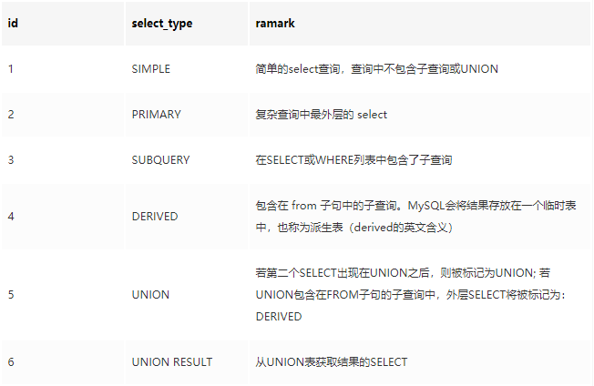
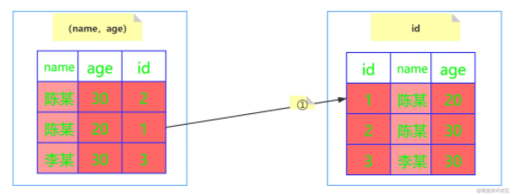
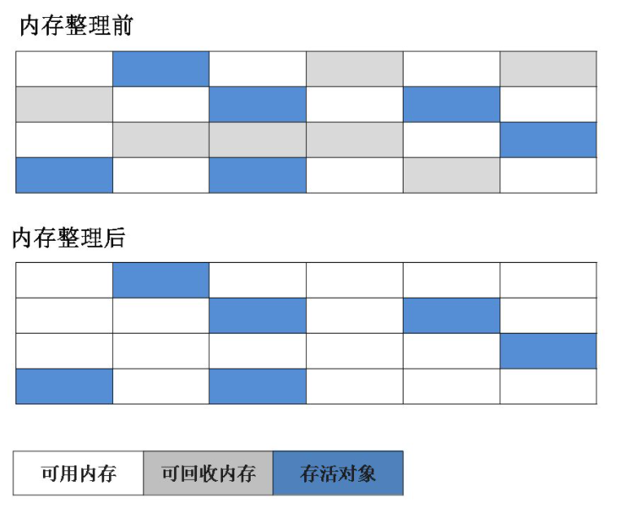
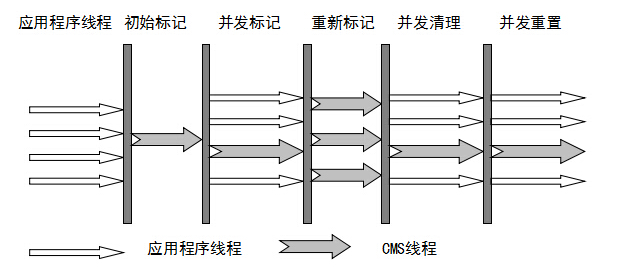

# 自我介绍

```markdown
面试官，您好，我是杨涛，是来自 重庆邮电大学 软件工程专业的一名专业硕士研究生，将于2022年7月毕业。
    研究生在校期间，获得过两次学业奖学金，并以主要负责人和答辩小组成员的角色参加了全国大学生挑战杯竞赛，并取得了重庆市特等奖；
    除此之外，在研二期间呢，都在参与导师签约的新华书店的项目，也就是我简历上的实习项目；
    通过这些参加比赛和项目实践的经历：
    	首先，提高了自己的一个与人沟通和解决问题的能力；（比如说在项目开发过程中，需要与系统的使用人员进行需求的沟通和确认）
    	而且，也积累了一定的项目经验。
我的介绍大概就是这些。
```

# 主观题

## 1.项目相关

```markdown
1) 项目介绍：那我就给您简单介绍一下项目的情况
	项目性质：对接多个平台的中间系统，主要实现新华本地系统数据与天猫、京东和拼多多等电商平台的对接；
	开发目的：简化公司运营人员的操作和保证一个工作效率；
	项目模块：主要包含商品、订单和库存模块，我们小组主要负责商品和库存管理模块；

    项目流程：系统读取本地商品数据，批量上架和下架到电商平台进行售卖，有人下单时，系统拉取订单数据存入数据库并更新库存；
    
2) 项目难点：
	1.批量发布：考虑到批量发布的响应效率问题，调研发现，消息队列呢，具有的异步处理优势，通过异步处理呢，就可以提高系统的响应效率。（当然可能会存在一些数据一致性和可靠性的问题）
	
	为什么不用线程池？而用MQ呢？
	其实，也可以考虑使用线程池来异步处理，其本质还是使用队列（LinkedBlockingQueue,ArrayBlockingQueue）来缓存需要执行的任务线程，任务队列会占用的应用服务器本身的资源，而MQ一般部署在其他服务器中，应用服务器只需考虑处理逻辑，无需考虑内存资源问题。
	
	2.库存同步：主要是处理逻辑比较复杂，需要兼容单品数据和套装数据的情况。
```

## 2.科技竞赛

```markdown
1.挑战杯比赛：
	比赛内容：参赛文档内容主要是基于新华项目来展开的。
	比赛的重点是作品的创新性，我们作品中主要包含两个部分：中台系统 + 区域型社交电商智能平台
	
	比赛中扮演的角色：是一个主要负责人，主要工作就是整体进度的把握、文档和答辩材料检查和整合，作为答辩小组的成员进行现场的答辩答疑。
	
	
	主要负责的是 点击率预测算法的背景调查（包括查阅相关资料做一些背景和研究现状的调研等）。
	
	点击率预测模型：
		基于传统机器学习的预测模型：LR 逻辑回归模型（一阶）-->GBDT 梯度提升决策树(特征组合)--->SVM 支持向量机的模型（多维，非线性）--> FM 因式分解机模型（数据高度稀疏）
		基于深度神经网络的预测模型：Wide & Deep 模型--->DFM 深度因子分解机模型--->其他基于卷积、递归神经网络（CNN，RNN）的模型
		基于注意力机制的预测模型：AFM 基于注意力机制的因子分解机模型--->基于注意力机制的协同过滤模型---->阿里提出的 DIN 深度兴趣模型。
2.数学建模
3.计算机设计大赛
```

## 3.职业规划

```markdown
1) 定位：我对自己有一个大致的定位。
	首先，因为个人对Java技术栈是比较有兴趣的，想要走技术路线，不断加强自己的技术水平。
2) 规划：
    短期内（积累经验 & 不断学习，提升技术）：通过工作经验的积累和新技术的学习来提升自己的技术水平，争取早日成为技术骨干;
    长期目标的话：在之前的学习和积累的基础上，想要对技术进行一个更深层次的研究，争取向架构师的方向来靠拢。
```

## 4.平时如何学习？最近在看什么书？

```markdown
学习的话，我个人习惯是：
	先去 网上找一些资料，比如掘金，CSDN，华为云或者美团技术团队等上面 找一些博客，技术文章，对技术进行一个大概的了解，学习一些基础知识；
	然后看有没有相关的开源项目，或者bilibili的实战视频，自己先跟着视频或者项目实践一下；
	再然后，就是查阅一些书籍或者文档资料，查漏补缺 和 深入学习。
最近的话，在看消息队列、计算机网络，数据库相关的一些技术文章和书籍。
关注的技术博主：代码随想录
哪些书：《深入理解Java虚拟机》，《高性能MySQL》，《代码整洁之道》，《Head First 设计模式》
```

## 5.为什么选择我们公司？

```markdown
1.主要的话，公司的福利待遇和技术的创新性，对我有很大的吸引力，在咱们这边工作的话，我可以掌握更专业、更新型的技术，发展前景是比较好的；
2.其次的话，因为我是西安本地人嘛，所以想要在西安发展，咱们这边不管是从用户的口碑还是从技术层面来讲的话，都是很好的，是我的最优选择；
3.因为荣耀是咱们自主研发的品牌嘛，所以，我就想用自己学的东西，为公司和社会贡献自己的一份力量吧。
```

## 6.个人优势 & 缺点

```java
优势：
    积极乐观的生活态度；
    比较细心
    坚持不懈的做事态度；
缺点：
    缺乏一定的自信
```

# 一、MYSQL

## **1.MYSQL的索引**

### 1.1 概述

```mysql
1)索引是存储引擎快速查找记录的一种数据结构，在存储引擎中实现;
2)使用索引的主要目的就是优化查询速度;
3)索引中存储对数据表中所有记录的引用指针,索引以文件的形式存储在磁盘中。
### 优势
# 1.提高语句查询效率，减少IO操作次数；
# 2.索引列会进行排序，使用分组和排序子句查询时，可以显著减少查询时间
### 缺点
# 1.索引文件需要占用物理空间
# 2.创建和维护索引比较耗时
# 3.索引需要动态维护，会降低数据更新效率
```

### 1.2 分类

```MYSQL
1.单列索引：
    普通索引:允许空值 & 重复值
    唯一索引:允许空值 & 不可重复
    主键索引:不允许空值 & 唯一
2.组合索引：在表中的多个字段上创建索引，遵循最左前缀原则；
## MyIsam引擎支持
3.全文索引：MyIsam引擎中使用，只能在 char,varchar,text 字段类型上使用。
4.空间索引：MySQL 在 5.7 之后的版本支持了空间索引
## Memory引擎支持
5.哈希索引：基于哈希表实现【无法用于排序、不支持部分索引匹配、不支持范围查找】
6.覆盖索引：可以避免二级索引的回表查询。【覆盖是指查询的字段都是索引字段】
```

### 1.3 索引内存模型

#### 1.3.1 哈希表

```mysql
以键值对存储数据的结构。
	key 用于存储索引列；
	value 就是某行的数据或者是它的磁盘地址。
## 底层结构：数组 + 链表实现
## 存在问题
# 无法用于排序、不支持部分索引匹配、不支持范围查找
```

#### 1.3.2 有序数组

```mysql
主要解决区间查询慢的问题，适用于存储不经常变动的数据,新增数据的成本太高。
## 底层主要通过二分查找来提高查询效率。
```

#### 1.3.3  B树

```mysql
对于m阶B树而言：（m路平衡查找树），有以下性质：
    1.根节点至少有两个子树;
    2.每个非叶子节点最多有 m 个子树，最少有 m/2 子树 （关键字数为子树数-1） & 升序排列;
    3.每个节点都有data域;
    4.所有叶子节点位于同一层

思想 : 通过减少树的高度，来减少磁盘的访问次数，通过扩展树的分支来降低树的高度，从而提高查询效率。
说明：
	InnoDB 存储引擎一次IO会读取一页(默认16k)数据，二叉树一次IO有效数据量为只有16个字节，空间利用率极低，为最大化利用一次IO空间，考虑在一个节点尽可能多的存储元素。根据页大小 & 一次IO的字节数 （ 16k / 16 = 1000）==>每个节点可以存储1000个索引。这样一来，1百万条数据只需要2层就可存储（只需要2次操作就可以查询到全部数据）
### 存在问题
# 1.叶子节点无指针相连，范围查询时会增加磁盘的IO次数，查询效率低。【范围查找过程为:从根节点开始先查找左边界，再从根节点开始查找右边界】
# 2.如果data存储的是行记录，行所占空间会随着列数的增多而变大，因为页大小固定，此时，一个页中可存储的数据量会变少，树会变高，IO次数会增多，效率变低。
```

#### 1.3.4 B+ 树

```mysql
与B Tree有三点不同：
1）B+ Tree的非叶子节点不存放数据，只存放键值；B Tree叶子 & 非叶子节点都存放数据 ====>（查询性能稳定）
2）B+ Tree的叶子节点之间通过双向指针相连，构成双向有序链表。====>(范围查询方便)
3）B+ 树非叶子节点的子树与关键字个数相同。
### 存在疑问：B+ Tree的数据都存在于叶子节点，只有遍历到叶子节点才能查出数据，而B Tree 不需要遍历到叶子节点就可以查询到数据，效率不是变慢了吗？
### 解答：B+ 树非叶子节点只存储键值，键所需存储空间比数据少的多，在页大小固定的情况下，每个节点就可以存储更多的索引，此时，索引树的高度会降低，磁盘IO操作变少，查询效率会有所提高。**
```

### **<font color = yellow> 1.4 MYSQL 索引是如何执行的</font>**

#### 1.4.1 聚簇索引（主键索引、一级索引）

```mysql
使用B+ Tree构建,叶子节点存储数据表的某一行数据。当表没有创建主键索引时,Innodb引擎会自动创建row_id作为数据表的主键索引。
```

**存储结构**


**索引查找执行流程：<font color = yellow>可以利用叶子节点之间构建的双向有序链表提高效率</font>**


#### 1.4.2 非聚簇索引（二级索引、辅助索引、普通索引）

```mysql
使用B+ Tree构建,叶子节点 & 非叶子节点均存储键值，需要进行‘回表’查询【可以通过覆盖索引来避免回表查询】。
```

**存储结构**


**查找流程：<font color = yellow>需要进行回表查询</font>**


### 1.5 索引建立规则 & 失效条件

#### 1.5.1 建立规则

```mysql
### 表选择：查询频次高且数据量大的表建立索引;
### 字段选择：从where子句、Order by的条件中提取;
### 合适的索引顺序：选择性（不重复记录/总记录）越高，查询效率越高;
```

#### 1.5.2 失效条件

```mysql
1.like语句：以 '%' 或者 '-'开头匹配的字段不会使用索引,以'%'结尾的会使用索引;
2.全部索引,但索引键之间不是 AND 操作;
3.部分索引,但违反最左前缀原则;
4.反向查询【<>,not in,doesn`t exists】;
5.索引列上进行函数操作、运算操作;
6.范围查询,右边索引失效
```

## **2.MYSQL事务**

### 2.1  概念 & 特性

```MYSQL 
1.事务是什么？
	1）一组数据操作，要么全部成功、要么全部失败。一部分操作失败时，会回滚所有操作。
	2）事务在引擎层实现。 Innodb 引擎支持、MyIsam不支持。
2.ACID特性
	1）原子性(Atomicity)：事务开始后所有操作，要么全部做完，要么全部不做。（undo log 保证）
	2）一致性(Consistency):事务开始前和结束后，数据库的完整性约束没有被破坏。（通过其他三个保证）
	3）隔离性(Isolation):同一时间，只允许一个事务请求同一数据，不同的事务之间彼此没有任何干扰。（MVCC + undo log + 行锁保证）
	4) 持久性(Durability):事务完成后，事务对数据库的所有更新将被保存到数据库，不能回滚。(redo log保证)
```

### 	2.2 并发问题

```mysql
1.脏读：事务 A 读取了事务 B 更新的数据，然后 B 进行了回滚，那么 A 读取到的数据是脏数据。
2.不可重复读(数据更新导致)：事务 A 多次读取同一数据，事务 B 在事务 A 多次读取的过程中，对数据作了更新并提交，导致事务 A 多次读取同一数据时，结果不一致。（通过MVCC的版本控制：快照读）
3.幻读(数据增加、删除导致)：事务 A 将数据库中所有学生的成绩从具体分数改为 ABCDE 等级, 事务 B 就在这个时候插入了一条记录，事务 A 修改结束后发现还有一条记录没有改过来，就好像发生了幻觉一样，这就叫幻读。
### 如何解决幻读问题？
    在快照读（读取记录的可见版本，不加锁）时，通过MVCC来避免幻读;
    在当前读（读取记录的最新版本，加锁）时，通过 next-key 锁 （行锁+间隙锁）来避免幻读。
```

### 2.3 隔离级别----解决并发问题

|                         事务隔离级别                         | 脏读  | 不可重复读 | 幻读  |
| :----------------------------------------------------------: | :---: | :--------: | :---: |
|                **读未提交(Read-Uncommited)**                 | **√** |   **√**    | **√** |
|                 **读提交（Read-Commited）**                  | **×** |   **√**    | **√** |
| **可重复读（Repeatable-Read）<font color = red >默认级别</font>** | **×** |   **×**    | **√** |
|                  **串行化（Serializable）**                  | **×** |   **×**    | **×** |

### 2.4 设置事务隔离级别

```mysql
### 1.查看事务隔离级别
    # 5.7.20之前
    show variables like 'transaction_isolation';
    # 5.7.20及之后
    show variables like 'tx_isolation';
### 2. 设置隔离级别
	# set [作用域] transaction isolation level [隔离级别]：设置全局隔离级别为‘读提交’
	set global transaction isolation level read committed; 
### 3.启动事务
	# 1）显式启动【一致性视图在执行第一个快照读时创建】
	start / begin transaction;    #开启事务,执行到第一条sql语句时，事务才真正启动。
	update student set name = '张三' where id = 2; #执行操作
	commit;                       #提交事务
	# 2）set autocommit = 0 : 关闭事务的自动提交，执行sql语句时会启动事务，直到commit / rollback
	# 3) set autocommit = 1 : 开启事务的自动提交，执行单个sql语句时会启动 & 提交事务；多个语句需要手动开启 & 提交事务。
	# 4）start transaction with consistent snapshot:立刻启动事务。
```

### 2.5 隔离级别的实现原理（MVCC + 行锁 + undo log ）

#### 2.5.1 MVCC 多版本并发控制

##### 1. 概述

```mysql
1.概念：MVCC 使得数据库读不会对数据加锁，普通的 SELECT 请求不会加锁，提高了数据库的并发处理能力；数据库写才会加锁。
2.说明：MVCC 只能实现 Repeatable Read & Read Committed 两种隔离级别. Read uncommitted 总是读取最新行，不符合当前事务版本的数据行; Serializable 会对所有读取的行加锁。
2.实现原理：在每行记录后面保存两个隐藏的列（trx_id,roll_ptr）来实现MVCC
    1） Innodb 的每个事务都有一个唯一的事务ID,记为 transaction_id,在事务开始时向 Innodb 引擎申请,按照时间先后严格递增。
    2） 依赖于 undo log,每行数据都存在多个版本。
    	a.每次事务更新数据会生成一个新的数据版本(trx_id),并将 transaction_id = trx_id;
    	b.将旧的数据版本保留在 undo log 中，而且通过 回滚指针roll_ptr 链接前一个版本。
```

##### 2. Undo Log

```mysql
### insert undo log
1) insert 操作产生的 undo log;
2) insert 操作没有历史版本，只对当前事务本身可见，对其他事务此记录不可见,insert undo log在事务提交后直接删除，不需要进行 purge 操作。
	# purge 操作：将数据库中已经 mark del 的数据删除，另外也会批量回收 undo pages
### update undo log
1) UPDATE 和 DELETE 操作产生的 Undo log;
2) update 可以视为 insert 新数据到原位置，delete 旧数据，undo log 暂时保留旧数据.
```

##### 3. Read-View（一致性视图）

```mysql
### 说明：
1) Innodb 在实现MVCC时用到的 一致性视图，用于支持 RC & RR 隔离级别的实现；
2) 不真实存在,通过 undo log 体现，作用是决定事务能够看到哪些数据。【主要包含当前系统中还未提交的读写事务】
3) 每个事务或语句都有自己的一致性视图。普通查询语句是一致性读，一致性读会根据 trx_id 和一致性视图确定数据版本的可见性。
```

###### 数据版本可见性解决方案

```mysql
### 说明：把系统中已提交的事务 ID 的最大值记为数组的低水位（low_id），已创建过的事务 ID + 1 记为高水位(up_id)。视图数组 & 高水位 组成当前事务的一致性视图（read-view）
### 可见性规则：
1) trx_id < low_id:表示生成该版本的事务在生成 read view 前已经提交，所以该版本可见，可以被当前事务访问;
2) trx_id > up_id：表示生成该版本的事务在生成 read view 后才生成，所以该版本不可见，不能被当前事务访问;
3) low_id <= trx_id <= up_id : 存在两种情况
	a) trx_id 在视图数组中，证明这个版本是由还未提交的事务生成的，不可见
	b) trx_id 不在视图数组中，证明这个版本是由已提交的事务生成的，可见	
### 注释：视图是否可见，主要看创建视图 & 提交事务的时机
```


## **3.MYSQL锁**


### 3.1 全局锁

**<font color = red>注释：</font><font color = yellow>InnoDB引擎中，可使用事务RR隔离级别代替</font>**

#### 3.1.1 概念 & 语法

```mysql
全局锁是对整个数据库实例加锁，让其处于只读状态。加全局锁后，DML & DDL 等操作将被阻塞。
### 实现(FTWRL)
Flush tables with read lock
### 解除只读状态
unlock tables
```

#### 3.1.2 应用场景

```mysql
全库逻辑备份：将数据库的所有表 select 出来存储为文本。 【FTWRL定时备份 + binLog恢复增量数据】
数据库处于只读状态，会存在两个问题：
	1）主库备份：备份期间数据不能写入，业务会受影响；
	2）从库备份：备份期间不能执行主库同步过来的 binlog,会导致主从延迟，业务会受影响。
```

#### 3.1.3 为什么要加锁？

```MYSQL
不加锁的话，会导致备份所得到的库，与开始备份的库，不是同一个逻辑时间点。【在备份的过程中，有新的数据插入、删除或更新，导致主从不一致】
```

#### 3.1.4 使用readonly = 1 的方式使全库只读是否可行？

```mysql
### sql 设置全库只读，不能使用
set global read_only = 1;
### 设置全库只读存在问题：
	1) 影响业务逻辑：在读写分离场景下，该语句可能会用于一些业务判断；
	2）异常时不释放状态：FTRWL 命令在异常发生时，会自动释放全局锁；set global read_only = 1 异常时，会一直保持只读状态。
	3）该命令对超级管理员无效。若在备份期间，超管更新数据，会导致数据不一致问题。
```

### 3.2 表级锁

#### 3.2.1 表锁

```mysql 
###  语法 
# 加锁
lock tables t1 read / write,t2 read / write;
# 释放锁
unlock tables;
```

#### 3.2.2 元数据锁（MDL）

```mysql
### 说明： 隐式使用，访问表时(执行语句时加锁,事务提交后释放)系统会加上，MYSQL5.5 版本引入;
### 主要作用： 防止DDL(修改表结构) & DML（CRUD表数据）并发的冲突。
### 实现逻辑：
	1.对 DML(增删改查) 操作，加MDL读锁;
	2.对 DDL 操作，加MDL写锁;
1)读读不互斥：可以多线程对一张表增删改查;
2)读写 & 写写互斥：保证对表结构操作时，只能有一个线程，其他线程阻塞。
```

### 3.3 行锁

```mysql
### 概念：行锁就是针对表中行记录的锁(锁定的是索引),可能会出现死锁。
### 说明：
	1)在存储引擎中实现;
	2)事务A先更新一行，同时事务B也要更新同一行，则事务B必须等待事务A操作完成后才能进行更新。
```

#### 3.3.1 两段锁协议

```mysql
### 两段锁协议：分为加锁 & 释放锁阶段，所有的lock操作都在unlock之后。
### 说明：
	1）根据两段锁协议，对于高并发的行记录操作应该尽可能安排到最后面，以减少行锁的等待时间，提高系统并发性能。
	2）释放锁发生在事务提交之后。
```

#### 3.3.2 Gap锁& Next key锁

```mysql
1.next Key锁:同时锁住记录(数据)，并且锁住记录前面的Gap; --- 解决幻读的问题
2.Gap 锁:不锁记录，仅仅记录前面的Gap;  ---- 防止同一事务的两次当前读，出现幻读的情况。
3.Record 锁:锁数据，不锁Gap;
** next Key = Gap + Record ** 
```

#### 3.3.3 死锁


```mysql
### 概念：不同线程出现循环资源等待，涉及的线程都在等待其他线程释放资源，会导致这几个线程进入无线等待的状态，成为死锁。
### 产生原因：一个线程访问了表A的某一行记录r1,然后访问表B的记录r2;另一个线程B访问表B的记录r2,又企图访问表A的记录r1,这时线程A & 线程B会相互等待对方释放资源,形成死锁。
```

#### 3.3.4 如何解决死锁？

##### 1. 加入等待时间

```mysql
### 设置超时时间参数
set global innodb_lock_wait_timeout = 500;
### 思想:直接进入等待，直到超时。
### 存在问题：超时时间无法确定
```

##### 2. 检测死锁，主动回滚事务

```mysql
### 设置开启死锁检测
set global innodb_deadlock_detect = on;
### 思想：循环依赖检测，判断是否存在死锁
### 存在问题：在检测死锁期间，会消耗大量的CPU资源。
```

##### 3.解决热点行更新问题

```mysql
通过控制服务端的并发度（限流），来减少死锁检测的CPU压力。
```

## **4.MYSQL引擎（InnoDB）**

### 4.1 四个特性

#### 4.1.1 插入缓存

```mysql
### 作用：减少IO交互，提高插入性能
### 使用条件：
	非聚集索引 & 非唯一索引 
	原因：避免读取索引页，如果是唯一索引，在插入时需要判断记录是否唯一。
### 实现原理：对于满足插入条件的记录，每一次的插入不是在索引页中
	1.先判断插入的辅助索引页是否在buffer pool中，如果在直接插入;
	2.若不在，先放入插入缓存，在按照"一定频率"进行合并操作【将多个插入操作合并为一个操作，减少随机IO带来的性能消耗】，再写回磁盘。
	"一定频率"：
		① 辅助索引页没有可用空间(空间小于1/32 页大小),强制合并;
		② master thread 每 1s/每 10s 合并一次;
```

#### 4.1.2 二次写


```mysql
### 作用：提高数据可靠性
### 实现原理：对缓冲池脏页进行刷新时,
	1.先将脏页复制到内存中的doublewrite buffer中;
	2.再将doublewrite buffer中的页先写入磁盘的'共享表空间',再写入'磁盘文件'中
### 写失效 & 部分写失效
	写失效：数据还在缓冲池中时，服务器宕机【'解决方案'：通过redo log恢复】;
	部分写失效：数据从缓冲池向磁盘刷新时，服务器宕机【'解决方案'：从共享表空间中找到备份并覆盖原来的数据,再利用redo log 恢复】
```

#### 4.1.3 自适应哈希索引

```mysql
### 作用：提高访问速度
### 实现原理：Innodb监控对所有索引的查询，对热点访问的页建立哈希索引，提高访问速度【不支持范围查询，不支持排序】
```

#### 4.1.4 预读

```mysql
### 作用：提高访问性能
### 实现原理：提前将下一次可能要读取的数据页放入缓冲池。
```

### 4.2  缓冲池


```mysql
1.查询请求：查询的数据缓冲池中没有，去磁盘中查找，并将匹配的数据放入缓存池中；
2.修改请求：MySQL 不会直接去修改磁盘，先修改已经在缓冲池页中的数据，然后将数据刷回磁盘。
```

#### 4.2.1 缓存池的作用

```mysql
由于CPU的处理速度和磁盘的IO速度之间差距太大，为提高整体效率，InnoDB向操作系统[本质：申请的一段连续的内存空间]，作为缓冲池。
```

#### 4.2.2 缓存池的结构

```mysql
内部主要通过链表实现：
    Free List：存储未被使用的页节点，若FreeList不够用，需要从LRU/FLU List上淘汰一定的节点；
    LRU List：存储新读取的数据页
    FLU List: 存储脏页（被修改过，还未刷新到磁盘上的页）
	Quick List: 存储带有Hint的SQL语句用到的数据页，SQL语句结束就淘汰对应的页。
```

#### 4.2.2 存在问题：缓冲池污染 & 预读失效

```mysql
1.缓冲池污染
    概念:当SQL语句要批量扫描大量数据时（只访问一次），可能会把缓冲池中所有页都替换出去，会导致大量热数据页被换出，MySQL性能急剧下降。
    解决方案：新老生代改进版LRU+“老生代停留时间窗口”T 机制
2.预读失效
    概念：预读（Read-Ahead）时,提前将页放入缓冲池，但最终Mysql并没有从预读页中读取数据；
    解决思路：
        让预读失败的页，停留在缓冲池LRU里的时间尽可能短
        让真正被读取的页，挪到缓冲池LRU的头部【保证真正被读取的热数据留在缓冲池的时间尽可能长】
```

## **5.MYSQL日志**

### 5.1 事务日志 redo log<font color = red>（引擎层面）</font>

#### 5.1.1 为什么需要redo log?

```mysql
### 存在问题：如果每一次更新都要写入磁盘，会带来严重的性能问题。
	1.Innodb 是以页为单位进行磁盘交互的,一个事务有可能只修改了一个数据页中的几个字节,这时将整页刷到磁盘，比较浪费资源;
	2.一个事务可能涉及修改多个物理上不连续的数据页,随机IO写入性能太差。
### Innodb 采用write-ahead log(日志先行)的策略更新数据,先写redo log,再写磁盘
	1.有记录更新时,Innodb 先把记录写到 redo log 中，并更新内存中(redo log buffer)数据页（更新完成）;
	2.后台线程会把操作记录异步更新到磁盘的数据页 redo log file。
### redo log 的优势在于：将全局的随机IO,变换为局部的顺序写,从而提高效率。
```

#### 5.1.2 redo log的写入过程


```mysql
### Redo log 包含两部分：内存中的Redo log buffer & 磁盘中的 redo log file
### DML语句执行过程：
	1.先将更新记录写入 redo log buffer;
	2.再将redo log buffer的记录,在后续一次性写入redo log file中。
	## 说明：用户空间下的缓冲区数据无法直接写入磁盘，需要通过内核空间缓冲区(OS Buffer)
	redo log buffer ---> OS Buffer ----> redo log file
```

**redo log file的不同写入时机**

```mysql
### 设置写入时机
set global innodb_flush_log_at_trx_commit = 0(延迟写)/1(实时写,实时刷新)/2(实时写,延时刷新)
```


**redo log file的结构**


#### 5.1.3 redo log 的两阶段提交(Prepare & Commit)

**两阶段提交就是让 redo log 和 binlog 表示事务的提交状态的逻辑保持一致。**


```mysql
例子: update T set c=c+1 where ID=2;
假设表的当前 ID=2 的行，字段 c 的值是 0，再假设执行 update 语句过程中在写完第一个日志后，第二个日志还没有写完的期间发生了 crash，会出现什么情况呢？

### 先写 redo log 后写 binlog
假设在 redo log 写完，binlog 还没有写完的时候，MySQL 进程异常重启。由于我们前面说过的，redo log 写完之后，系统即使崩溃，仍然能够把数据恢复回来，所以恢复后这一行 c 的值是 1。但是由于 binlog 没写完就 crash 了，这时候 binlog 里面就没有记录这个语句。因此，之后备份日志的时候，存起来的 binlog 里面就没有这条语句。然后你会发现，如果需要用这个 binlog 来恢复临时库的话，由于这个语句的 binlog 丢失，这个临时库就会少了这一次更新，恢复出来的这一行 c 的值就是 0，与原库的值不同。
### 先写 binlog 后写 redo log
如果在 binlog 写完之后 crash，由于 redo log 还没写，崩溃恢复以后这个事务无效，所以这一行 c 的值是 0。但是 binlog 里面已经记录了“把 c 从 0 改成 1”这个日志。所以，在之后用 binlog 来恢复的时候就多了一个事务出来，恢复出来的这一行 c 的值就是 1，与原库的值不同。
```

### 5.2 归档 日志 binLog<font color = red>（Server层面）</font>

#### 5.2.1  bin log 日志格式

```mysql
### 三种格式：STATMENT、ROW & MIXED
1.STATMENT：每一条会修改数据的 sql 语句会记录到 binlog 中;
2.ROW：不记录 sql 的上下文信息，仅需记录哪条数据被修改。记两条，更新前和更新后都有;
3.MIXED：前两种模式的混合，一般的复制使用 STATEMENT 模式保存 binlog ，对于 STATEMENT 模式无法复制的操作使用 ROW 模式保存 binlog。
```

#### 5.2.2 bin log 适合做crash-save吗？

```mysql
### 通过加入checkpoint实现,数据库故障重启后,binlog checkpoint之后的sql都会重放一遍。【可以做，但是不适合做】
### 原因：
	binlog 是追加写,crash不能判定binlog中哪些内容已经写入磁盘，哪些未被写入，导致重复写入，出现 duplicate key;
	redolog 是循环写,从checkpoint - write pos 间的内容都是未写入磁盘的。
```

#### 5.2.3 bin log 应用场景

```mysql
### 1.主从复制：在master 端开启binlog,将其发送到各个slave端,slave重放binlog 实现主从数据的一致性。
### 2.数据恢复：使用mysqlbinlog工具来恢复数据。
```

### 5.3 binLog & redo Log

```mysql
1.redo log 是 Innodb 引擎特有的;binlog 是 MySQL 的 Server 层实现的，所有引擎都可以使用。
2.redo log 是物理日志，记录的是在某个数据页上做了什么修改;binlog 是逻辑日志，记录的是这个语句的原始逻辑，比如 **"给 ID=2 这一行的 age 字段加 1"**。
3.redo log 是循环写的，空间固定会用完；binlog 是可以追加写入的。追加写是指 binlog 文件写到一定大小后会切换到下一个，并不会覆盖以前的日志。
```

## **6.SQL优化**

### 6.1 Explain(索引优化)

**<font color = red>作用:查看SQL语句的执行计划</font>**

```mysql
1.是否使用了索引;
2.是否做了全表扫描;
3.是否进行了回表查询;
```

**explain关键字段**


**1) id & select_type**

```mysql
### 说明：查询的类型，主要用于区别普通查询、联合查询、子查询等复杂查询。
```



**2）TYPE **

```mysql
### 说明：访问类型（重要指标）,一般得保证查询至少达到range级别，最好能达到const。
```

| TYPE      | 说明                                                         |
| :-------- | ------------------------------------------------------------ |
| All       | 最坏情况，全表扫描                                           |
| Index     | 扫描索引树，通常比All速度快                                  |
| **range** | **使用一个索引来检索给定范围的行，范围扫描通常出现在in()、between、>、<、>=等范围操作中。** |
| ref       | 不使用唯一索引，而是使用普通索引、唯一性索引的部分前缀和某个值比较，可能会找到多个符合条件的行 |
| eq_ref    | primary key 或 unique key 索引的所有部分被连接使用 ，最多只会返回一条符合条件的记录。这可能是在 const 之外最好的联接类型了 |
| **const** | **表示通过索引一次就找到了, const用于比较primary key或者unique索引。因为只匹配一行数据，所以很快。** |
| system    | 表中只有一条数据. 这个类型是特殊的 `const` 类型              |

**3）possible_keys & key & key_len**

```mysql
1.possible_keys：查询过程中，可能会用到得的索引;
2.key:Mysql当前查询时，真正用到的索引;
3.key_len:表示索引中使用的字节数，可通过该列计算查询中使用的索引的长度，key_len显示的值为索引字段的最大可能长度，并非实际使用长度【根据表定义计算】
```

**4）rows:表示mysql估计要读取 & 检测的行数，衡量标准，越少越好<font color = yellow>（不是结果集里的行数）</font>**

**5）Extra **

| 类型            | 说明                                                         |
| --------------- | ------------------------------------------------------------ |
| Using temporary | 查询时使用临时表，一般出现在排序、分组和多表join的情况。<font color = yellow>(效率不高，建议优化)</font> |
| Using index     | "覆盖索引扫描"，查询索引树即可找到所需数据，不用扫描表数据文件。<font color = yellow>(性能不错)</font> |
| Using filesort  | 表示 MySQL 需额外的排序操作, 不能通过索引顺序达到排序效果。<font color = yellow>(比较消耗CPU资源，建议优化)</font> |
| Using where     | 使用了WHERE从句来限制哪些行将与下一张表匹配或者是返回给用户。<font color = yellow>(将存储引擎数据返回服务层以后，再应用Where条件过滤)</font> |

### 6.2 SQL优化（开发规范优化）

```mysql 
1.尽可能使用覆盖索引,避免查询所有列,减少回表查询的消耗;
2.考虑是否组件'联合索引',如果组件联合索引,尽量将区分度最高的列放在最左边,考虑'最左匹配原则';
3.使用子查询优化超多分页场景(limit offset,n 需要获取 offset+n的记录,再返回n条,可以利用子查询避免冗余查询,提高查询效率)
4.对索引列进行函数操作或者表达式运算时会导致索引失效;
5.减少使用 in / not in,使用 exists / not exists 或者关联查询替代;
6.优化 insert 语句：尽量一次性插入多个值,减少客户端与服务器的交互消耗;
7.优化关联查询：
	确保 on 子句的列上有索引;
	确保 group by & order by表达式只涉及一个表中的列，可以使用索引优化;
8.优化 group by:可以使用 order by null 禁止结果集排序;
9.优化 union 查询：可以使用 union all 来降低唯一性检查代价;
```

## **7.主从复制**

### 7.1 概述

```mysql
### 概念
	将一个主库 master 服务器的数据同步到多台从库 slave 上,保持主从一致。
### 主要作用
	1.数据分布和备份;
	2.负载均衡：读写分离将读负载到多台从库中;
	3.高可用性和故障切换：利用主从复制实现;
	4.提高数据库的并发性能。
### 实现原理
	在主库上记录二进制日志（binLog），在备库上重放日志（relay_log），实现异步数据复制。
### 复制方式
	1.基于行的复制【物理复制】;
	2.基于语句的复制【逻辑复制】;---SQL语句,binlog 
### 衡量标准 QPS & TPS
	TPS(Transactions Per Second)：服务器每秒处理的事务数;
	QPS(Queries Per Second):服务器每秒能够查询的次数,是服务器在规定时间内处理流量多少的衡量标准.
```

### 7.2 复制原理详解


```mysql
### 复制步骤
1.将 Master主库上的数据更改记录(insert,update,delete),按顺序写入二进制日志(binlog)中【提交事务之前，按照事务的提交顺序将更新记录写入日志中，然后提交事务】;
2.slave从库连接 Master主库,Master 主库创建与 slave从库数量相等的 binlog dump 线程;
3.当 Master主库的 binlog发生变化时,binlog dump 线程会通知所有的 slave从库，将相应的 binlog内容推送到 slave从库中;
4.slave从库的 I/O 线程将接收的 binlog内容，写入本地的中继日志(relay-log);
5.slave从库的 SQL线程读取I/O线程写入的relay-log,对 slave从库进行更新【单线程,实现数据更新】。
```

### 7.3 存在问题及解决方案

#### 7.3.1 高并发时，同步延时问题

```mysql
### 发生原因
	高并发时,主库的 binlog是多线程写入的,而从库的 SQL线程进行数据更新时是单线程串行执行的，导致从库 SQL线程处理速度跟不上主库的写入速度【生产者比消费者快，消息积压，数据同步延时】
### 解决方案：并行复制【多线程复制multi-threaded slave】（Mysql5.6开始支持）
	从库开启多个 SQL线程，并行读取relay log中不同库的日志,然后重放。【实现库级别的并行】
```

#### 7.3.2 主机宕机，数据丢失问题


```mysql
### 发生原因
	主库突然宕机,此时主库的 binlog(更新记录)还未同步到从库，从而出现主库更新的数据未同步到从库，导致数据丢失。
### 解决方案：半同步复制【semi-sync】
	1.异步复制（mysql默认）：主库将事件写入 binlog后立即将结果返回客户端，不关心从库是否已经获取和处理日志;
	2.全同步复制：当主库执行完一个事务，且等待所有从库都执行了该事务才将结果返回给客户端。【性能低】;
	3.半同步复制（semi_sync）:主库执行完提交事务后，不会立刻返回结果，而是等待至少一个从库接收 binlog并写到本地relay log中【会发送给主库确认ack标记】,主库接收到至少一个从库的ack响应才返回给客户端结果【会产生一个TCP/IP RTT延时，最好在低延时网络中使用】
### 相关命令
	1.查看是否开启半同步复制：show variables like "have_dynamic_loading";
### 注意
	半同步复制时,当主库等待超时，会还原为异步复制，当至少有一个从库响应ack时，主库会恢复半同步复制。
```

## **8.高频面试题**

### 8.1主键自增问题

#### 8.1.1 自增主键为何不用varchar?

```mysql
UUID是 32个字符+4个'-'组成，长度为36,虽然UUID可以保证唯一性，但是有两个致命的缺点：
	1)UUID不是自增的，插入可能会导致页分裂，树高度增加，性能下降。
    MYSQL中索引的数据结构是B+树，这种数据结构的特点是索引树上的节点数据有序，如果使用UUID作为主键，每次插入数据时，因为无法保证每次产生的UUID有序，所以会出现新的UUID插入到索引树的中间去，频繁导致页分裂，使得性能下降。
    2)太占用内存。
    ① 字符串需要从前向后比较，字符串越长，性能就越差；
    ② 字符串比较占用内存，数据页的大小是固定的，主键越长，能存储的数量就越少，最终会导致索引树的高度越大，在索引搜索时发生磁盘IO的次数就越多，导致性能下降。
```

#### 8.1.2 自增ID用完了怎么处理？

**<font color = yellow>分两种情况讨论</font>**

> **1）声明了自增主键：报主键冲突错误**
>
> ```mysql
> 1）将主键类型修改为 bigint 类型,8 个字节（ 2 ^ 64 - 1位）。
> 2）一般情况下，数据量达到500万时就应该考虑分库分表。
> ```
>
> **2）未声明自增主键：新数据会覆盖旧数据**
>
> ```mysql 
> Innodb会自动创建一个不可见的、长度为6个字节的row_id(bigint unsigned类型);
> Innodb会维护了一个全局的dictsys.row_id,未定义主键的表都共享该row_id,插入一条数据，都会把row_id当成主键id,然后 +1。
> 
> 如果全局row_id一直涨，涨到 2 ^ 48 - 1时，这个时候再+1, row_id 的低48位都为0，在插入新一行数据时，拿到的row_id就为0，再插入时会覆盖之前的值。
> ```

### 8.2 MYSQ的四大范式

```MYSQL
1.第一范式（1NF）：属性不可再分（属性的原子性）; --- 存在数据冗余、更新，插入，删除异常等问题。
2.第二范式（2NF）：在 1NF 的基础上,每一个非主属性完全依赖于主码（消除非主属性对主码的部分依赖）;
3.第三范式（3NF）：在 2NF 的基础上，每一个非主属性既不部分依赖于主码，也不传递依赖于主码（消除非主属性对主码的传递依赖）;
4.鲍依斯-科德范式（BCNF）：在 3NF 的基础上，消除主码与主码之间的部分依赖和传递依赖。
```

### 8.3 聊一下索引条件下推？

```MYSQL
1.索引下推： Index condition pushdown(ICP),在 MYSQL 5.6 版本引入，用于优化查询;
	在不使用ICP时,使用二级索引查询时，存储引擎通过索引检索数据，然后返回给MYSQL服务器判断是否符合条件;	
	使用ICP时,如果存在某些被索引列的判断条件时，MYSQL服务器将此判断条件传递给存储引擎,存储引擎根据条件返回数据给服务器。
2.优势：索引条件下推优化可以减少存储引擎查询基础表的次数，也可以减少MySQL服务器从存储引擎接收数据的次数。
```

**举例说明**

```mysql
用户表user(id,name,age,address) 建立联合索引 name_idx (name,age);
查询语句： SELECT * from user where  name like '陈%' and age=20;   //索引列age无法命中,会被忽略
```

**MYSQL 5.6 之前未引入ICP**


```MYSQL
InnoDB会忽略age字段,直接通过 name 匹配,在(name,age)索引树上匹配到两个结果id = 2,1,然后拿着取到的id值进行两次回表查询
```

**MYSQL 5.6  引入ICP**



```mysql 
InnoDB并没有忽略age这个字段，而是在索引内部就判断了age是否等于20，对于不等于20的记录直接跳过，因此在(name,age)这棵索引树中只匹配到了一个记录，此时拿着这个id去主键索引树中回表查询全部数据，这个过程只需要回表一次。
```

### 8.4 SQL的执行顺序是怎样的？


```mysql
第一层（连接器）：主要管理连接、权限验证等;
第二层（核心服务层:）：包括查询解析、词法与语法分析、执行计划优化、查询缓存以及引擎操作等;
	查询缓存：查看当前查询是否命中缓存,命中缓存时直接返回;
	分析器：对SQL语句进行相应的词法和语法分析;
	优化器:生成执行计划,选择合适的索引;
	执行器：操作引擎，调用存储引擎提供的读写接口，返回操作结果。
第三层（存储引擎层）：主要负责数据的存储及提取，服务器通过读写接口与存储引擎进行通信，这些接口屏蔽了不同存储引擎之间的差异。
```

------

# 二、Java基础

## 1.final关键字

```
1.final 变量：
	基本数据类型：数值一旦在初始化之后便不能更改；
	引用类型：初始化之后便不能再让其指向另一个对象。
2. final 类：
	类不能被继承 && 类中的所有成员方法都会被隐式地指定为 final 方法
3. final 方法：
	1）把方法锁定,以防任何继承类修改它的含义,保证安全性;
	2）提高效率。
```

## 2.异常处理机制


## **3. String & Stringbuilder & Stringbuffer**

```java
相同点：底层实现都是字符数组char[] values;
1.是否可变长： String 不可变[final 修饰],StringBuilder & StringBuffer 可变长;
2.线程安全性:  String 是常量[final 修饰]线程安全;StringBuffer 线程安全[synchronized 关键字修饰方法];StringBuilder 线程不安全[未用 synchronized 关键字修饰];
3.性能方面： StringBuilder > StringBuffer > String;

/**扩展：
	1.final & finally & finalize
		1)final 修饰类不可被继承,修饰属性不可变,修饰方法不可重写;
		2)finally 异常处理语句结构，表示总是执行;
		3)finalize 是 Object类的一个方法,在垃圾收集器执行时调用此方法回收对象。
*/
```

## 4. 接口与抽象类


### 4.1  接口与抽象类的区别

```java
//1.概念
	接口：是一个抽象类型，是抽象方法的集合;【通过实现其抽象方法来实现该接口】
	抽象类：体现数据抽象的思想，是实现多态的一种机制【通过重写其方法来继承该抽象类】
//2.区别
    1.变量：
        接口的所有变量默认为final（ public static final varName）;
      	抽象类中可包含非 final 变量;
    2.方法：
        接口的所有方法默认为 public abstract,实现接口必须重写其全部抽象方法;
	    抽象类中可包含非抽象方法【自己实现的方法，继承它的子类可以忽略该方法】 & 修饰符可以是 public、protected、private;
    3.接口和抽象类都不能被实例化;
    4.JDK 1.8 之后,接口 & 抽象类都可以包含 static 方法,JDK 1.8之前接口中不能有 static 方法;
    5.一个类只能继承一个抽象类,可以实现多个接口;
```

### 4.2 接口与抽象类的应用场景

```java
1.抽象类是对类本质的抽象(表达"is a"关系,如果B类是A,则A用抽象类); 接口是对行为的抽象(表达"like a"关系,如果B和A有某种关系,则A用接口);
2.如果需要拥有自己的成员变量 和 非抽象方法,则用抽象类;接口中只能存在 static final 变量(一般不在接口中定义成员变量);
3.为接口添加任何方法（抽象的），所有实现了这个接口的类，也必须实现新增的方法，否则会出现编译错误;对于抽象类，如果添加了非抽象方法，其子类却可以坐享其成，不必担心编译会出问题。
```

### 4.3 接口设计原则

```Java
○ 开闭原则：对扩展开发，对修改关闭
○ 里氏替换原则：继承必须确保超类所拥有的性质在子类中依然成立（尽量不重写父类的方法）
○ 依赖倒置原则：面向接口编程，不应该面向实现编程；
○ 单一职责原则：控制类的粒度大小，高内聚，低耦合；
○ 接口隔离原则：为各个类建立他们需要的专用接口；
○ 迪米特法则：只与直接朋友交互，不于"陌生人"说话；（降低耦合度）
○ 合成复用原则：尽量先使用组合或者聚合等关联关系来实现，其次考虑使用继承关系实现。
```

## 5.浅拷贝 & 深拷贝

### 5.1 浅拷贝

**说明：对基本数据类型进行值传递，对引用数据类型进行引用地址的拷贝；**

```json
所复制对象的所有变量都含有与原来的对象相同的值，而所有的对其他对象的引用仍然指向原来的对象。
对象的"浅拷贝"会对“主”对象进行拷贝，但不会复制主对象里面的对象("引用的对象"-"会在主对象与其副本之间共享")
```


### 5.2 深拷贝

**说明：对基本数据类型进行值传递，对引用数据类型，创建一个新对象，并复制其内容。**

```json
深拷贝是一个整个独立的对象拷贝，深拷贝会拷贝所有的属性,并拷贝属性指向的动态分配的内存。当对象和它所引用的对象一起拷贝时即发生深拷贝。"深拷贝会把要复制的对象及其所引用的对象都复制一遍"。
```


## 6.面向过程与面向对象

```Java
1.面向过程性能高，面向对象易维护、易复用、易扩展（由于其封装,继承,多态的特性）
2.Java性能差的原因是：Java是半编译型语言，最终执行的代码并不是可以直接被CPU执行的二进制码，而面向过程语言大多都是直接编译成二进制码在电脑上运行。
```

## 7. == 与 equals()

```java 
== : 判断两个对象的地址是不是相等。即，判断两个对象是不是同一个对象(基本数据类型==比较的是值，引用数据类型==比较的是内存地址)。
equals() : 判断两个对象是否相等。但它一般有两种使用情况：
	情况 1：类没有覆盖 equals() 方法。则通过 equals() 比较该类的两个对象时，等价于通过“==”比较这两个对象。
	情况 2：类覆盖了 equals() 方法。一般，我们都覆盖 equals() 方法来比较两个对象的内容是否相等；若它们的内容相等，则返回 true (即，认为这两个对象相等)。
```

## 8.hashCode() 与 equals()

```java
1.hashCode():获取哈希码,确定该对象在哈希表中的索引位置。
2.对象相等,hashCode一定相同;hashCode相同,对象不一定相等。【hashCode使用的杂凑算法会让多个对象传回相同的杂凑值（会产生哈希碰撞）】
```

## 9.wait() 与 sleep()

```Java
1.wait()是Object类的成员方法,sleep()是Thread类的静态方法;
2.wait()导致当前线程释放锁，并进入此对象的等待池,调用notify()/notifyAll()，线程进入对象锁定池,sleep()导致线程暂定执行,不释放锁;
3.wait()只能在同步代码块、同步方法中使用,否则抛出illegalMonitorStateException,sleep()可以在任何地方使用。
```

## 10.yield()与sleep()

```java
1.sleep()休眠线程,yield()只是为相同或更高优先级的线程让出CPU执行权;
2.sleep()后进入阻塞状态,yield()后进入就绪状态;
3.sleep()会抛出InterruptedException,yield()未声明任何异常
```

## 11.重载与重写

```java
1.重载(overloading): 在同一个类中创建具有相同名称、不同参数个数/类型的函数（一个类中多态性的表现：编译时多态）;
2.重写(overriding)：在子类中定义与父类具有相同名称且参数的函数，该函数会被重写（父类与子类之间的多态性表现：运行时多态）
```

## 12. 用户线程和守护线程

```Java
1.用户线程：所有用户线程停止，进程会停掉所有守护线程，退出程序
2.守护线程（Daemon）：程序运行时在后台提供的一种通用服务的线程，通过线程对象的setDaemon（）方法设置守护线程
```

## 13. Runnable 与 Callable

```java
1.Runnable接口run（）方法无返回值；Callable接口call（）方法有返回值，支持泛型;
2.Runnable接口run()方法只能抛出运行时异常，无法捕获；Callable接口call（）方法允许捕获异常，可以获取异常信息
```

## 14.线程池中 submit() 和execute()

```java 
1.submit() 有返回值,execute()无返回值;
2.submit() 参数为(Runnable)/(Runnable,结果T)/(Callable),execute()参数为Runnable。
```

## 15.线程的几种状态及转换


## 16.Java IO模型

### 16.1  阻塞 & 非阻塞

```java 
阻塞：调用结果返回之前，当前线程会被挂起，调用线程只有在得到结果之后才会返回。
非阻塞：在不能立刻得到结果之前，该调用不会阻塞当前线程。
```

### 16.2 同步 & 异步

```java 
同步：调用结果未返回之前，不能执行其他后续操作。
异步：调用结果未返回之前，可以继续执行后续操作。该调用结果通过：监听状态、通知和回调来通知调用者结果。
优势:
    同步：按顺序处理请求，可以避免死锁和脏读发生。
    异步：发送请求不等待返回结果，可以提高运行效率，保证并发。
```

### 16.3 并发 & 并行

```java
并行：（多个处理机）当一个CPU执行一个线程时，另一个CPU可以执行另一个线程，两个线程互不抢占CPU资源，可以同时进行。
并发：（单个处理机）同一时间段在同一个处理机上运行多个处于已启动--运行完毕状态之间的程序，任意时刻只有一个程序在处理机上运行。（来回切换，耗费CPU资源）。
```

### 16.4 BIO & NIO & AIO

```Java
1.BIO模式（同步阻塞I/O模式-----synchronous同步、blocking阻塞)
	服务器实现模式:服务器需要为每个客户端请求创建一个线程;
	特点：一个连接对应一个线程，可通过线程池改善;
	举例：餐馆点餐之后，一直等待;
	应用场景：连接数少（<= 1000） & 服务器资源多
2.NIO模式(同步非阻塞I/O模式---synchronous同步，non-blocking非阻塞)
	服务器实现模式：客户端发送的连接请求都会注册到多路复用器上【Selector】,Selector轮询到连接有IO请求时才启动一个线程进行处理;
	特点：多个连接对应一个线程【数据的读写都是通过通道（channel）在缓冲区(buffer)中完成的，即是面向缓冲区的】;
	举例：饭馆点餐之后，去做其他事情，过会询问饭馆餐是否做好？
	应用场景：各种分布式、即时通信和中间件系统中（Zookeeper,Dubbo,Netty等）。（连接数多且时间短）     
3.AIO模式（异步非阻塞I/O模式---asynchronous异步，non-blocking非阻塞）
	服务器实现模式：客户端的IO请求都是由操作系统先完成IO操作后，再通知服务器应用来直接使用准备好的数据;
	特点：一个有效请求对应一个线程;
	举例：点餐之后，饭馆先回应一声，然后备餐，做好之后自动给您！（外卖）;
	应用场景：连接数多且连接时间长。
```

## 17.如何去评价代码质量的好坏？

```java
有以下几个衡量标准:
	1.可维护性：在不破坏原有代码设计的基础上，能够快速的修改或者添加代码，是否符合高内聚，低耦合等;
	2.可读性：代码的命名是否规范，注释是否详细，函数长短是否合适，模块划分是否清晰;
	3.可扩展性：在不修改原有代码的基础上，通过扩展的方式添加新的功能代码,代码是否预留了新功能的扩展点;
	4.可测试性：从侧面反映代码质量的好坏（代码的可测试差，单元测试就比较难写）。
```

## 18.聊一聊Java反射机制

```java
反射：运行时动态获取类信息以及动态调用对象方法的功能;
主要功能：
    在运行时判断任意一个对象所属的类。
    在运行时构造任意一个类的对象。
    在运行时判断任意一个类所具有的成员变量和方法。
    在运行时调用任意一个对象的方法。
主要方法：
    //1.动态获取类对象
    	1) 通过完整类名获取：Class.forName("gk.demo.pojo.Student");
	    2) 通过类的class属性获取：Student.class;
	    3) 通过对象的getClass()方法获取：student.getClass();
    //2.获取类中所有字段
	    1) 获取声明字段（公有+私有）：Student.getDeclaredFields();
    	2) 获取公有字段：Student.getFields();
    //3.获取类中所有构造方法
		1) 获取声明的构造方法：Student.getDeclaredConstructors();
		2) 获取公有构造方法:Student.getConstructors();
    //4.获取类中所有非构造方法
		1) 获取声明函数：Student.getDeclaredMethods();
		2) 获取公有函数：Student.getMethods();
/*
	问题：Class.forName() 与 ClassLoader.loadClass()有什么区别?
		forName()加载类时会初始化类中的static代码块;
		loadClass()只会将.class加载到jvm中，主动调用newInstance()方法时，才会运行static代码块
*/
```

------

# 三、Java集合

## 1.HashMap & ConcurrentHashMap

### **1.1  底层结构**

```java
"Map 相关参数"：
{
    //1.初始化容量：16
    static final int DEFAULT_INITIAL_CAPACITY = 1 << 4; 
    //2.最大容量：1073741824
    static final int MAXIMUM_CAPACITY = 1 << 30;
    //3.加载因子(扩容因子)：默认0.75
    static final float DEFAULT_LOAD_FACTOR = 0.75f;
    //4.当链表长度大于此值且容量大于 64 时，转换为红黑树结构
	static final int TREEIFY_THRESHOLD = 8;
    static final int MIN_TREEIFY_CAPACITY = 64;
    //5.转换链表的临界值，当元素小于此值时，会将红黑树结构转换成链表结构
    static final int UNTREEIFY_THRESHOLD = 6;
}
HashMap底层结构（JDK 1.7 & 1.8）
/**JDK 1.7版本：数组 + 链表**/
/**JDK 1.8版本：数组 + 链表 & 红黑树 **/
ConcurrentHashMap底层结构【JDK 1.7 & 1.8】
/**
JDK 1.7 : 
	1.实现原理：分段锁(Segment,继承于ReentrantLock) + HashEntry + 链表;
	2.参数说明：Segment
		1) 一个静态内部类;
		2) 默认为16个，即默认并发度为16;
		3) 由 volatile 修饰,保证多线程环境下的数据可见性。
	3.缺点：查询遍历链表的效率太低
JKD 1.8 : CAS + Synchronized + Node + 红黑树
	说明：
		1）为保证序列化时的兼容,内部仍然具有Segment的定义;
		2) 使用lazy-load形式来避免初始化开销;
	1.实现原理：CAS + Synchronized + volatile 
		1）使用volatile保证数据的可见性;
		2）使用CAS操作,在特定场景下进行无锁并发操作,提高并发性能;
		3）使用CAS + synchronized将锁粒度控制在table元素级别。
	2.sizeCtl参数：用于表初始化和调整大小
*/
```

### 1.2底层实现

#### 1.2.1 put()

```java 
1)调用 putVal() 添加元素;
2)判断 table 数组是否为空 || 长度为0：
     若为空：调用 resize()初始化数组;
	 若不为空：根据 key 计算 hash值【hashCode ^ hashCode >>> 16】,计算元素在 table 的下标 index = hash & (n-1),执行步骤 3);
3)判断 index 是否存在数据：
    index 位置不存在数据:构造Node节点,存入table[index];
    index 位置存在数据：执行步骤 4);
4)判断当前节点的key与待插入节点的key是否相等：
    若相等：更新该节点的value,并返回旧value;
	若不相等：执行步骤 5);
5)判断当前节点是否为红黑树节点：
    若是：执行步骤 6);
	若否：执行步骤 7);
6)调用 putTreeVal()方法将节点插入红黑树,判断节点数是否大于扩容阈值:
	若大于：调用 resize() 扩容 & 迁移元素;
7)遍历链表,根据key判断 更新 OR 插入节点,插入后判断节点数量是否大于建树阈值：
    若大于：将链表转为红黑树;
8)操作完成后,modCount+1,结束。
```


#### 1.2.2 resize()

```java
思想：重新规划长度和阈值，如果长度发生了变化，部分数据节点也要重新排列
重新规划长度：
    1)如果当前容量oldCap > 0 & 达到最大值，将阈值设为Integer的最大值，return终止扩容；
    2)如果未达到最大容量，当oldCap << 1 不超过最大容量时,就扩大2倍； 
    3)如果都不满足且当前扩容阈值 oldThr > 0,使用当前扩容阈值作为新容量；
    4)否则将新容量置为初始容量16,新扩容阈值置为12。
重写排列数据节点：
    1)如果节点为null：不进行处理;
    2)如果节点不为null & 没有next节点，通过[节点的hash & (新容量-1)]计算出节点在table数组中的下标;
    3)如果节点为TreeNode类型，调用split方法处理，如果节点数hc达到6，调用untreeify方法转回链表;
    4)如果是链表节点，需要将链表拆分为[hash值超出旧容量 & hash值未超出旧容量]的链表，对于hash & oldCap == 0 的部分不做处理，否则将节点放在新下标的位置。[新下标 = 旧下标 + 旧容量]
```

### 1.3 HashMap线程不安全

```Java
1.数据丢失【JDK 1.7 & 1.8均存在】:
	①并发赋值被覆盖：两个线程同时修改同一个key,后一个的修改会覆盖前一个的修改;
	②已遍历区间新增元素丢失：在transfer迁移过程中，其他线程在已遍历区间的哈希槽中新增数据，遍历完成后，table数组引用指向newTable,新增元素丢失;
	③新表被覆盖:resize完成后，table = newTable,后续元素会在newTable上插入。如果多个线程同时resize,因为newTable是线程私有的局部变量，后面线程的newTable可能会覆盖之前线程的newTable,导致前一个线程在newTable上插入的元素被覆盖。
2.死循环【JDK 1.7存在,1.8不存在该问题】
     resize() 扩容时调用transfer方法转移元素时使用头插法，由于原table共享，若多个线程对next指针进行并发修改，其中某个线程还没有将table = newTable时，时间片用完，多线程就会陷入死循环。
```

### 1.4  为什么扩容容量必须为2的幂次方？

```java 
目的：减少碰撞次数，使得数据分布均匀，链表和红黑树的长度大致相同。
```

​	情况①：容量为2的幂次方，每次 （n-1）& hash的结果不同，减少了碰撞的可能性


​	情况②：容量不为2的幂次方，每次 （n-1）& hash的结果可能相同，相对情况①，碰撞可能性增加


### 1.5 为什么负载因子默认为0.75?

```Java
1.负载因子过低时，【扩容阈值=newCapacity * loadFactory】 会很小，导致频繁扩容，性能下降;
2.负载因子过高时，扩容阈值会很大，扩容发生的几率小，占用的空间比较小，此时发生Hash冲突的概率会提升。
```

### 1.6 为什么建树阈值为8？退化链表阈值为6？

```java
建树阈值：在hash函数设计合理的情况下，发生hash碰撞8次的概率为百分之6;
退化阈值：如果hash碰撞次数在 8 附近徘徊，会一直发生链表和红黑树的转换，为了预防这种情况发生。
```

### 1.7 HashMap如何保证元素的唯一性？

```Java
//hashCode() & equals()
1.HashMap在存储元素时，首先调用该元素的hashCode()方法===>计算对应的hash值;
2.判断该hash值位置上是否有相同的hash值元素：
    若没有：直接存储；
    若有：产生哈希冲突，执行步骤3；
3.调用该元素的equals()方法与该哈希值位置上的元素进行比较，如果没有相同的元素则存储，否则不存储。
```

## 2.HashMap & HashTable & ConcurrentHashMap

```java 
1.HashMap
	1) 实现了 Map接口;
	2) 允许键 和 值 为 null;
	3) 不允许重复键,允许重复值;
	4) 线程不安全。
2.HashTable
	1) 实现了Map接口;
	2) 不允许 键或值 为 null;
	3) 使用 synchronized 方法,实现线程安全;
    4) 为全表加锁。
3.ConcurrentHashMap：用于本地缓存。
	1) 满足高效 & 线程安全;
	2) 不允许 键 为 null;
	3) 通过分段锁Segment实现高并发 & 线程安全	
       原理：将Map分为N个Segment,对每一个Segment加锁
```

## 3.ArrayList & LinkedList 

```java
1. 底层实现：
    ArrayList:
		实现了 List & RandomAccess接口;
		继承了AbstractList抽象类;
		基于数组实现 & 支持动态扩容; 
    LinkedList:
		实现了 List & Deque 接口;
		继承了AbstractSequentialList抽象类
         基于双向链表实现。
2.关键参数:
	ArrayList:
        1)数据域为： transient Object[] elementData,size(实际大小)
        2)writeObject() & readObject() 完成序列化和反序列化。
    /**
    	疑问1：ArrayList通过实现Seralizable接口实现序列化，为什么数据域elementData 又不能序列化?
    	大概思路：
        1）ArrayList的扩容机制是：在添加元素时,发现数组容量已满，会重新开辟原始容量1.5倍的内存空间 & 将原始数组的元素复制到新分配的内存地址上，从而实现动态扩容;
        2) 这样一来,elementData数组是无法被填满的,闲置空间会随着元素数量增加,序列化时会耗费大量的时间来处理闲置空间。
    */
     LinkedList：
         transient int size, Node<E> first, Node<E> last;    
3.优势：
    ArrayList 支持随机访问[原因：实现了RandomAccess接口，通过索引方式访问],但插入和删除速度慢,适用于存储数据基本不变动的场景;
    LinkedList 插入和删除速度快，但不支持随机访问,适用于更新频繁的场景;内存利用率高 
```

------

# 四、并发编程

## 1.Java 锁

### 1.1谈谈Java锁

```java
锁的出现：并发编程中，当多个线程对同一个共享变量进行读写操作时，会产生数据不一致的问题，可以通过锁来解决；
锁的分类：锁可以按照不同的标准分为以下几类
	1)可重入锁 & 不可重入锁:同一线程在外层方法中获得锁，进入内层方法时会自动获取锁;
	2)乐观锁 & 悲观锁 ： 线程在处理共享数据时先不加锁，更新数据时判断是否需要加锁;
	3)独占锁 & 共享锁：锁一次是否只能被一个线程持有，若是：为独占锁（synchronized & ReentrantLock），否则为共享锁;
	4)自旋锁 & 适应性自旋锁
 		自旋锁：尝试获取锁的线程不会立即阻塞，会采用循环的方式重新尝试获取 (默认自旋10次);
		适应性自旋锁：自旋时间不固定，由前一次的自旋时间和锁的拥有者决定。如果在同一个锁上，通过自旋刚刚成功获取过锁且持有锁的线程正在运行，JVM会认为这次自旋很有可能成功，进而允许自旋持续更新，否则，直接放弃自旋，避免浪费资源。(经验值自旋)
```

#### 1.1.1 公平锁 & 非公平锁

```java
1.公平锁
    锁的获取顺序按照请求的绝对时间顺序（遵循FIFO原则），获取锁时会先判断当前节点的是否有前驱节点，等待其释放锁后，才能获取锁。
    优势：所有的线程都能得到资源，不会饿死在队列中。
	缺点：系统吞吐量会下降很多，队列中除了第一个线程，其他线程都会阻塞,CPU唤醒阻塞线程的开销很大。
2.非公平锁
    多个线程获取锁时，会直接去尝试获取，获取不到时，再去等待队列。
    优势：减少CPU唤醒线程的开销，提高系统的吞吐量
    缺点：会导致队列中间的线程长时间获取不到锁，导致饿死。
```

#### 1.1.2 读写锁

```java
	维护一个读锁和写锁，通过分离读写操作来提高并发性，其实现依赖AQS(抽象队列同步器)，其读写状态就是同步器的同步状态【int变量的高16、低16位分别表示读和写线程状态】
	1.锁降级问题：保持当前写锁，再次获取读锁，随后再释放先前拥有的写锁。
    /*
    疑问:为什么不直接释放写锁，获取读锁？
    	保证数据的可见性【如果先释放写锁，假设此时另一个线程A获得写锁并修改了数据，当前线程无法感知线程A的数据更新】
    */
```

#### 1.1.3 锁升级

```java 
升级过程：无锁 --> 偏向锁 --> 轻量级锁 --> 重量级锁
    1.无锁(01 & 是否为偏向锁 = 0):未对资源进行锁定，所有线程都能访问并修改同一资源【修改操作在循环内执行，线程会不断尝试修改共享资源】，但只有一个线程能够修改成功；
    2.偏向锁(01 & 是否为偏向锁 = 1):同一段代码同时被一个线程访问，该线程会自动获取锁，降低获取锁的代价【不存在多线程竞争问题,JDK 6之后默认启用】【CAS实现】
    3.轻量级锁(00):当前锁为偏向锁 & 被另一个线程访问时，会升级为轻量级锁，另一个线程会通过自旋的方式尝试获取锁，不会阻塞，从而提高性能；【底层实现：CAS + 自旋】
    4.重量级锁(10):若当前只有一个线程等待，则该线程通过自旋等待，当自旋超过一定次数 || 此时有另一线程请求锁时，线程阻塞，轻量级锁升级为重量级锁。
```

#### 1.1.4 偏向锁，轻量级锁和重量级锁的应用场景

| 锁           | 优点                                                         | 缺点                                            | 适用场景                                       |
| ------------ | ------------------------------------------------------------ | ----------------------------------------------- | ---------------------------------------------- |
| **偏向锁**   | 加锁和释放锁不需要额外的消耗，和执行非同步方法相比存在纳秒级差距 | 如果线程间存在资源竞争，会带来额外释放锁的消耗  | 适用于只有一个线程访问同步块的情景             |
| **轻量级锁** | 竞争的线程不会阻塞，程序响应效率高                           | 如果始终得不到竞争的资源，使用自旋会消耗CPU资源 | 适应于追求响应速度，同步块执行速度比较快       |
| **重量级锁** | 竞争的线程不会自旋，不会消耗CPU资源                          | 线程阻塞，响应慢                                | 适用于追求吞吐量的场景，同步代码块的执行时间长 |

### 1.2 ReentrantLock & Synchronized

#### 1.2.1 谈谈Synchronized

```java
性质：
    一种互斥锁：一次只能允许一个线程进入被锁定的代码块；
    Java的关键字：能够将代码块/方法锁定，
目的：解决多个线程之间访问资源的同步性，保证其修饰的方法、代码块在任意时刻只能有一个线程执行。
1.修饰范围：
	1)实例方法：作用于当前对象实例加锁，进入同步代码前要获得当前实例对象的锁;
	2)静态方法：作用于当前类对象加锁，进入同步代码前要获得当前类对象的锁;
	3)代码块：指定加锁对象，对给定对象加锁，进入同步代码块前要获得给定对象的锁。
2.底层原理:
	1)代码块： synchronized 同步代码块使用 monitorenter & monitorexit 指令;
	2)方法： synchronized 同步方法使用 ACC_SYNCHRONIZED 标识，指明该方法是一个同步方法，JVM通过该标识辨别一个方法是否声明为同步方法，执行同步操作。
	/**
		无论锁定方法/代码块,对应的锁都是一个对象,对象由三部分组成【对象头、实例数据、对齐填充】
		对象头：Mark Word(记录对象的Hash,GC分代年龄,锁标志,偏向线程ID) + 类型指针
		每个对象都会有一个与之对应的monitor对象（记录当前持有锁的线程 & 等待锁的线程队列）
	*/
3.JDK 1.6的优化
     JDK 1.6 之前是重量级锁（线程进入同步代码块/方法时,monitor锁依赖底层操作系统的mutex lock相关指令）,存在用户态和内核态的切换,性能损耗明显。
	 JDK 1.6 之后引入偏向锁和轻量级锁在JVM层面实现加锁逻辑,并通过自旋锁、适应性自旋锁、锁消除、锁粗化等技术来减少锁操作的开销。
```

#### 1.2.2谈谈ReentrantLock


```java 
1)底层通过AQS实现，使用共享资源volatile State作为同步状态变量; 
2)ReentrantLock通过调用AQS的getState、setState、CompareAndSetState三个方法来管理State同步状态，从而实现公平锁 & 非公平锁的lock & unlock;
3)实现Lock接口，并构造了三个内部类[继承自AQS的Sync类、继承自Sync的FairSync & NonfairSync,分别实现公平锁 & 非公平锁。
```

- **公平锁实现**

  ```Java
  1.获取状态state：
  	若state == 0:判断同步队列是否存在等待线程(节点)：
          若不存在，通过CAS 更新state状态[0-->1],并将当前线程设置为锁的所有者,返回true;
          若存在,返回false。
  	若state != 0:判断锁的所有者是不是当前线程：
          若是，则更新state状态[state + 1],返回true;
          若否，返回false。
  ```

  

- **非公平锁实现**

  ```java
  1)调用CAS设置state的值(0 --> 1)：
      设置成功：执行 setExclusiveOwnerThread() 方法将当前线程设置为锁的所有者；
      设置失败：代表锁被占用,执行 2);
  2)调用 acquire(1)方法：
      重写 tryAcquire(),内部调用 nonfairTryAcquire()-->执行 3);
  3)调用getState方法获取state的值( nonfairTryAcquire() 内部逻辑)：
      若state == 0:调用CAS设置state的值，并执行 setExclusiveOwnerThread()方法将当前线程设置为锁的所有者；
      若state != 0:判断占用锁的线程是否为当前线程：
      	若是：将 state + 1 并返回 true;
  	    若否：否则返回false,将线程加入同步队列等待。 
  ```
  
  

#### 1.2.3 比较Synchronized & ReentrantLock

```java
1)两者都是可重入锁，自己可以再次获取自己的内部锁；
2)synchronized 依赖于JVM;ReentrantLock依赖于API(JDK),需要通过lock & unlock方法配合try/finally语句块完成。
3)ReentrantLock 比 synchronized增加了一些高级功能：
    等待可中断：通过lock.lockInterruptibly()来实现【正在等待的线程可以选择放弃等待】；
    可实现公平锁；而 synchronized 是非公平的【原因：所有收到锁请求的线程⾸先⾃旋，如果通过⾃旋也没有获取锁将被放⼊ ContentionList，该做法对于已经进⼊队列的线程不公平。】
    可实现选择性通知（锁可以绑定多个条件）：线程对象可以注册到指定的Condition队列中，实现选择性的线程通知，在调度上更加灵活；
    
** 性能不是区分 synchronized & ReentrantLock的标准：JDK 1.6之前 synchronized 的吞吐量会随着线程数的增加而急剧下降，JDK 1.6之后，性能基本持平。**
```

#### 1.2.4 JDK 1.8中为什么使用synchronized 替换 可重入锁ReentrantLock?

```java
1.JDK 1.6中，对 synchronized 锁的实现引入了大量的优化 & 锁有多种状态,会从无锁->偏向锁->轻量级锁->重量级锁一步步转换。
2.减少内存开销。使用 ReentrantLock 获得同步支持时，每个节点都需要通过继承 AQS 来获得同步支持，但并不是每个节点都需要获得同步支持的，只有链表（红黑树）的头节点需要同步，带来了巨大的内存浪费。
```

#### 1.2.5 JDK 1.6对synchronized的优化

```java 
1.适应性自旋锁
    自旋思想：让一个线程在请求一个共享数据的锁时执行忙循环（自旋）一段时间，如果在这段时间内能获得锁，可以避免进入阻塞状态。
    自适应自旋：若锁一直被其他线程占有，一直自旋会带来巨大CPU消耗,自适应时,锁自旋的次数不固定【由前一次在同一个锁上的自旋时间及锁的拥有者的状态决定】。
2.锁消除
    通过JIT的逃逸分析来消除一些没有在当前同步块以外被其他线程共享的数据的锁的保护【消除一些不可能存在竞争的锁】。
3.锁粗化
    将多个连续的锁扩展成一个范围更大的锁。
4.偏向锁【可重入】
    在无线程竞争的情况下避免在锁获取过程中执行不必要的CAS原子指令，减少锁申请的操作。
5.轻量级锁
    当存在锁竞争的情况下，执行 CAS 指令失败的线程将调用操作系统互斥锁进入到阻塞状态，当锁被释放的时候被唤醒。
```

### 1.3 谈谈volatile关键字

```Java
//主要作用
    1) 保证线程间变量的可见性【开销小，轻量级锁】;
    2) 通过内存屏障，来禁止CPU进行指令重排序以及happens-before原则，从而保证多线程操作的有序性;
//1.如何保证可见性？
    § 保证可见性原理：被volatile修饰的共享变量对所有线程可见，当一个线程修改了该共享变量时，新值总是可以被其他线程立即得知。
    1）线程在将数据store回主存之前，会加lock来锁定内存区域的缓存【行锁定】，根据MESI缓存一致性协议，总线通过侦听器发现数据被修改，会立即让其他线程工作内存中的不一致副本立即失效；
    2）当前线程将store操作的数据write回主存后，立即执行unlock指令；
    3）其他线程再重新读取更新后的数据，拷贝到自己的工作内存中。
//2.volatile一定能保证线程安全吗？---【不能】
	volatile不能保证操作的原子性，所以线程是不安全的，需要使用synchronized或者lock来保证安全。
//3.如何保证有序性
    内存屏障 + 禁止指令重排序
    实现原理：JVM采用‘内存屏障’来实现指定类型的处理器重排序，volatile关键字会给对应的汇编指令前加上lock前缀，这个lock前缀相当于一个内存屏障，后面的指令不能重排到内存屏障之前。
    内存屏障的主要作用：
        1）确保指令重排序时不会把屏障后面的指令排到前面，也不会把前面的指令排到后面【即：当执行到内存屏障这句指令时，前面的操作已经全部完成。】
        2）会强制性地将对缓存的修改操作立即回写到主存中；
        3）如果是写操作，它会导致其他CPU中对应的缓存行无效。 
```

## 2.AQS【FIFO队列 + State】

### 2.1 是什么？底层数据结构？如何使用？

**核心思想：**根据状态变量state来判断当前线程是否可获取资源，若无法获取资源，则将线程封装为node节点加入等待队列的尾部。

```Java
1）如果被请求的共享资源（volatile int state 变量）空闲，则将当前请求资源的线程设置为有效的工作线程，并且将共享资源设置为锁定状态。
2）如果被请求的共享资源已被占用，则通过CAS自旋的方式获取资源【底层使用CHL队列实现，将暂时获取不到锁的线程加入队列】
```


```Java
1.概念：AQS(AbstractQueueSynchronizer,抽象队列同步器),是实现锁的框架。
    1) 内部使用一个 volatile int state 变量作为共享资源,并通过CAS完成State的更新;
	2) 使用了模板方法设计模式，模板方法有：
        tryAcquire(int)//独占方式。尝试获取资源，成功则返回true，失败则返回false。
        tryRelease(int)//独占方式。尝试释放资源，成功则返回true，失败则返回false。
        tryAcquireShared(int)//共享方式。尝试获取资源。负数表示失败；0表示成功，但没有剩余可用资源；正数表示成功，且有剩余资源。
        tryReleaseShared(int)//共享方式。尝试释放资源，成功则返回true，失败则返回false。
2.底层结构：AQS通过一个双向链表(FIFO队列CLH)实现,竞争资源的线程被封装在链表的Node节点。
    节点有四种状态:
		CANCELLED :线程已取消  1;
		SIGNAL：线程需要唤醒  -1;
		CONDITION：线程正在等待 -2;
		PROPAGATE：后继节点会传播唤醒操作，仅存在于共享模式  -3。
3.使用方式：在静态内部类中被继承（ReentrantLock、CountDownLatch、ReentrantReadWriteLock、Semaphore）并实现它的方法【 getState()、setState()、compareAndSetState()】来安全地管理同步状态。
```

### 2.2 AQS  &  锁

```java 
1.同步器是实现锁的关键，在锁的实现中聚合同步器，利用同步器实现锁的语义;
2.同步器面向锁的实现者，简化了锁的实现方式，屏蔽了同步状态管理、线程排队，等待与唤醒等底层操作;锁面向使用者，定义了使用者与锁交互的接口，隐藏实现细节。
```

### 2.3 独占模式 & 共享模式

```java
独占模式：同一时刻，锁只能被一个线程占用，其他线程只能等到持有锁的线程释放锁后才能获取锁【 acquire() & release() 获取、释放锁】
共享模式：同一时刻，锁可以被多个线程获取【 acquireShared() & releaseShared() 获取和释放锁】
/**
AQS相关组件：
	1.Semaphore(信号量)：允许多个线程同时访问某个共享资源；
	2.CountDownLatch(倒计时器)：同步工具类，用来协调多个线程之间的同步【通常允许一个或多个线程，等待其他一组线程完成操作，再继续执行】
	3.CyclicBarrier(循环栅栏)：
		1) 与CountDownLatch相似，可以实现线程间的技术等待。
		2) 实现原理：一组线程到达一个屏障(同步点)时被阻塞，直到最后一个线程到达屏障时，屏障才会取消，被屏障拦截的一组线程正常工作。（屏障的线程数量由构造函数参数确定，每个线程调用await()方法告知同步器自己到达屏障 & 阻塞）
*/
/**
CountDownLatch & CyclicBarrier 的应用场景有哪些？
	CountDownLatch:启动一个服务时，主线程需要等待多个组件加载完毕后，才能继续执行。
	CyclicBarrier: 多个 独立组件 并行加载 完成后，才能开始启动服务。
*/
```

### 2.4 源码分析

#### 2.4.1 独占获取锁

```Java
1.调用 tryAcquire() 安全地获取线程同步状态，获取失败的线程会被构造为同步节点并通过 addWaiter()加入同步队列尾部，并在队列中以自旋的方式获取锁;
2.调用 acquireQueued()：将获取失败的线程构造为同步节点并通过 addWaiter()加入同步队列尾部，并在同步队列中以死循环的形式（自旋）获取锁。（如果获取不到则阻塞【被阻塞线程的唤醒主要依靠前驱节点的出队或中断实现】，节点移出队列或停止自旋的条件是前驱节点是头结点 & 成功获取同步状态。）
/**
为什么只有前驱节点是头结点时才能尝试获取同步状态？
    1.维护同步队列的FIFO原则。节点和节点在循环检查过程中基本不通信，而是简单判断自己的前驱是否为头节点，使得节点的释放规则符合FIFO原则。
    2.便于对过早通知的处理。【过早通知：前驱节点不是头节点的线程由于中断被唤醒】
*/
```


#### 2.4.2 独占锁释放

```Java
1.同步器调用 tryRelease()释放同步状态;
2.调用 unparkSuccessor() 唤醒头结点的后继节点，使得后继节点重新尝试获得同步状态。
```


#### 2.4.3 共享锁获取

```java
1.调用 tryAcquireShared()尝试获取同步状态,返回值为int,不小于0表示可以获取同步状态;
2.可以获取时，调用 doAcquireShared()以自旋的方式获取同步状态，自旋过程中，当 tryAcquireShared>=0时退出自旋，成功获取。
```


#### 2.4.4 共享锁释放

```Java
1.调用 tryReleaseShared()确保同步状态的安全释放；
2.调用 doReleaseShared()释放同步状态，并唤醒后续处理等待状态的节点。
```


## 3.CAS

### 2.1  CAS实现原理？ABA问题及解决方案

```java
//1.实现原理
CAS底层是利用LOCK指令 & cmpxchg汇编指令来保证原子性的,LOCK指令会锁定内存总线,其他CPU的内存操作将会被阻塞。
本质都是调用 compareAndSwapInt(obj,offset,expect,update):如果obj的 value 和 except相等，就将其更新为update,若CAS未成功，就自旋CAS。
//2.ABA 问题及解决方案
ABA问题就是：线程读取时变量x的值为a,此时，另一个线程将变量x的值先变为b,又变回a,之后第一个线程对变量x进行CAS操作成功。
解决方案：atomic 包中的 AtomicStampedReference 通过添加版本号解决该问题。（版本 + value比较）
```

### 2.2  源码分析（AtomicInteger）

1. **AtomicInteger.java，上层封装，由程序员直接进行调用。** 

   ```java
   //关键字段
   public class AtomicInteger extends Number implements java.io.Serializable {
   
       //Unsafe对象
       private static final Unsafe unsafe = Unsafe.getUnsafe();
       //地址偏移量：向对于对象首地址的地址偏移量
       private static final long valueOffset;
       
       //valueOffset赋值具体实现
       static {
           try {
               valueOffset = unsafe.objectFieldOffset
                   (AtomicInteger.class.getDeclaredField("value"));
           } catch (Exception ex) { throw new Error(ex); }
       }
       // 目标值
       private volatile int value;
       
       /*更新操作：
       	this:当前AtomicInteger对象,通过实例对象可以获得该对象在堆中的首地址，配合valueOffset可以获取value字段
       	valueOffset:偏移量
       	1：表示在当前值的基础上增加的值
       */
       public final int incrementAndGet() {
           return unsafe.getAndAddInt(this, valueOffset, 1) + 1;
       }
   }
   ```

2. **Unsafe.java，通过JNI（Java Native Interface，Java本地接口）对本地C代码“unsafe.cpp”进行调用。**

   ```java
   /*
       AtomicInteger实例对象 var1
       地址偏移量 var2 
       预期值 var4
       更新值 var5
   */
   public final int getAndAddInt(Object var1, long var2, int var4) {
       int var5;
       do {
           var5 = this.getIntVolatile(var1, var2);
       } while(!this.compareAndSwapInt(var1, var2, var5, var5 + var4));
       //compareAndSwapInt(var1, var2, var5, var5 + var4) 是本地方法，JVM通过JNI调用本地C程序实现CAS
       return var5;
   }
   ```

3. **unsafe.cpp，C++文件，内嵌汇编指令“cmpxchg指令”。** 

4. **汇编指令之“cmpxchg指令”，即compare and exchange，完成比较 · 并交换。**

##  4.多线程

### 4.1三种实现方式

```Java
1）继承Thread类，并重写其run()方法   
public class testThread extends Thread{
    @Override
    public void run(){
        //具体实现
    }
}
"使用":new TestThread().start();
2）实现Runnable接口,并重写其run()方法
public class testThread implements Runnable{
    @Override
    public void run(){
        //具体实现
    }
}
"使用":作为Thread的参数使用，new Thread(new TestThread1()).start();
3）实现Callable接口，并重写其call()方法【有返回值】
class TestThread2 implements Callable{
    @Override
    public Object call() throws Exception {
        System.out.println("实现Callable接口......");
        return null;
    }
}
"使用"：new FutureTask<Object>(new TestThread2()).run();
```

### 4.2为什么使用多线程

```json
程序中有很多操作时非常耗时的【数据库的读写、IO操作等】，如果使用单线程，程序就必须等这些操作完成后才能执行其他操作。使用多线程可以将耗时任务放在后台继续执行，同时执行其他操作，提高系统的性能及CPU的利用率。
    1.线程可以作为轻量级的进程,是程序执行的最小单位,线程间的切换和调度成本小;
    2.多核CPU意味着多个线程可以同时运行,提高CPU的利用率。
```

### 4.3什么时候使用多线程

```Java
/**注意:多线程可以更加充分地利用CPU的资源,不会增加CPU的处理性能*/
是否使用多线程很大程度上取决于应用程序的类型;
多线程的应用场景：
    1）IO密集型任务：IO操作比较耗时，当程序在等待资源的过程中，可以使用多线程来执行其他操作，提高系统性能；
    2）并行任务：C/S架构中，服务器端可以通过并行任务来处理用户的请求，提高响应速度；
    3）多CPU系统中，可以使用多线程提高CPU的利用率；
```

### 4.4  线程间通信方式

```Java
Java并发采用'共享内存模型'进行线程通信,主要有以下几种：
    1.volatile 关键字：告知程序对任何变量的读需要从主内存中获取，写必须同步刷回主内存【store & write】,保证所有线程对变量访问的可见性。
    2.synchronized 关键字：确保多个线程在同一时刻只能处于一个同步方法/代码块中,保证线程对变量访问的原子性、可见性及有序性。
    3.等待通知机制：一个线程A调用了对象的 wait()进入等待状态，另一个线程B调用了对象的 notify/notifyAll方法，线程A收到通知后结束阻塞并执行后续操作。【wait & notify/notifyAll如同开关，完成等待方和通知方的交互】
    4.管道IO：线程间数据传输，媒介为内存。管道流默认使用一个1KB的循环缓冲数组。【输出流向缓冲区写入数据，输入流从缓冲区中读数据】【当数据空间满时，输出流线程阻塞；数组首次为空时，输入流线程阻塞。】
    5.ThreadLocal线程共享变量。为每个线程创建单独的副本，该副本线程私有，互相之间不影响。
```

### 4.5 ThreadLocal

#### 4.5.1 概述

```Java
1.线程共享变量，用于一个线程内跨类 & 跨方法传递数据;
2.含有静态内部类：ThreadLocalMap<Key:ThreadLocal对象,Value:Entry对象>
3.ThreadLocal线程共享，ThreadLocalMap线程私有。
/*
	如果想实现每一个线程都有自己的专属本地变量该如何解决？
	ThreadLocal类主要解决的是：让每个线程绑定自己的值。
*/
```

#### 4.5.2 存在问题

```java 
1.线程复用产生脏数据
    由于线程池会重用Thread对象，因此与Thread绑定的ThreadLocal也会被重用。【若没有调用remove清理线程相关的ThreadLocal信息，下一个线程没有调用set设置初始值就可能get到重用的线程信息】
2.存在内存泄漏
    ThreadLocal是弱引用，Entry的value是强引用，当ThreadLocal没有被外部引用后会被GC，value依旧不会被释放,这样一来，ThreadLocalMap 中就会出现 key 为 null 的 Entry。假如我们不做任何措施的话，value 永远无法被 GC 回收，这个时候就可能会产生内存泄露。
    解决办法：ThreadLocalMap 实现中已经考虑了这种情况，在调用 set()、get()、remove() 方法的时候，会清理掉 key 为 null 的记录。
    使用完 ThreadLocal方法后 最好手动调用remove()方法。
```

#### 4.5.3 源码分析

```java 
//1.set方法
① 获取当前线程，获取当前线程对应的ThreadLocalMap类型的对象map;
	② map 存在：直接设置值，key是当前ThreadLocal对象，value是传入参数；
	③ map 不存在：通过 createMap()为当前线程创建一个ThreadLocalMap对象再设置值.
// 2.get方法
① 获取当前线程，获取当前线程对应的ThreadLocalMap类型的对象map;
	② map 存在：以当前ThreadLocal对象作为key 获取 Entry类型的对象 e ,如果 e 存在就返回其 value属性;
	③ map 不存在 || e 不存在：调用 setInitialValue()先为当前线程创建一个ThreadLocalMap对象然后返回默认的初始值null。
// 3.remove方法
①获取当前线程，获取当前线程对应的ThreadLocalMap类型的对象map;
	② 若 map 存在 ： 以当前ThreadLocal对象为key，解除key 与 对应value的关系。
```

## 5.线程池

### 5.1 优势

```java
1.JVM在HotSpot线程模式下，Java线程会一对一映射为内核线程，每次创建 & 回收线程都会去内核创建和回收，耗时且耗费资源,通过重复利用已创建的线程可以减少创建 & 销毁带来的消耗;
2.提高响应速度：任务达到时，不需要等待线程创建;
3.提高线程的可管理性：线程池统一分配，调优和监控线程;
4.实现任务线程队列的缓冲策略 & 拒绝机制。
```

### 5.2 核心参数

```java
七个：核心线程数、最大线程数、非核心线程的最大存活时间、空闲存活时间单位、工作队列、创建线程的工厂、饱和策略。
```

### 5.3 线程池类型

```Java
newCachedThreadPool:可缓存线程池【核心线程数为0，最大线程数为 Integer 的最大值，空闲存活时间为60s,无容量的同步队列】
newFixedThreadPool:固定工作线程数量线程池【核心与最大相等，无空闲存活时间，无界队列】
newScheduleThreadPool:定长定时周期线程池【最大线程数为 Integer 的最大值，无空闲存活时间，延迟队列】
newSingleThreadExecutor：单线程线程池【核心线程数 & 最大线程数 = 1，无空闲存活时间，无界队列】
newWorkStealingPool：创建持有足够线程的线程池支持给定的并行度，通过多个队列减少竞争【JDK 8 引入】
```

### 5.4  阻塞队列<存储等待执行的任务>

```Java
ArrayBlockingQueue：一个由数组结构组成的有界阻塞队列。
LinkedBlockingQueue：一个由链表结构组成的有界阻塞队列。
LinkedBlockingDeque：一个由链表结构组成的双向阻塞队列。
PriorityBlockingQueue：一个支持优先级排序的无界阻塞队列。
SynchronousQueue：一个不存储元素的阻塞队列，即直接提交给线程不保存它们。
DelayQueue：一个使用优先级队列实现的无界阻塞队列，只有在延迟期满时才能从中提取元素。
LinkedTransferQueue：一个由链表结构组成的无界阻塞队列。与SynchronousQueue类似，还含有非阻塞方法。
```

### 5.5  饱和策略

```java
AbortPolicy: 抛出异常(默认策略)
DiscardPolicy: 抛弃新提交任务
DiscardOldestPolicy: 抛弃队列中最老任务，将当前任务加入任务队列
CallerRunsPolicy: 将任务交于线程池调用的线程处理
```

### 5.6  创建线程池的方式

```java
1.通过Executors类提供的方法: (缺陷：一直创建线程,会导致资源耗尽)
	ExecutorService service = Executors.newCachedThreadPool();
2.通过ThreadPoolExecutor类自定义
    new ThreadPoolExecutor(10,10000,60, TimeUnit.SECONDS,new LinkedBlockingDeque<>());
```

### 5.7  线程池执行规则


```java
1.当线程数小于核心线程数时：创建线程;
2.当线程数大于等于核心线程数 & 任务队列未满时：将任务放入任务队列；
3.当线程数大于等于核心线程数 & 任务队列已满时：
	若线程数小于最大线程数，创建线程；
	若线程数等于最大线程数，抛出异常，拒绝任务<根据创建时的拒绝策略>。
```

## 6. JMM（Java内存模型）

### 6.1 什么是JMM? 为什么需要?

```java
1.定义：在不同的硬件生产商和不同的操作系统下，内存的访问具有一定的差异，会造成相同的代码运行在不同的系统上时会出现各种问题。'JMM屏蔽掉各种硬件和操作系统的内存访问差异，使得java程序在各平台下都能达到一致的内存访问效果'
2.作用:定义MESI缓存一致性协议，规定数据读写的规则
    1) 所有的实例变量、静态变量都存储在主内存中，不包括局部变量和方法参数。
    2) 每个线程都有自己的工作内存，保存线程用到的变量和主内存的副本拷贝，线程对变量的操作都在工作内存中进行，线程不能直接读写主内存中的变量。
    3) JMM是连接工作内存和主内存的桥梁，线程之间的变量值传递需要通过主内存完成。
```


### 6.2 JMM定义了什么？

```java
//定义了原子性、可见性和有序性，是java并发的基础
1.原子性【synchronized】
    1) 定义：原子性是指一个操作是不可分割的，不可中断的，一个执行的线程不会被其他线程干扰。
    2) 说明：JVM将没有被volatile修饰的64位数据操作划分为两次32位操作【除 long & double之外的基本数据类型的访问都具备原子性】.
    3) 如何保证？
    	JMM保证了基本的原子性，Java提供了synchronized关键字【Monitorenter和Moniterexit两个字节码指令】来保证一个代码块的原子性。
2.可见性【volatile,synchronized,final】
    1) 定义：可见性是指当一个线程修改共享变量的值时，其他线程能够立即知道该变量被修改了。
    2) 如何保证？
        a. volatile原理：当变量被volatile修饰时，根据MESI缓存一致性协议，该变量被修改后会立刻刷新到主内存中，其他线程就可以读取主内存【先拷贝主内存到工作内存，线程再从工作内存中读取】中的最新值;
        b. synchronized原理：在共享变量访问完成，释放锁unlock之前，将共享变量刷新到主内存【store & write】中即可;
        c. final原理：被final修饰的字段在构造方法中一旦初始化完成，并且构造方法没有将this引用传递出去，那么线程就能看到final字段的值。
3.有序性
	1) 定义：在本线程内观察所有操作都是有序的【as-if-serial】,在一个线程内观察另一个线程，所有操作都是无序的【指令重排序和工作内存与主内存的延迟现象】。
	2) 如何保证？【volatile,synchronized】
		volatile原理:使用内存屏障达到禁止CPU进行指令重排序，从而保证操作的有序性。
		synchronized原理：synchronized块被一个线程被lock后，其他线程只能等当前线程unlock后，才能被重新lock此块，以保证同步代码块在多线程之间的串行执行，从而保证操作的有序性。
```

### 6.3 JMM 的八种内存交互操作及八大原则


```java 
1.八种操作
    Lock（锁定）：作用于主内存的变量，把变量标识为线程独占状态;
    Read（读取）：作用于主内存的变量，把变量值从主内存加载到工作内存中，便于下一步的load操作;
    Load（加载）：作用于工作内存的变量，把read操作的主存变量加载到工作内存的主内存变量副本中;
    Use（使用）：作用于工作内存的变量，把工作内存中的变量传输到执行引擎，每当虚拟机遇到一个使用变量值的字节码指令时，执行该操作;
    Assign（赋值）：作用于工作内存，把执行引擎返回的值赋值给工作内存中的变量副本中，每当虚拟机遇到一个变量赋值的字节码指令时，执行该操作;
    Store（存储）：作用于工作内存，将工作内存中的一个变量的值传递给主内存，以便下一步write操作;
    Write（写入）：作用于主内存的变量，把store操作从工作内存中得到的变量值放入主内存的变量中;
    Unlock（解锁）：作用于主内存的变量，把一个处于锁定状态的变量释放出来，释放后的变量可被其他线程锁定。
2.八大规则
    不允许<read,load>、<store,write>操作之一单独出现，即read之后必须load,store之后必须write;
    不允许线程丢弃它最近的assign操作，即工作内存中的变量数据改变之后，必须同步到主内存；
    不允许线程将没有assign的数据从工作内存同步到主内存；
    一个新变量必须在主内存中诞生，不允许工作内存直接使用一个未被初始化的变量，即对变量use、store之前，必须经过load、assign操作。
    一个变量同一时间只能有一个线程对其lock，多次lock之后，必须执行相同次数的unlock才可以解锁；
    如果对一个变量进行lock操作，会清空所有工作内存中此变量的值，在执行引擎使用这个变量之前，必须重新load或者assign操作来初始化变量的值。
    如果一个变量没有被lock,就不能对其unlock，也不能unlock一个被其他线程锁住的变量；
    一个线程对一个变量进行unlock之前，必须把此变量同步回主内存。
```

### 6.4 **先行发生原则（**Happen-before）

```java
1) 程序次序规则（Program Order Rule）：在一个线程中，按照代码的控制流顺序来执行代码；
2) 管程锁定规则（Mintor Lock Rule）：一个unlock操作先行发生于后面对同一个锁的lock操作；
3) volatile规则：对volatile变量的写操作先行发生于后面的读操作；
4) 线程启动规则（Thread start Rule)：线程的start()方法先行发生于此线程的每一个动作；
5) 线程终止规则（Thread termination rule）：线程的所有操作都先行发生于对该线程的终止检测；【Thread.join()/Thread.isAlive()操作检测线程已经终止执行】
6) 线程中断规则（Thread interruption rule)：对线程interrupt()方法的调用先行于被中断线程的中断检测到中断事件的发生【Thread.interrupted()检测是否有中断发生】
7) 对象终结规则（Finalizer Rule)：一个对象的初始化完成（构造函数执行完成）先行于finalize()方法的开始；
8) 传递性（Transitivity）：如果操作A先行发生于操作B，操作B先行发生于操作C，那么，操作A先行发生于操作C；
```

------

# 五、设计模式

## **5.1 单例模式**

```java 
○ 饿汉式：在类加载时就初始化创建单例对象，线程安全，但不管是否使⽤都创建对象可能会浪费内存。
    public class HungrySingleton {

        private HungrySingleton(){}
        private static HungrySingleton instance = new HungrySingleton();

        public static HungrySingleton getInstance(){
            return instance;
        }
    }
○ 懒汉式：外部调用时才会加载，线程不安全，可以加锁保证安全性，但效率较低。
    public class lazySingleton {

        private lazySingleton(){}
        private static lazySingleton instance;

        public static lazySingleton getInstance(){
            if(instance == null){
                instance = new lazySingleton(); 
            }
            return instance;
        }
    }
○ ****双重检测锁：使用volatile及多重检查来减小锁范围，提升效率 ****
    public class DoubleCheckingSingleton {
        private DoubleCheckingSingleton(){}

        private volatile static DoubleCheckingSingleton instance;

        public static DoubleCheckingSingleton getInstance(){
            //先判断对象是否已经实例化，未实例化加锁
            if(instance == null){
                //静态成员：对类对象加锁
                synchronized (DoubleCheckingSingleton.class){
                    if(instance == null){
                        instance = new DoubleCheckingSingleton();
                    }
                }
            }
            return instance;
        }
    }
○ 静态内部类：解决饿汉的内存浪费和懒汉的线程不安全问题
    public class StaticSingleton {
        private StaticSingleton(){}


        public static StaticSingleton getInstance(){
            return StaticClass.instance;
        }

        private static StaticClass {
            private static final StaticSingleton instance = new StaticSingleton();
        }
    }

○ 枚举：Effective Java提倡方式，避免线程安全问题 & 防止反序列化重新创建新的对象 & 防止反射破解单例
    public enum EnumSingleton {
    INSTANCEOF;
}
```

## **5.2 职责链模式**

```java 
/**
 * 责任链模式（职责链模式）：
  优势：
     * 1.降低对象之间的耦合度
     * 2.增强系统的可扩展性
     * 3.增强对象指派职责的灵活性
     * 4.简化对象之间的连接
     * 5.责任分担
 *结构：
 *  抽象处理者Handler : 处理请求的接口，包含抽象处理方法和后继连接
 *  具体处理者Concrete Handler ：实现抽象处理者的处理方法，判断能否处理本次请求，如果可以处理请求则处理，否则将该请求转给它的后继者
 *  客户类 Client ： 创建处理链，并向链头的具体处理者提交请求，不关心处理细节。
 */
```


## **5.3  代理模式**

**当前对象无法处理的事情，创建代理对象去处理，实现类功能的增强**

### 5.3.1 静态代理

```java
涉及成员：
    抽象业务接口
    被代理对象实现业务接口，完成业务方法；【完成核心需求】
    代理对象实现业务接口 并接收需要代理的对象，实现业务需求的扩展。【完成扩展业务】
//1.定义业务接口
    public interface Programmer {
        void coding();
    }
    //2.实现被代理对象，完成核心业务
    public class RealProgramer implements Programmer{
        @Override
        public void coding() {
            System.out.println("实际编码对象：写代码");
        }
    }
    //3.实现代理对象，接收被代理对象，完成扩展业务
    public class proxyProgramer implements Programmer{
        //实际对象委托代理对象去完成一些业务
        private RealProgramer realProgramer;

        public proxyProgramer(RealProgramer realProgramer) {
            this.realProgramer = realProgramer;
        }

        //代理对象完成一些实际对象无法完成的业务
        public void upvote(){
            System.out.println("代理对象点赞、评论&收藏文章");
        }
        @Override
        public void coding() {
            //实际业务还是交由实际对象完成
            realProgramer.coding();

            upvote();
        }
    }
```

### 5.3.2  动态代理（JDK）

```java
动态代理（JDK动态代理）:java提供一个Proxy类，调用其newProxyInstance()方法可以生成某个对象的代理对象；
    newProxyInstance()需要三个参数：
    1.被代理对象的类加载器;
    2.被代理对象的接口；
    3.生成代理对象的方法里面需要实现什么业务：实现 new InvocationHandler()类并重写其invoke方法，返回被代理的对象。
	//1.被代理对象的接口
    public interface Teach {
        void doTeach();
    }
    //2.被代理类（实现接口，重写其方法）
    public class TeachImpl implements Teach {
        @Override
        public void doTeach() {
            for(int i =0 ;i < 20000;i++){
                System.out.println("Do teach...");
            }
        }
    }
	//3.调用Proxy.newProxyInstance()根据被代理类动态创建代理对象
    public class TeachProxy {
        private Object target;

        public TeachProxy(Object target) {
            this.target = target;
        }

        public Object getInstance() {
            return Proxy.newProxyInstance(
                    target.getClass().getClassLoader(),     //被代理类的类加载器
                    target.getClass().getInterfaces(),      //被代理类实现的接口
                    new InvocationHandler() {               
                        @Override
                        public Object invoke(Object proxy, Method method, Object[] args) throws Throwable {
                            Long startTimestamp = System.currentTimeMillis();
                            Object invoke = method.invoke(target, args);

                            Long endTimeStamp = System.currentTimeMillis();
                            Long teachTime = endTimeStamp - startTimestamp;
                            System.out.println("Time: " + teachTime);
                            return invoke;
                        }
                    }
                );
            }
    }
```

### 5.3.3 动态 代理 & 静态代理

```java
静态代理需要自己实现代理类（代理类需要实现与目标对象相同的接口）
动态代理不需要自己实现代理类，调用JDK API动态在内存中根据指定的被代理类来构建代理对象，默认实现接口的全部方法。【实现类的增强】
    典型应用：Spring AOP
```

## **5.4  工厂模式**

```

```

## **5.5  模板模式**

```java
AQS使用模板设计模式实现
```

## **5.6  生产者-消费者模式**

```

```

# 六、Spring

## **6.1 IOC & AOP**

### **6.1.1 IOC**

#### 1.概述

```java 
1.说明：将原本在程序中手动创建对象的控制权，交由Spring框架管理。其底层是使用ConcurrentHashMap存储的键值对，key为字符串，value为BeanDefination对象。
2.作用：解决对象管理 和 对象依赖的问题，将原本需要手动new的对象，交由Spring的IOC容器管理。
3.IOC容器：可以理解为一个对象工厂,我们将对象交给工厂管理【创建 & 关联】,需要使用时从工厂里面获取。
/**
疑问:本来可以new的对象,为什么交由Spring IOC 容器管理？
	实现对象的统一管理 && 降低对象间的耦合度。
*/
```

#### 2.容器初始化过程


```java 
1.Resource资源（BeanDefinition）定位
    ① 设置加载器：调用父容器的构造方法为容器设置好Bean资源加载器；
    ② 资源定位：调用父类的 setConfigLocation()设置Bean配置信息的定位路径。
2.BeanDefinition的载入和解析【refresh方法 & loadBeanDefinition方法】
    ① 创建容器：调用父类 AbstractApplicationContext 的 refresh() 启动IOC容器；
    ② 资源 加载 & 解析：容器创建后，通过 loadBeanDefinition() 加载并解析Bean资源【通过子类XMLBeanDefinitionReader解析配置文件路径、读取配置文件内容，并通过XML解析器将Bean配置信息转换为XML文档对象，并按照Spring Bean的定义规则对文档对象进行解析。】
3.BeanDefinition注册【实质：IOC容器将解析的Bean信息存放在ConcurrentHashMap中，key为字符串，值为BeanDefinition，注册过程中使用synchronized保证线程安全。】
// 做完以上三步,Bean被定义到了IOC 容器中,但未被初始化、未完成依赖注入。
```

#### 3. 控制反转 & 依赖注入

```
控制反转：将原有的掌控权交给别人;更多表现为一种思想。【比如将本来由自己手动new的对象，交由IOC容器管理】
依赖注入：对象无需自行创建 & 管理其依赖关系,依赖关系被[自动注入]到需要他们的对象中去;更多表现为控制反转的实现方式。
```

#### 4.Bean的生命周期

```java
1.IOC容器初始化过程中：完成Bean资源的定位、加载读取配置并解析，最后将解析的Bean【BeanDefinition】存入HashMap中;
2.IOC容器初始化完成后：完成Bean实例的创建 和 依赖注入【注入对象的依赖的各种属性】;
3.Bean注入完成达到可用状态：使用Bean,使用完后调用 destroy()销毁Bean。
```

#### 5.创建Bean的方式

```java
//Spring提供了四种方式：
1.注解
2.XML
3.JavaConfig
4.基于Goovy DSL配置
```

#### 6.依赖注入

```java 
/**
注入方式：
	1.构造方法注入
	2.setter方法注入
	3.接口注入
	4.注解自动注入:
		@Autowired：自动按类型注入、如果有多个匹配则按照Bean的ID查找，查找不到会报错；
		@Qualifier：在自动类型注入的基础上再按照Bean的ID注入,注入变量时搭配@Autowired使用
		@Resource：直接按照Bean的id属性注入，只能注入bean类型
		@Value：注入基本数据类型 & String类型
*/
```

#### **<font color= skyBlue>7.Spring如何解决循环依赖？</font>**

```Java 
循环依赖：对象A依赖对象B,而对象B又依赖A【对象A、B互相依赖】
解决方案：三级缓存【三个Map】
    1.说明:
   		一级缓存 (singletonObjects)：存放日常实际获取Bean对象（初始化完成的对象，由二级缓存放入）;
    	二级缓存（earlySingletonObjects<beanName,Bean>）: 存放以实例化 & 属性注入的对象,由三级缓存放入;
    	三级缓存（singletonFactories<beanName,ObjectFactory>）: 对象工厂：存放已经实例化，但未进行属性注入的对象。
	2.执行过程：
         1）A 对象实例化后 & 属性注入前,放入三级缓存;
		2) A 属性注入时,发现依赖 B 对象,实例化 B 对象,进行属性注入时获取三级缓存中的 A 对象,从三级缓存的ObjectFactory中得到对应的Bean(对象A) ,注入完成后将 A 对象从三级缓存移动到二级缓存;
		3) 等到 A 对象完成属性注入,完全初始化后,将其移动到一级缓存。
```

### **6.1.2 AOP：面向切面编程**

#### 1.概述

```java
1.基于动态代理实现的，为减少代码冗余、降低模块间耦合度，利于系统可扩展和可维护性;
2.解决了 重复性的非业务代码抽取问题。
3.面向切面编程：就是在方法前后增加非业务代码。
```

#### 2.初始化流程

```java 
1.注册自动代理器Creator,当做一个系统组件Bean；
2.解析配置元素，决定代理的模式【JDk 、CGLib】
3.将Creator放在Spring容器中，Spring实例化时，启动该代理器。
```

## 6.2 SpringMVC 

### 6.2.1  概述

```java 
核心组件:
	1) 前端控制器 DispatcherServlet:接收请求,响应结果(json/String/Model页面);
	2) 处理器映射器 HandlerMapping:根据URL去查找处理器，一般通过XML配置/注解查找;
	3) 处理器 Handler: 常用的controller控制器;
	4) 处理器适配器 HandlerAdapter: 可以将处理器包装为适配器;
	5) 视图解析器 ViewResovler: 进行视图解析,返回view对象。
```

### 6.2.2 工作原理 & 运行流程


```Java
运行流程:
	1.用户发送请求到前端控制器(DispatcherServlet);
	2.前端控制器调用处理器映射器(HandlerMapping)去查找具体的处理器(Handler);
	3.处理器映射器找到处理器或拦截器后向前端控制器返回执行链(HandlerExecutionChain);
	4.前端控制器调用处理器适配器(HandlerAdapter)去执行处理器(Handler);
	5.处理器适配器执行处理器Handler(Controller);
	6.处理器执行完业务流程后向适配器返回ModelAndView;
	7.适配器向前端控制器返回ModelAndView;
	8.前端控制器将ModelAndView交给视图解析器(ViewResolver)去视图解析;
	9.视图解析器向前端控制器返回解析后的视图View;
	10.前端控制器对视图进行渲染产生视图如html;
	11.前端控制器将产生的视图html通过http返回给前端用户。
```

### 6.2.3 拦截器  & 过滤器

```java
1.过滤器是基于函数的回调，而拦截器是基于 Java 反射机制的;
2.过滤器可以修改 request，而拦截器则不能;
3.过滤器需要在 servlet 容器中实现，拦截器可以适用于 JavaEE、JavaSE 等各种环境;
4.拦截器可以调用 IOC 容器中的各种依赖，而过滤器不能;
5.过滤器只能在请求的前后使用，而拦截器可以详细到每个方法
```

## 6.3 Spring 事务

### 6.3.1 Spring事务管理的几种方式？

```java 
1.编程式事务：在代码中硬编码（不推荐）;
2.声明式事务：在配置文件中配置（推荐使用）：
	基于XML配置
	基于注解配置
```

### 6.3.2 Spring事务的隔离级别？--5种

```java
TransactionDefinition接口中定义了五个表示隔离级别的常量：
    1.TransactionDefinition.ISOLATION_DEFAULT: 使用后端数据库默认的隔离级别，Mysql 默认采用的 REPEATABLE_READ隔离级别 Oracle 默认采用的READ_COMMITTED隔离级别.
    2.TransactionDefinition.ISOLATION_READ_UNCOMMITTED: 最低的隔离级别，允许读取尚未提交的数据变更，可能会导致脏读、幻读或不可重复读;
    3.TransactionDefinition.ISOLATION_READ_COMMITTED: 允许读取并发事务已经提交的数据，可以阻止脏读，但是幻读或不可重复读仍有可能发生;
    4.TransactionDefinition.ISOLATION_REPEATABLE_READ: 对同一字段的多次读取结果都是一致的，除非数据是被本身事务自己所修改，可以阻止脏读和不可重复读，但幻读仍有可能发生。
    5.TransactionDefinition.ISOLATION_SERIALIZABLE: 最高的隔离级别，完全服从ACID的隔离级别。所有的事务依次逐个执行，这样事务之间就完全不可能产生干扰，也就是说，该级别可以防止脏读、不可重复读以及幻读。但是这将严重影响程序的性能。通常情况下也不会用到该级别。
```

### 6.3.3 Spring事务有哪几种事务传播行为？

```java
//1.支持当前事务的情况

//2.不支持当前事务的情况
```

### 6.3.4  Transactional(rollbackFor = Exception.class)注解

```

```


## 6.4 SpringBoot的自动装配原理

```Java

```

## 6.5 SpringBoot的启动流程

```java 

```

------

# 七、JVM

## 1.JVM 内存结构


```java
//线程私有区域
    1.程序计数器：用于记录各个线程执行的字节码地址（分支、循环、跳转、异常和线程恢复）,在多线程情况下,来保证线程切换后能够恢复到正确的执行位置。
    2.虚拟机栈：线程创建时创建,每次方法调用时都会创建一个【栈帧】,虚拟机栈用于管理Java函数的调用。
        栈帧：局部变量表、操作数栈、动态链接和返回地址。
    3.本地方法栈:用于管理本地(native)方法的调用。
//线程共享区域
    1.方法区：用于存储已被虚拟机加载的类相关信息：类信息 & 常量池。
        类信息：类的版本、字段、方法、接口&父类信息；
        常量池：
        	静态常量池：字面量、符号引用 & 字符串常量池
        	运行时常量池：存储类加载时生成的【直接引用】等信息
       /**
       	JDK 1.7：用【永久代】实现方法区,常量池在逻辑上属于方法区,实际上存储在堆内存中;
       	JDK 1.8 及之后：用【元空间】实现方法区,用于存储类的元信息。
       */
     2.堆内存：用于存储对象实例 & 数组。（主要与GC相关）,	堆内存结构如下：
```


## 2.垃圾回收机制

### 2.1 说一下堆内存中对象内存分配策略

```java
1.对象优先在Eden区分配
    当 eden 区没有足够空间进行分配时，虚拟机将发起一次 Minor GC。
2.大对象(字符串、数组)直接进入老年代
    为了避免为大对象分配内存时由于分配担保机制带来的复制而降低GC效率。
3.长期存活对象进入老年代
	JVM在每个对象头定义了一个年龄计数器,如果经历第一次Minor GC仍然存活 & 能被Survivor区容纳,则该对象被移动到Survivor中并将年龄设置为1,对象在Survivor区中熬过一次Minor GC年龄 + 1，当增加到一定年龄（默认为15,CMS默认为6），就被晋升到老年代。
4.动态对象年龄判定
    Hotspot 遍历所有对象时，按照年龄从小到大对其所占用的大小进行累积，当累积的某个年龄大小超过了 survivor 区的一半时，取这个年龄和 MaxTenuringThreshold 中更小的一个值，作为新的晋升年龄阈值”。
```

### 2.2 Minor GC & Full GC何时触发？ 

```java
针对HotSpot VM的实现,GC主要分为两类：
部分收集(Partial GC): 
	新生代收集（Minor GC / Young GC）：只对新生代进行垃圾收集；
    老年代收集（Major GC / Old GC）：只对老年代进行垃圾收集。需要注意的是 Major GC 在有的语境中也用于指代整堆收集；
    混合收集（Mixed GC）：对整个新生代和部分老年代进行垃圾收集。
整堆收集(Full GC): 收集整个 Java 堆和方法区。
        
Minor GC: 新生代内部收集,包含以下两种情况:
	1)Eden区满收集时,执行Minor GC;
	2)Survivor某一个区域满时 && 对象年龄未达到老年代阈值时,执行Minor GC;
Full GC：老年代的垃圾收集
    1)老年代空间不足;
    2)老年代空间不足以容纳历史进入老年代数据的平均值;
    3)永久代【方法区】空间不足;
    4)To_Survivor无法容纳的部分，老年代也没空间容纳
```

### 2.3 如何判断对象是否死亡？

#### 2.3.1 引用计数法

```java
原理：给对象添加一个引用计数器，每当有一个地方引用它,计数器加1;当引用失效,计数器减1。当计数器为0时,表示对象未被引用，可以回收。
缺点：很难解决对象间存在的循环引用问题
```


#### 2.3.2 可达性分析算法

```Java
原理：将"GC Roots"对象作为起始点，向下搜索【走过的路径称为引用链】，当一个对象到GC Roots没有任何引用链相连时，说明该对象不可用。
"GC Roots"包括：
	虚拟机栈引用的对象;
	方法区中类静态属性;
	方法区中常量的引用对象;
	本地方法区中引用的对象。
```


### 2.4 说一下常见的垃圾回收算法

#### 2.4.1 标记-清除算法

```java
原理：分为"标记"和"清除"两个阶段。首先标记所有不需要回收的对象,标记完成后回收掉所有未被标记的对象。
存在问题：
	1) 效率问题
	2) 内存碎片化严重，无法为较大对象分配内存
```



#### 2.4.2 复制算法

```java
原理：按容量将内存划分为等大的两块，每次只使用一块，当该块内存满后，将该内存中存活的对象复制到另一块中，并将已使用的内存清除。
存在问题：
	1) 对象存活较多时，效率低下;
	2) 内存空间被压缩了一半
```


#### 2.4.3 标记-整理算法

```Java
原理：
	标记: 标记出所有需要被回收的对象;
	整理：将存活的对象移动到内存一端，并清除掉端边界外的对象。
```


#### 2.4.4 分代收集算法

```Java
原理：根据各个年代的特点选择合适的垃圾收集算法。
	新生代中，每次都会回收大量对象，可选择复制算法;老年代的对象存活几率高,选择标记清除 或 标记整理算法进行收集。
```

### 2.5  常见的垃圾回收器有哪些？


#### 2.5.1 新生代

##### 1. Serial

```java 
1.特点：单线程  + 复制算法
2."单线程"意味着:
	①只会使用一条垃圾收集线程去完成GC;
	②在GC时必须暂停其他所有工作（存在系统停顿'STW'）,直到GC结束。
3.优势：由于单线程,简单高效.
4.应用场景：适用于运行在Client模式下的虚拟机。
```


##### 2.ParNew

```Java
1.特点：多线程 + 复制算法 【Serial的多线程版本】
2.应用场景: 适用于运行在Server模式下的虚拟机,可以与CMS收集器配合工作。
```


##### 3.Parallel Scavenge（JDK 1.8默认）

```Java
1.特点：多线程 + 复制算法
2.说明：
	1）重点关注吞吐量(高效率的利用CPU) = CPU中用于运行用户代码的时间/CPU消耗时间 的比值
	2）具有自适应调节策略,将内存管理优化交给虚拟机去完成。
3.应用场景：适用于在后台运算且不需要太多交互的任务。
```

#### 2.5.2 老年代

##### 1. Serial Old

```java
1.Serial收集器的老年代版本,使用 '单线程 + 标记-整理算法'。
2.作用
    1）在JDK 1.5及之前版本与Parallel Scavange搭配使用;
	2) 作为CMS 收集器的后备方案。
```

##### 2. Parallel Old

```java
Parallel Scavenge 收集器的老年代版本,使用'多线程 + 标记整理算法'
```

##### <font color = yellow>3. CMS(Concurrent Mark Swap)</font>

```java 
1.以'获取最短停顿时间为目标'的,第一款真正意义上的'并发收集器',基于'标记-清除算法'。
2.收集过程分为四步:
	1) 初始标记：暂停所有其他线程,并记录下直接与Root相连的对象,速度很快;
	2) 并发标记：从GC Roots的直接关联对象遍历整个对象图【无法保证包含所有可达对象,因为与用户线程并发】;
	3) 重新标记：停止用户线程,修正并发标记期间因为用户程序继续运行而导致标记产生变动的那一部分对象的标记记录;
	4) 并发清理：开启用户线程，同时 GC 线程开始对未标记的区域做清扫。
3.存在问题
	1) 对CPU资源敏感,系统吞吐量低;
	2) 无法处理并发清理阶段产生的浮动垃圾;
	3) 使用标记-清除算法会产生大量的内存碎片。
```



#### 2.5.3 G1收集器（Garbage-First）

```java
1.设计思路：在后台维护了一个优先列表，每次根据允许的收集时间（STW停顿时间），优先选择回收价值最大的 Region。这种使用 Region 划分内存空间以及有优先级的区域回收方式，保证了 G1 收集器在有限时间内可以尽可能高的收集效率。
2.优势：
    1) 并行与并发：G1能够充分利用多核CPU的优势,来缩短STW停顿时间;
    2) 分代收集;
    3) 空间整合：整体基于'标记-整理算法',局部Region基于'复制算法';
    4) 可预测停顿时间：建立可预测的停顿时间模型，能让使用者明确指定在一个长度为 M 毫秒的时间片段内。
3.收集步骤:
	1) 初始标记：标记GC Roots能直接关联的对象，尽可能保证下阶段的用户线程并发运行时能够正确地在可用Region中分配新对象;
	2) 并发标记：从GC Roots开始对堆中对象进行可达性分析，递归扫描整个堆的对象图。扫描完成后，重新处理SATB记录在并发时有变动的对象;
	3) 最终标记：对用户线程做短暂暂停，处理并发阶段留下的SATB记录;
	4) 筛选回收：对各Region的回收价值排序，根据用户期望停顿时间制定回收计划，必须停止用户线程，开启多条收集线程并发完成。
```

#### 2.5.4 ZGC 收集器(JDK 11 引入)

```java
定义：具有实验性质的低延迟垃圾收集器;
目标：尽可能在不影响吞吐量的前提下，将任意堆内存大小的停顿时间限制在10ms以内的低延时;
原理：基于Region的内存布局，不设置分代，使用读屏障、染色指针和内存多重映射等技术实现【并发 + 标记整理算法】
特性：动态创建和销毁，容量大小动态变化。
```

### 2.6 JVM调优（**补充**）


## 3.类加载机制

### 3.1 Java程序的执行过程是怎样的？

```Java
大概总结为四步：编译->加载->解释->执行。（编译 && 运行）
	1.编译：将源码文件(.java)编译成JVM可以解释的字节码文件(.class)【编译过程：词法分析->语法分析->语义分析->字节码生成】;
	2.加载: 执行类加载流程（加载->连接（验证-准备-解析）->初始化）。//详见3.2节
         1）装载时将class文件装载到jvm;
		2）连接时校验class信息、分配内存空间及赋默认值;
		3）初始化时为变量赋值为正确的初始值。
	3.解释: 初始化完成后,【解释器/即时编译器】将字节码信息解释成操作系统能识别的指令码;
		/**说明：
			1) JVM会对‘热点代码’做编译，非热点代码直接解释;
			2) JVM使用‘计数器’和‘抽样’进行‘热点探测’,HotSpot采用‘计数器’（方法调用计数器 & 回边计数器）进行探测,当计数器超出给定阈值,会触发JIT编译; 即时编译器会保存‘热点代码’。
		*/
	4.执行: 操作系统调用硬件执行最终的程序指令。
```


### 3.2 聊一聊类加载流程


```Java
1.加载：通过类加载器查找并加载类的二进制数据，在JVM堆中创建类对象，并将类相关信息存储在JVM方法区中;
2.连接：验证class信息、为类变量分配内存空间并对其赋默认值。
    验证：验证class是否符合Java规范和JVM规范;
    准备：为类的静态变量分配内存,并赋默认值;
    解析: 将符号引用转为直接引用;
3.初始化：为类的静态变量赋予正确的初始值。（收集class的静态变量、静态代码块、静态方法到clinit()方法中，随后从上往下开始执行）
```

### 3.3 聊一聊双亲委派机制

```Java
为保证类的安全性，当前类加载器不会尝试去加载类，而是把请求委托给父类加载器去完成，依次向上委托。
主要有三种类加载器:
	1.根加载器 BootStrapLoader:加载JDK中的本地方法;
	2.扩展类加载器 ExtClassLoader:加载JDK中内部实现的扩展类;
	3.系统加载器 AppClassLoader: 加载程序中的类文件。
```

### 3.4 聊一聊对象的创建过程


```java
1.类加载检查：虚拟机遇到new指令时,首先去检查在这个指令的参数能否在‘常量池’中定位到这个类的‘符号引用’,并且检查这个‘符号引用’代表的类是否已经被加载（包括加载、连接和初始化）。如果没有,先执行相应的类加载过程;
2.分配内存：类加载检查通过后,为新生对象在堆中分配内存（内存大小在类加载完成后即可确定）。
    /*说明:
    	1) 分配方式有两种‘指针碰撞’ & ‘空闲列表’;
    	2) 采用哪种分配方式由Java堆是否规整决定，Java堆是否规整由采用的GC收集器决定。
    */
3.初始化零值：内存分配完成后,虚拟机需要将分配到的内存空间都初始化为零值（不包括对象头）,保证对象的实例字段在不赋初值的情况下可以直接使用。
4.设置对象头：初始化零值完成后,虚拟机对对象头进行必要的设置【对象的类元信息、哈希码、GC分代年龄信息等】
5.执行init方法：在Java程序层面,将对象按照给定值进行初始化,初始化完成后对象才真正可用。
```

**对象内存布局图**


### 3.5 聊一下对象内存分配方式

**两种分配方式**


**内存分配时，存在并发问题**

```java
1.产生原因：对象创建十分频繁，可能正在给对象A分配内存，指针还未来得及修改，对象B使用了同一个指针来分配内存。
2.解决方案:
	1）CAS+失败重试: 通过乐观锁的方式,保证更新操作的原子性;
	2）本地线程分配缓存 TLAB： 为每一个线程预先在 Eden 区分配一块儿内存，JVM 在给线程中的对象分配内存时，首先在 TLAB 分配，当对象大于 TLAB 中的剩余内存或 TLAB 的内存已用尽时，再采用上述的 CAS 进行内存分配。
```

### 3.6 聊一下对象的访问方式

**<font color = skyBlue>Java程序通过栈上的引用地址来操作堆中的实例对象。</font>目前主要有两种访问方式：直接指针访问 & 句柄访问**

#### 3.6.1 直接指针访问

```
原理：堆中的对象内存布局必须考虑如何放置访问类型数据的相关信息，栈中存储实例对象地址，如果只是访问对象本身就不需要多一次间接访问的开销。
优势：访问速度快，节省一次指针定位的时间开销【HotSpot】
```


#### 3.6.2 句柄访问

```
原理：Java堆划分一块内存作为句柄池，栈中存储实例对象的句柄地址【句柄包含对象的实例数据地址+对象类型数据地址】
优势：栈中存放的是稳定的句柄地址，对象移动时只需要改变句柄中的实例数据和类型地址，不需要修改栈中的引用地址（堆内部就可以完成）
```


## 4.常见问题

### 4.1 程序计数器为什么是私有的？

```java
程序计数器的作用：保证线程切换后能恢复到正确的执行位置。
	1.字节码解释器通过改变程序计数器来依次读取指令，从而实现代码的流程控制;
	2.在多线程情况下,如果线程数大于CPU数量,就需要进行线程间的切换[中断 & 恢复]。此时，程序计数器用于记录当前线程执行的位置，当线程被切换回来的时候能够知道上次运行在哪里。
/**注意：执行native方法时,程序计数器记录undefined地址;执行java方法时,记录下一条指令的地址**/
```

### 4.2 虚拟机栈 & 本地方法栈为什么是私有的？

```java
原因：保证线程中的局部变量不被别的线程访问。
```

### 4.3 永久代 & 元空间，有什么区别？

```java
1.存储位置：元空间在本地内存中，永久代在JVM内存中;
2.内存溢出：元空间实现的方法区不会出现内存溢出,永久代实现的方法区经常因为内存不够而导致OOM。
```

### 4.4 介绍一下Java的四种引用方式

```Java
1.强引用：普遍存在的引用（如 Object o = new Object()）,只要强引用还在,被引用的对象就不能被回收;
2.软引用：有用但非必须对象的引用（如 new SoftReference<Object>(new Object())）,在系统将要发生内存溢出之前，将此类引用列入回收范围（存储在队列中）。【可以用来解决内存溢出问题,实现高速缓存】
3.弱引用：非必须对象的引用（如 new WeakReference<Object>(new Object())）,无论内存是否充足,都会被回收。
4.虚引用：主要用来跟踪对象被垃圾回收的活动。无法通过该引用取得实例对象。
```

### 4.5 如何判断一个类是无用的类？

```Java
方法区主要回收无用的类。无用的类需要满足以下三个条件：
1.该类的所有实例都已经被回收,即Java堆中不存在该类的任何实例;
2.加载该类的ClassLoader已经被回收;
3.该类对应的java.lang.Class对象没有在任何地方被引用,无法通过反射访问该类的方法。
```

### 4.6 HotSpot为什么要分为新生代和老年代？

```Java
可以根据对象的存活几率来选择不同的GC算法,从而提高GC效率。
	新生代中，每次收集都会有大量对象死去，所以可以选择复制算法，只需要付出少量对象的复制成本就可以完成每次垃圾收集。
	老年代的对象存活几率是比较高的，而且没有额外的空间对它进行分配担保，所以我们必须选择“标记-清除”或“标记-整理”算法进行垃圾收集。
```

### 4.7 聊一下JVM内存回收的完整流程

```java

```

------

# 八、计算机网络


## 8.1 OSI 七层协议 & TCP/IP 五层协议


**应用层**

```java 
1.说明
    1) 主要任务是 通过应用进程间的交互来完成特定网络应用;
    2) 定义应用进程间的通信和交互规则，提供应用层协议;
    3) 数据以'报文'的形式在应用间传输;
2.相关协议
    域名系统DNS、超文本传输协议 Http、电子邮件协议SMTP、文件传输协议FTP等
```

**运输层**

```java
1.说明
    1) 主要任务是 负责向两台主机进程之间的通信提供通用的数据传输服务;
    2) 应用进程之间利用该数据传输服务来传输报文，从而实现相互通信;
    3) 运输层主要通过 '多路复用' 和 '多路分解' 技术 来为上层应用提供数据服务;
    	多路复用：在发送端,从源主机的不同套接字中收集数据块,并为每个数据块封装上首部信息从而生成报文段，然后将报文段传递到网络层中。
    	多路分解：在接收端,运输层检查报文段中的（源端口，目标端口号）标识出接收套接字，然后将该报文定向到该套接字。
2.相关协议
    传输控制协议 TCP：提供面向连接的，可靠的数据传输服务;
    用户数据报协议 UDP： 提供无连接的，不保证可靠传输的服务;
```

**网络层**

```java 
1.说明
    1) 主要任务是 
		a.为分组交换网络上的不同主机提供通信服务;
		b.选择合适的路由，使得源主机运输层传输分组能够通过网络中的路由器找到目标主机;
    2) 将运输层产生的报文段/用户数据报封装成IP数据报（分组和包）进行传输
2.相关协议：IP协议、ARP协议、路由协议
```

**数据链路层**

```Java
1) 网络层针对的是主机之间的数据传输服务，主机之间会存在很多链路，链路层为同一链路上的主机提供服务;
2) 将网络层传输的分组封装成帧
```

**物理层**

```Java
1.作用是实现相邻计算机节点之间比特流的透明传输，尽可能屏蔽掉具体传输介质和物理设备的差异;
2.以比特流的形式传输
```

## 8.2 TCP & UDP

| 类型 | 是否面向连接 | 传输可靠性 |  传输形式  | 传输效率 | 所需资源 |                     应用场景                     | 首部字节 |
| :--: | :----------: | :--------: | :--------: | :------: | :------: | :----------------------------------------------: | :------: |
| TCP  |   面向连接   |    可靠    |   字节流   |    慢    |    多    | 文件传输、邮件传输等（对于可靠性要求较高的场景） |  20-60   |
| UDP  |    无连接    | 不保证可靠 | 数据报文段 |    快    |    少    |     即时通信、域名转换等(实时性要求高的场景)     |    8     |

## 8.3 TCP 的三次握手和四次挥手

### 8.3.1 三次握手


```Java
1.第一次握手：客户端令标志位SYN = 1,随机产生序列号 seq = x,并将该数据报发送给服务端，客户端进入syn_sent状态，等待服务器确认;
2.第二次握手：服务端接收到客户端请求，由SYN= 1确认客户端请求连接，服务端令标志位SYN = 1，ACK =1,确认号ack = x +1,随机产生序列号seq = y,并将该数据报发送给客户端以确认连接请求，服务端进入syn_rcvd状态【半连接】;
3.第三次握手：客户端收到确认后检查，若正确则令ACK = 1,ack = y +1,并将该数据报发送给服务器，服务器检查若正确则连接建立成功，客户端和服务器进入established状态，开始传输数据。
/*
	为什么需要三次握手?
	1.两次行不行? 不行
        1) 由于网络原因，已失效的连接请求报文段传输到了服务端。若只有两次握手，服务端发出确认报文后，新的连接就已经建立，但是该连接请求已经失效，无法正常通信，浪费服务器资源;
        2) 三次握手是确保双方的数据包能够被对方接收到，如果只有两次握手，只有客户端的序列号可以得到确认，服务端的序列号得不到确认，一直处于半连接状态，无法进行数据传输。
	
	2.四次行不行？可以，但是会降低传输效率
	四次握手是将服务器确认报文分两次发送(先发送确认报文 ACK = 1 & ack = x+1，再发送请求连接报文 SYN = 1 & seq = y),这样多一次不必要的传输，降低效率。
*/
```

### 8.3.2如果已经建立了连接，但客户端出现了故障怎么办？

```Java
服务器每收到一次客户端请求都会重新复位一个计时器（默认两个小时），若两个小时还没有收到客户端的任何数据，服务器就会发送一个探测报文段，以后每隔 75s 发送一次，若一连发送 10 个探测报文段仍未应答，服务器会认为客户端出现故障，关闭连接。
```

### 8.3.3 四次挥手


```java
1.客户端发送关闭请求报文(FIN = 1,seq = x)给服务端，进入FIN-WAIT-1状态，等待服务器确认;
2.服务端收到FIN报文后，发送确认报文（ACK = 1，seq = y,ack = x+1）给客户端，服务端进入ClOSE-WAIT状态，同时，客户端进入 FIN-WAIT-2 状态【半关闭状态：客户端不再发送数据，服务端可能会发送数据给客户端】;
3.服务端发送数据完成 & 发送 FIN报文（FIN= 1,ACK = 1,ack = x+1,seq = z）给客户端，进入 LAST-ACK状态;
4.客户端收到FIN报文后，进入'TIME-WAIT状态[等待2MSL]',发送确认报文（ACK = 1，ack = z+1,seq = x+1）给服务端，服务端立即进入CLOSED状态，客户端等待2MSL后进入CLOSED状态，完成四次挥手。
```

### 8.3.4 客户端为什么要等待2MSL?(为什么要存在TIME-WAIT状态?)

```Java
	1.第四次挥手时，客户端发送给服务器的ACK报文有可能丢失，TIME-WAIT的状态是用来重发可能丢失的ACK报文，如果服务器没有收到ACK，会通过超时重传机制来重发FIN报文，如果客户端在2MSL的时间内收到了FIN，就会重新发送ACK并再次等待2MSL,防止服务器没有收到ACK而不断重发FIN报文。
	2.MSL（Maximum Segment Lifetime）是报文在网络中的最大生存时间，超过该时间将被丢弃。客户端发送ACK报文无论是否送达服务器最多存活1MSL，而服务器若在1MSL内未收到ACK便会重发FIN报文，最多需要1MSL到达客户端，所以客户端需要等待2MSL。
```

## 8.4 TCP如何保证可靠传输?

```java 
1.校验和:发送端计算待发送TCP报文段的校验和，然后接收端对接收到的TCP报文段验证其校验和，若两者有差错，说明该报文段在传输期间发生变动，丢弃该报文段;
2.对失序数据包重新排序;
3.接收端丢弃重复数据;
4.序列号和应答机制（ARQ协议）：接收方收到数据后，会发送一个确认报文;
5.超时重传机制：发送方发出数据后，启动一个定时器，超时为收到接收方的确认时，会重新发送数据;
6.流量控制：确保接收方能够接收发送方的数据而不会缓冲区溢出。（滑动窗口协议）
7.拥塞控制：当网络拥塞时，减少数据的发送
```

### 8.4.1 TCP如何实现流量控制？


```java 
1.使用 '滑动窗口协议' 实现流量控制，防止发送方发送速率过快，接收方缓存区不够导致溢出。
2.滑动窗口的实现原理：接收方会维护一个接收窗口(receiver window,以字节为单位)，其大小根据本身资源情况动态调整，在返回ACK时将接收窗口大小放在TCP报文的窗口字段中，告知发送方，并且只有当发送方发送并收到确认后，才能将发送窗口后移。
3.发送窗口的大小为（接收窗口大小 和 拥塞窗口大小）的较小值。
/**
什么是零窗口?(接收窗口为0时会怎样)
    定义：零窗口表示接收方没有能力接收数据，而将接收窗口设置为0。
    做法：此时发送方暂停发送数据，并启动一个持续计时器（persistence timer）,到期后发送一个大小为1字节的探测数据包，以查看接收窗口状态。如果接收方能够接收数据，就在返回的报文中更新接收窗口的大小，恢复数据传输。
*/
```

### 8.4.2 TCP的拥塞控制如何实现？

```java 
1.拥塞控制的思想：设置一个慢开始门限 ssthresh,防止拥塞窗口 cwnd 增长过大引起网络拥塞;
2.主要由四个算法组成：慢启动、拥塞避免、快重传和快恢复;
	1) 慢启动: 刚开始发送数据时，将拥塞窗口设置为一个最大报文段MSS的数值，每收到一个新的确认报文，将拥塞窗口+1。经过一次传输（或往返时间RTT），拥塞窗口大小会加倍（指数增加）;
	2) 拥塞避免: 当拥塞窗口大小达到慢开始门限ssthresh时,开始执行拥塞避免算法，拥塞窗口大小不再指数增加，而是线性增加（每经过一次RTT增加 1）;
	3) 快重传: 接收方在收到一个失序报文之后立即发出重复确认【及早告知发送方有报文段丢失】，发送方只要一连收到三个重复确认就立即重传对方尚未收到的报文段，无需等待重传计时器时间到期;
	4) 快恢复: 当发送方连续收到三个重复确认时，将慢开始门限ssthresh减半，然后执行拥塞避免算法。
    /* 
    为何不采用慢启动算法？
    	如果出现网络拥塞，发送方就不会收到好几个重复确认，所以发送方认为现在网络没有出现拥塞。
    */
3.控制机制：
    cwnd < ssthresh:使用慢启动算法;
    cwnd > ssthresh:使用拥塞避免算法;
    cwnd == ssthresh：两者任意一个
```

**快重传图示**


### 8.4.3 聊一聊TCP的重传机制

```java
包括超时重传、快重传、选择性确认(SACK)
1.超时重传：发送数据时，设定定时器，当超过指定的时间，没有收到对方的ACK确认报文，重发该数据;
2.接收方在收到一个失序报文之后立即发出重复确认【及早告知发送方有报文段丢失】，发送方只要一连收到三个重复确认就立即重传对方尚未收到的报文段，无需等待重传计时器时间到期;
3.在TCP头部添加SACK字段，通过该字段将缓存的地图发送给发送方【从地图信息可以知道哪些收据收到了，哪些数据丢失了】，然后使用快重传机制重传该丢失数据。
```

## 8.5 HTTP & HTTPS

### 8.5.1 HTTP 与 HTTPS 有什么区别？

```java 
1.端口不同：
	HTTP使用的是80端口，HTTPS使用443端口;
2.安全性：
	HTTP 明文传输，数据未加密，安全性差
	Https 建立在SSL【SSL是基于TCP协议的】之上,添加了加密和认证机制，安全性高
3.响应速度：
	HTTP页面响应速度快
	HTTPs页面响应速度慢
3.资源消耗：
	HTTPs 需要加密和解密,比较耗费CPU和内存资源;
```

### 8.5.2 HTTP的请求-响应过程（从输入网址到获取页面的过程）?

```java 
1.DNS域名解析
    1)浏览器先进行缓存解析：浏览器获取URL后，先去缓存中查找资源【依次查找：浏览器缓存->系统缓存->路由器缓存】
    	如果缓存中有，就从缓存中加载页面，不再发送请求;
	    如果缓存中没有，则发送Http请求;
	2)DNS域名解析，获取域名对应的IP地址
2.TCP连接建立：域名解析获取到对应的IP地址后，浏览器向服务器发起TCP连接请求（通过三次握手建立TCP连接）;
3.TCP连接建立后，浏览器发起HTTP请求;
4.服务器接收处理请求并返回HTTP响应报文【状态行、响应头和响应体】;
5.浏览器解析渲染页面:浏览器收到服务器发送的响应头和响应体，进行客户端渲染【文档加载过程中遇到js文件时，加载解析渲染的同步线程会被挂起，等待js文件加载& 执行完毕】。
     1) 解析HTML文件 构建 DOM 树;
	2) 解析css文件 构建 渲染（render）树;
	3) 构建渲染树后，通过 reflow (回流) 和 repain (重绘) 开始布局渲染树;
	4) 绘制渲染树。
6.TCP断开连接（短连接需要）
```

### 8.5.3 HTTPS的 工作原理（连接过程）？


```Java
1.客户端发起HTTPS请求;
2.服务端生成一套数字证书【公钥 + 私钥】;
3.服务器将锁生成证书中的公钥【包括证书的颁发时间、到期时间等】传送给客户端;
4.客户端解析证书：
    客户端验证公钥是否有效,若无效，弹出警告框，
    若有效,生成一个随机key,通过该公钥对产生的 随机值加密 & 传输给服务器加密后的信息;
5.服务端解密信息：
    服务端对客户端传输的加密信息,使用证书的私钥进行解密;
	获取到解密后的随机值后,通过该值对需要响应的内容进行对称加密 & 传输给客户端加密后的响应信息;
6.客户端解密响应信息：客户端使用 步骤 4 生成的随机key 解密服务器的响应数据，获取结果。
```

### 8.5.4 Http请求有哪些常见的状态码？


### 8.5.5 聊一下Http 1.0 、Http 1.1 和 Http 2.0

```java 
Http 1.0:
	1) Http协议的第二个版本，第一个在通讯中指定版本号的HTTP协议;
	2) 默认使用短连接，每次请求都要重新建立TCP连接，开销较大;
	3) 缓存控制策略：主要使用 header 里的 If-Modified-Since,Expires做缓存判断的标准;
Http 1.1:（长连接串行执行）
	1) 默认使用长连接（即默认开启Connection : keep-alive）:在一个TCP连接上可以传送多个HTTP请求和响应，减少了建立和关闭连接的消耗及延迟;
	2) 支持请求的流水线处理:允许客户端不用等待上一次请求结果返回，就可以发出下一次请求，但是客户端必须按照请求顺序依次响应;
	3) 引入更多缓存控制策略:在Http 1.0 的基础上，引入Entity tag,If-Unmodified-Since, If-Match, If-None-Match等缓存头来控制缓存策略;
	4) 引入range头域：允许只请求资源的某部分内容【状态码：206,实现断点续传】,方便开发者自由选择以便充分利用带宽和连接;
	5) 引入Host头域：一台物理服务器上可以存在多个虚拟主机（不同的主机名），共享物理服务器的IP地址，请求头中如果没有host域，报400错误。
Http 2.0:（多路复用并发执行）
	1) 二进制数据高效解析：Http 1.x 是基于文本协议解析的，文本形式多样，服务器处理复杂;Http 2.0 采用二进制格式解析，更加方便和高效;
	2) 多路复用 & 设置请求优先级：连接共享，多个请求在同一个TCP连接上并行执行（优先级高的请求先处理），某个请求任务耗时严重时,不会影响到其他请求的正常执行;而在Http 1.1的长连接中，多个请求串行执行，若前一个请求阻塞，后面的所有请求都会被阻塞;
	3) 服务器推送：把客户端所需要的资源伴随着index.html一起发送到客户端，省去了客户端重复请求的步骤，提升响应效率;
	4) 头部压缩：header中带有大量的信息，每次请求都要重复发送，HTTP2.0使用encoder来减少需要传输的header大小，通讯双方各自缓存一份header fields表，既避免了重复header的传输，又减小了需要传输的大小。
```

### 8.5.6  GET 和 POST的区别

```java
1.请求形式:
	GET请求的数据放在URL中;
	POST放在请求体中。
2.安全性:
	Get请求可被缓存、收藏、保留到历史记录中，且其请求数据明文放在URL中,安全性低;
	POST的请求不会被保存，安全性相对较高。
3.GET请求刷新无影响，POST请求刷新会重复提交数据;
4.GET是幂等的（读取同一资源，总是得到相同的数据），POST不是幂等的;
5.GET的数据只能是ACSII字符 & 长度有限制，POST允许二进制数据 & 长度无限制 
```

### 8.5.7 短连接 和 长连接

```Java
短连接：客户端与服务器进行一次HTTP请求响应操作，就进行一次TCP连接和关闭操作;
长连接：HTTP请求头部带有Keep-alive参数，开启长连接，一次HTTP请求后，底层的TCP连接不会断开，会根据服务器设置的保持时间保持连接，保持时间过后关闭TCP连接。
```

### 8.5.8 Cookie 和 Session

| 属性    | 存储位置 | 作用                                           | 数据大小                                         | 数据类型      | 安全性 | 资源消耗 | 应用场景               |
| :------ | -------- | :--------------------------------------------- | ------------------------------------------------ | ------------- | ------ | -------- | ---------------------- |
| Cookie  | 客户端   | Http是无状态的，需要使用Cookie保存状态信息     | 单个<=4kb,一个站点最多20个Cookie【<= 20 * 4 KB】 | 文本类型      | 低     | 少       | 个性化推送，免密登录等 |
| Session | 服务器   | 用于标记客户端信息，存储于服务器的一个文件中。 | 取决于服务器，理论上不限制                       | key-value类型 | 高     | 多       | 站点在线人数统计等     |

### 8.5.9 Cookie被禁用了，应该如何处理（如何保存浏览器状态）？

```Java
Cookie用于存储服务器端的SessionID,如果禁用Cookie,SessionID无法保存（客户端状态无法保存），Session就无法使用。
解决办法：URL重写技术（将服务器返回的session id直接附加在URL路径的后面）解决Cookie禁用后，保存Session状态信息。
```

## 8.6 聊一下TCP粘包、拆包问题

```java
//粘包问题是什么？
假设客户端向服务器连续发送了两个数据包p1 和 p2,那么服务端收到的数据可以分为三种：
    1.服务器接收到正常的两个包：没有发生粘包和拆包现象;
	2.服务器只接收到一个数据包，由于TCP是可靠传输，不会出现丢包现象，所以这一个包中包含了发送端的两个包的完整信息，此现象称为粘包;
	3.服务器接收到两个数据包，其中一个数据包只包含一个一条消息的一部分（拆包），其余部分和另一条消息发生粘包现象。
//产生原因
	TCP是以字节流的形式来传输数据的，一个完整的包可能会被拆分成多个包进行发送，也可能把多个较小的包封装成一个大的数据包发送，主要原因有:
	拆包：
        1.应用程序写入的字节数大于套接字发送缓冲区的大小，发生拆包现象;
        2.进行MSS(最大报文长度)大小的TCP分段，当TCP报文长度-TCP头部长度 > MSS时，发生拆包现象;	
	粘包：
        1.应用程序写入的字节数小于套接字发送缓冲区的大小，网卡将应用多次写入的数据一次发送到网络上，发生粘包现象;
        2.服务器未及时读取套接字缓冲区的数据时，会发生粘包现象。
//解决办法
    1.为数据包添加首部标志（包含数据包长度），服务器接收到数据包后，先解析首部，获取数据包的长度即可;
	2.发送端将每个数据包封装为定长的数据（以0填充），服务器每次从套接字缓冲区中读取固定长度的数据即可;
	3.为数据包结束标志，标记包的边界，服务器通过边界标志将每个包分开即可。
```

## 8.7 聊一下DNS域名解析过程


```Java
1. 浏览器先检查缓存中是否存在访问域名对应的<域名，IP地址>，若有，直接返回该IP地址即可;否则，执行 2;
2. 检查操作系统的hosts配置文件，若找到直接返回IP地址,否则，执行 3;
	hosts文件位置：【windows:C:\Windows\System32\drivers\etc\hosts; Linux: /etc/hosts】
3. 请求本地域名服务器(LDNS)解析，若找到，直接返回IP地址，否则，执行 4;
4. LDNS请求根域名服务器解析，根域名服务器返回一个主域名服务器（gTLD）地址给LDNS;
5. LDNS向gTLD发送解析请求，gTLD返回一个Name Server【注册域名时由对应的域名提供商存储】地址给LDNS;
6. LDNS向Name Server发起解析请求，返回域名对应的IP地址;
7. LDNS接收到域名对应的IP地址将其缓存并返回给浏览器，浏览器缓存该<域名，IP地址>，解析结束
```

------

# 九、Redis缓存

## 9.1 简单聊一下Redis？

### 9.1.1  简单介绍一下Redis?

```java
1.使用 C 语言开发的 内存 数据库,主要用于缓存;
2.可以用来做分布式锁 & 消息队列;
3.提供多种数据结构（ 5基 + 3特）来支持不同的业务场景;
4.支持事务、持久化和多种集群方案。
```

### 9.1.2 Redis的数据类型及其应用场景？（5基 + 3特）

```java
// 五种基本的数据类型
1.string
    底层实现
    	1）redis使用自己构建的一种简单动态字符串（Simple Dynamic String,SDS）
    	2）可以保存文本数据 & 二进制数据,获取字符串长度的复杂度为O（1）
    	3）SDS API是安全的，不会造成缓冲区溢出
   	常用命令
    	基本操作：set,get,del,strlen,exists,dect,setex（设置过期时间）,setnx(存在时执行失败，不存在时执行成功),ttl（查看剩余多久过期）
    	数值操作：incr/decr(+1/-1),incrby/decrby (+step/-step)
    	批量操作：mset,mget,msetnx
    	范围操作：getrange key start end /setrange key start newValue
    应用场景：计数场景（用户访问次数、热点文章的点赞转发数量等）
2.list
    底层实现：双向链表，支持反向查找和遍历
    常用命令：rpush & lpop（实现队列）,rpush & rpop(实现栈),lrange（范围查找）,llen（查看链表长度),lindex(获取指定下标元素),lrem(删除元素),ltrim(截取列表元素)
    应用场景：发布-订阅，消息队列，慢查询
3.hash
    底层实现
    	1) 类似于hashmap，内部通过（数组 + 链表）实现
    	2) <key(string类型),value(对象类型)>
    常用命令：hset,hmset,hexists,hget,hgetall（获取哈希中指定key的所有字段和值）,hkeys（获取key列表）,hvals（获取value列表）
    应用场景:存储对象数据
4.set
    底层实现
        1）类似于hashset，底层是通过hash实现的
        2）无序 & 无重复元素
    常用命令：sadd,srem(移除指定元素),spop（随机删除元素）,smembers(查看所有元素),sismember(是否属于set),scard(查看set长度),sinter(求交集),sunion(求并集),sdiff(求差集)
    应用场景：存放不重复数据,获取多个数据源交集 & 并集 & 差集
5.zset
    底层实现
        1）类似于HashMap + TreeSet的结合体
        2）按照 score权重对元素进行有序排列
    常用命令：zadd(添加元素 & 权重),zcard（查看zset的长度）,zscore(查看某个值权重),zrange/zrevrange(顺序/逆序输出某范围元素)，zrem(移除指定元素)
    应用场景：对数据根据某个权重进行排序的场景。（排行榜信息）
```

## 9.2  为什么Redis这么快？

```java
两个误区：
    § 误区1：高性能的服务器一定是多线程的？
    § 误区2：多线程（CPU上下文切换）一定比单线程效率高？
原因：
    § 读写速度：CPU > 内存 >硬盘
    1）redis将所有的数据全部存放在内存中;
    2) redis是单线程的，可避免多线程进行上下文切换耗时，对于内存系统来说，没有上下文切换的效率是最高的。
    3）redis通过IO多路复用技术,监听客户端的大量连接，避免创建多个线程所带来的消耗。
**CPU不是redis的性能瓶颈，redis的瓶颈是由机器内存和网络带宽决定的**
```

## 9.3 持久化机制

**为什么需要持久化？**

```Java
Redis是内存数据库,如果不能将内存中的数据保存到磁盘中,服务器进程退出后,内存中的数据会丢失。
```

### 9.3.1 RDB（Redis DataBase，默认方式）

```java
1.一种'快照存储持久化方式'，就是Redis将某一时刻的内存数据保存到硬盘的文件中【默认是dump.rdb文件】，当Redis服务器启动时，会重新加载dump.rdb文件中的数据到内存中。
    
2.优势 & 缺点
    § 优势
        1) 文件恢复速度较快；
        2) rdb文件比较紧凑，适用于数据备份；
        3) rdb数据备份是在子进程中完成的，对服务器性能影响小。
    § 劣势
        1) 如果服务器宕机时，没有达到触发数据备份的条件，会出现部分数据丢失。
        2) 使用save命令会造成服务器阻塞；
        3）使用bgsave命令在forks子进程时，如果数据量太大，forks过程也会阻塞并forks子进程会耗费内存。

3.开启RDB的三种方式：
    //1) save命令同步保存数据
    	使用save命令持久化时,服务器会阻塞save命令之后的其他请求，直至数据同步完成。
    //2) bgsave命令异步保存数据
    	使用bgsave命令异步持久化时，Redis主进程会forks一个子进程来同步数据，同步完成后退出。主进程仍然可以处理其他请求。
    //3) 配置
    # 900s内至少达到一条写命令：save 900 1
    # 是否压缩rdb文件：rdbcompression yes
    # rdb文件的名称：dbfilename redis-6379.rdb
    # rdb文件保存目录：dir ~/redis/
```

### 9.3.2 AOF（Append Only File）

```Java
1.与RDB存储某时刻的快照不同，AOF会记录客户端对服务器的每一次写操作，并将这些操作以Redis协议的形式追加保存到后缀为.aof的文件末尾，在Redis服务器重启时，会重新加载并运行aof的命令，从而恢复数据。
    
2.优势 & 缺点
    § 优势：
    	数据安全：通过配置写入策略appendfsync always 将每个写操作都保存到aof中；
    	可靠性高：aof模式下，即使中途服务器宕机，可以通过redis-check-aof -fix file.aof 重启服务器，解决数据一致性的问题
    § 劣势：
    	aof文件占用内存太大
    	恢复数据的速度慢。

3.开启AOF持久化方式--配置文件详解
    # 1）开启aof机制：Appendonly yes
    # 2）aof文件名：Appendfilename "appendonly.aof"
    # 3）设置写入策略
            Appendfsync always【每个写操作都保存到aof文件中。比较安全，性能较低】
            Appendfsync everysec【默认策略--每秒写入一次。最多可能丢失1s的数据】
            Appendfsync no【Redis不负责写入aof,交由操作系统处理。速度较快，但不安全】
    # 4）默认不重写aof文件，设置重写模式
            No-appendfsync-no-rewrite no
            #可通过bgwriteaof命令让服务器对aof文件重写，Redis主进程会forks一个子进程来处理
            重写好处:
                1)压缩aof文件，减少磁盘占用量
                2)压缩aof命令为最小命令集，加快数据恢复的速度
    # 5）aof文件保存目录：dir ~/redis/
    # 6）aof损坏文件恢复
    	如果Redis服务器宕机，aof文件会出现格式问题，导致Redis重启时会拒绝载入该文件，可通过以下命令修复文件并恢复数据。
   		Redis-check-aof -fix file.aof----->重启Redis服务器     
```


## 9.4 分布式相关

### 9.4.1 缓存穿透

```java
1.当用户查询一个数据，发现redis内存数据（缓存）中不存在，于是向持久性数据库查询，数据库中也不存在，此时查询失败。【当用户数量很大的时候，缓存都未命中，此时持久层数据库的压力很大，相当于缓存被穿透了。】
2.解决方案
    1）布隆过滤器：将所有可能查询的参数以hash形式存储，在控制层进行校验，不符合的丢弃。避免对底层存储系统造成查询压力。
    2）缓存空对象：当存储层不命中后，将返回的空对象也存储在缓存中并设置过期时间，之后再访问同样的数据时直接从缓存中获取，保护存储层的数据源。【需要大量存储空间，影响缓存性能】
```

### 9.4.2 缓存击穿

```java
1.当热点数据中的某个key在缓存中失效时，大量对该数据的并发请求，会直接请求数据库服务器，导致数据库瞬间负载过大。
2.解决方案：
    1）设置热点数据永不过期；
    2）加互斥锁：在数据库访问时，利用互斥锁来保证同一时刻只有一个线程可以查询底层数据库的同一个数据，一旦查询到数据就将其缓存到Redis中，避免其他大量的请求同时穿过Redis访问数据库。
```

### 9.4.3 缓存雪崩

```java
1.定义：如果缓存在某一时刻出现大规模的key失效，大量的用户请求会压在数据库上面，导致数据库压力过大，在高并发的情况下，数据库服务区可能瞬间宕机，数据库立即重启后，新的流量会重新使其宕机，这就是缓存雪崩。
2.产生原因：
    1）Redis服务器宕机；
    2）Redis中的所有数据采用了相同的过期时间。
3.解决方案
    1) 尽量保证每个key的过期时间不同【在失效时间上添加随机值】，避免所有key在同一时刻过期；setRedis(key,value,time+Math.random()*10000);
    2）为保证一个高可用性，可以搭建Redis集群，将热点数据分布在不同的redis服务器上;
    3) 限流降级：通过加锁或者消息队列来控制读写数据库和写缓存的线程数量;
    4) 设置热点数据永不过期;
    5) 数据预热（提前演练）：在正式部署之前。将可能大量访问的数据预先加载到缓存中，在即将发生大并发访问前手动触发加载缓存不同的key，设置不同的过期时间，让缓存生效时间尽量均匀。
```

### 9.4.4 如何保证高可用？(哨兵模式 & 主从复制 & 集群模式)

**哨兵模式**

**主从复制**

**集群模式**

### 9.4.5 分布式缓存常见的技术选型方案有哪些？

```java
//分布式缓存的主要作用
	主要解决单机缓存的容量受服务器限制 & 无法保存服务间通用的信息(本地缓存只对当前服务有效，若有多个服务，缓存数据无法共用);
//常见的技术选型：Memcached  & Redis
    1.共同点:
		1) 都是基于内存的,性能好
		2) 都有过期策略.
    2.区别:
		1) 数据类型: redis支持更丰富的数据类型(list,set,zset,hash),可以支持更复杂的应用场景,memcached仅支持简单的k/v数据类型;
		2) 持久化：redis支持数据持久化（AOF & RDB机制）,重启时可以再次加载,memcached数据全部存在于内存中;
		3) 内存耗尽机制：redis在服务器内存使用完后,会将不用的数据放在磁盘中,memcached会直接报异常;
		4) 集群模式: redis支持原生的cluster(集群模式),memcached不支持（需要依靠客户端往集群中分片写入数据）;
		5) 事务：redis支持发布订阅模式 & 事务 & 更多的编程语言,memcached不支持;
		6) 过期删除策略：redis使用定期删除 & 惰性删除,memcached使用惰性删除;
		7) 并发：redis使用单线程的多路IO复用模型（redis 6.0引入多线程IO）,memcached使用多线程的非阻塞IO复用模型。
```

## 9.5 事务操作 （multi）& 锁 (watch)

```Java
//1.说明
    1）redis单条命令保证原子性，但是事务的操作不保证原子性；
    2）redis事务没有隔离级别的概念
    3) 本质是一组命令的集合，所有命令会被序列化，被顺序执行
//2.特性
    一次性：一次顺序执行队列中的全部命令;
    顺序性：命令按照入队顺序先后依次执行;
    排他性：事务执行过程中不能被打断。
//3.事务操作
    开启事务：multi
    命令入队：普通命令入队
    执行事务：exec
    放弃事务：discard 【命令队列中的命令都不会执行】
//4.锁 watch(相当于Java的乐观锁)
    对需要监视的变量加锁 【watch 变量】
     存在问题：若一个事务未执行完，另一个线程中的事务修改了加锁的变量，第一个事务会执行失败;
	解决办法：在执行第一个事务之前，先对变量解锁，再加锁，然后再重新执行事务（保证每次操作的值都是内存中的最新值）
```

## 9.6 Redis的过期设置

### 9.6.1 如何判断数据是否过期？

```java
redis通过过期字典(key,key的过期时间)保存了key 创建时设置的key & 过期时间,过期数据删除时会访问该字典 判断对应的key是否已经过期。
```

### 9.6.2 过期数据删除策略( 定期 + 惰性 )

```java 
定期删除：
    原理 ： redis默认每隔100ms就随机抽取设置了过期时间的key (setex),检查其是否过期，如果过期了就删除；（随即抽取：检查全部的话，CPU负载太大）;
	存在问题：随机选择时，存在一些问题，可能导致很多到期的key未被删除；
惰性删除：
   若过期的key未通过定期删除给删除，还停留在内存中，除非系统去访问一下相应的key,Redis才会去删除。
```

### 9.6.3  聊一聊内存淘汰机制（6种）

```java 
   volatile-lru:从设置过期时间的数据中，挑选最近最少使用的数据进行淘汰;
   volatile-ttl:从设置过期时间的数据中，挑选将要过期的数据进行淘汰;
   volatile-random:从设置过期时间的数据中，任意挑选数据进行淘汰;
   allkeys-lru:从全部数据中，挑选最近最少使用的数据进行淘汰;
   allkeys-random:从全部数据中，任意挑选数据进行淘汰;
   no-enviction:禁止驱逐数据。
```

# 十、RabbitMQ消息队列

## 10.1 为什么要用消息队列（应用场景）？有什么优缺点？

```java 
消息队列的核心应用场景主要有：（核心优势）
	异步处理：提高系统响应效率;(比如项目中的订单推送模块，会先将订单信息存入消息队列中，然后开启线程去异步处理订单消息来更新数据)
    应用解耦：一个系统不会影响另一个系统的正常使用;
    流量削峰：为防止高流量压垮系统,在请求到达系统之前,先加入MQ。
存在问题:
	系统可用性降低：如果MQ挂掉，整套系统将崩溃;
	系统复杂性较高：引入MQ，需要考虑 如何保证消息不被重复消费？如何处理消息丢失的情况？如何保证消息的顺序性？
	存在数据一致性问题：数据写入MQ成功，但是处理时出错了，就会导致数据不一致了
```

**应用场景举例说明**

> **1.异步处理**
>
> ```java
> 以用户注册为例（注册成功后，发短信和邮箱通知用户），对于发短信和邮箱通知这两个业务来讲,可以有以下几种处理方式：串行、并行和MQ异步处理。
> 假设注册业务需要50ms,发送短信需要50ms,邮箱通知同样需要50ms,对以上三种方式响应时间进行分析
> ```
>
> 串行处理：注册50ms，发送邮箱50ms，发送短信50ms ===>用户注册业务耗时150ms；
>
> 
>
> 并行处理：注册50ms,发送短信和邮箱同时进行（50ms） ====>注册业务耗时100ms;
>
> 
>
> MQ异步处理：注册50ms,写入MQ5ms ====>注册业务耗时55ms;
>
> 
>
> **2.应用解耦（订单系统--库存系统）**
>
> 传统的订单与库存系统高耦合，库存系统出现故障时，订单失败；
>
> 
>
> 引入消息队列，系统解耦
>
> ```java 
> 订单系统：用户下单后，订单系统完成持久化处理，将消息写入消息队列，返回给用户下单成功信息;
> 库存系统：订阅订单的消息队列，获取下单信息后进行库存操作，即使库存系统出现故障，不会影响订单系统的正常运行。除此之外，消息队列也能保证消息的可靠投递，不会导致消息丢失。
> ```
>
> 
>
> **3.流量削峰**
>
> ```Java
> 秒杀活动时，因为流量过大，会导致应用挂掉，为解决这个问题，在请求到达应用前加入消息队列。
> § 作用：
> 	可以控制活动人数，超过一定阈值的订单直接丢弃！
> 	可以缓解短时间的高流量压垮应用（应用程序按照自己的最大能力获取订单）	
> ```

## 10.2 目前主流的消息中间件有哪些？适合哪些应用场景

| 特性           | RabbitMQ                                       | kafka                   | ActiveMQ             | RocketMQ                |
| -------------- | ---------------------------------------------- | ----------------------- | -------------------- | ----------------------- |
| **单机吞吐量** | 万级                                           | 10万级，支持高吞吐      | 万级                 | 10万级，支持高吞吐      |
| **时效性**     | **<font color=yellow>微秒级，延时最低</font>** | ms级以内                | ms级                 | ms级                    |
| **可用性**     | 高可用，基于主从架构                           | 非常高，分布式架构      | 高可用，基于主从架构 | 非常高，分布式架构      |
| **消息可靠性** | 基本可靠                                       | 可通过参数优化达到0丢失 | 有较低的概率丢失数据 | 可通过参数优化达到0丢失 |
| **应用场景**   | 并发性强、性能极好、延时很低                   | 实时计算、日志采集      | 功能极其完备         | 分布式应用，扩展性好    |

## 10.3 聊一聊RabbitMQ & AMQP协议

```Java
1.用Erlang语言编写的，实现了AMQP（高级消息队列协议）的开源消息中间件;
2.RabbitMQ的主要角色
    生产者：消息的创建者,负责创建和推送数据到消息服务器;
    消费者：消息的接收者，用于处理数据和确认消息;
    代理：MQ队列，用于存储消息
3.RabbitMQ的重要组件及其作用
    ConnectionFactory（连接管理器）：应用程序与 RabbitMQ 之间建立连接的管理器;
    Channel（信道）：消息推送使用的通道;
    Exchange（交换器）：用于接受、分配消息;
    Queue（队列）：用于存储生产者的消息;
    RoutingKey（路由键）：用于把生成者的数据分配到交换器上;
    BindingKey（绑定键）：用于把交换器的消息绑定到队列上;
4.RabbitMQ的交换器都有哪些类型？
    fanout:广播模型，交换机将生产的消息发送给绑定过的所有队列;
    direct:生产者发送消息时需要指定routingKey,交换机根据指定的routingKey将消息发送到指定队列中;
    topic：routingKey可通过通配符来绑定队列和路由器（*代表某一个，#代表一个或多个）   
            
5.聊一下AMQP是什么？AMQP主要包含三层协议
     Module Layer：最高层协议（定义客户端调用的命令，客户端使用这些命令实现业务逻辑）
     Session Layer：中间层协议（将客户端命令发送给服务器，将服务器应答返回客户端，提供可靠性同步和错误处理机制）
     Transport Layer：最底层协议（传输二进制流，提供帧处理、信道复用、错误检测和数据表示等）
```

## 10.4 常见面试题

### 10.4.1 如何保证高可用？

```Java
RabbitMQ的高可用是基于主从复制的，RabbitMQ的集群模式分两种：普通集群和镜像集群。
	普通集群模式
		1.无法保证高可用的，其主要目的是提高MQ的吞吐量，让MQ集群中的多个节点服务于一个queue实例的读写操作;
		2.实现原理：生产者创建的queue只会放在一个RabbitMQ实例上（Master）,但是每个MQ实例(slave)都会同步queue的元数据（queue的配置信息），消费时slave会根据存储的元数据的寻找queue实例,并拉取数据;
		3.存在问题：集群内部拉取数据时产生大量的开销 & 可用性无法保证，若queue所在的MQ服务器宕机，其他实例无法拉取数据，数据也可能丢失;
	镜像集群模式（高可用）
         1.实现原理：生产者创建的queue实例会存在于多个实例上，无论操作哪一个实例,消息自动同步到全部的实例。若有一个MQ节点宕机，可以去其他任何节点消费。
         2.存在问题：需要将消息同步到所有实例上去，性能开销大,导致网络带宽压力和消耗大。
```

### 10.4.2 如何保证消息的顺序性？

```java 
//1.什么是顺序性问题？
存在于一个生产者和多个消费者时，由于消费者处理速度的不同，导致顺序性问题的出现。
    比如：数据压入顺序为 1,2,3,消费者 1,2,3分别消费 1,2,3; 结果2先执行完，存入数据顺序为 2,1,3,如果是数据库同步操作，就会出现数据不一致的情况;
//2.如何解决顺序性问题
	拆分多个queue,然后将要发送的数据全都放到一个queue中，每个consumer消费一个queue，这样就能保证所有数据只到达一个消费者，从而保证数据的顺序性。
```

**消息的顺序性问题图示**


**解决方案图示**


### 10.4.3 如何保证消息不被重复消费（如何保证消息队列的幂等性）？

```Java
原因：消费者消费成功后，给MQ发送确认时出现网络波动，MQ未接收到消息，为保证消息被消费，MQ会重复给消费者投递之前的消息
    解决方案：保证消息的幂等性（每个消息携带全局唯一ID），消费者获取到消息后先根据ID去查询 redis/db,判断该消息是否存在
    1) 若不存在：正常消费，消费完毕后写入redis（setnx命令） / db（主键唯一性约束） 中;
2) 若存在，则证明消息已经被消费，直接丢弃
```

### 10.4.4 如何保证消息的可靠传输？

```Java
1.保证生产者传输的可靠性，两种解决方案：
	1) 开启RabbitMQ事务,发送消息,出现异常时回滚 & 重新发送消息，否则提交事务【同步处理,吞吐量较差，性能低】
	2) 开启Confirm模式,每个消息有唯一ID，MQ接收成功后，回传ack消息；MQ接收失败后，调用发送方的nack接口，重新发送。【异步处理】
2.保证RabbitMQ数据可靠性，开启RabbitMQ的持久化,即便MQ挂了，恢复之后会自动读取之前存储的数据。持久化主要分两步：
     1) 持久化队列：创建队列时，将其设置为持久化,保证 queue元数据的持久化，但是不会持久化队列中的数据;
	 2) 持久化数据：发送消息时，设置 deliveryMode = 2 将消息持久化到磁盘中去
3.保证消费者的数据可靠性，关闭MQ的自动确认机制，等待消息处理完之后再手动确认。
```


### 10.4.5 如何解决消息过期失效问题？

```java 
处理办法：批量重导
处理思路：当大量消息积压时，直接丢失数据，等过了高峰期后，编写临时程序将丢失的数据找回，并重回写入MQ中。
```

### 10.4.6 如何解决消息堆积问题？

```java 
处理办法:临时紧急扩容
处理思路:
	1.修复consumer的消费速度，然后将现有的consumer全部停掉;
	2.新建topic,patition是原来的10倍，临时建立原先 10/20倍数量的queue数量;
	3.编写临时分发数据的consumer程序消费积压的数据,消费后不做耗时处理，直接轮询写入建立好的10倍数量的queue;
	4.临时征用10倍的机器来部署consumer,每个consumer消费临时的queue数据【以10倍速来消费数据】;
	5.积压数据消费完后，恢复原先部署的架构，重新用原先的consumer机器消费消息。
```

### 10.4.7 延时队列如何实现

```java
死信队列：存放“死信”消息的队列
    死信消息:
		① 消息被否定确认【channel.basicNack，channel.basicReject】 且 requeue属性被设置为false;
		② 消息在队列的存活时间超过设置的TTL（消息过期时间）时间;
		③ 消息队列的消息数量超过最大队列长度。
    //死信消息如何处理？
         若配置了死信队列信息，则会将死信消息存入死信队列，若未配置，该消息将被丢弃！
    //如何配置死信队列?
         ① 配置业务队列，绑定到业务交换机上;
		② 为业务队列配置死信交换机和路由key;
         ③ 为死信交换机配置死信队列。
 //延时队列：存放需要在指定时间处理元素的队列，本质是封装的一个优先队列（按照处理时间先后排序）
    RabbitMQ通过 TTL + 死信队列 实现延时队列
```

# 十一、操作系统

## 11.1 什么是操作系统

```Java
1.本质是运行在计算机上的软件程序，用于管理计算机硬件和软件资源，是计算机的基石;
2.屏蔽了硬件层的复杂性;
3.内核是操作系统的核心部分，负责系统的内存管理、硬件设备的管理、文件系统的管理以及应用程序的管理。
```

## 11.2 系统调用 & 用户态 与 系统态

```Java
1.什么是系统调用?
    运行在用户态的程序需要调用操作系统提供的系统态级别的功能时，需要系统调用来实现。
2.用户态 & 系统态
    用户态(user mode)：用户态运行的进程可以直接读取用户程序的数据，不能直接访问操作系统内核数据结构和程序;
    系统态(kernel mode)：系统态运行的进程可以访问计算机的任何资源，不受限制。
```

## 11.3 进程间的通信方式

### 1. 管道

### 2.信号量

### 3.消息队列

### 4.信号

### 5.共享内存

### 6.套接字Socket

```Java

```

## 11.4 进程和线程

```java
1.根本区别：
	进程是操作系统进行资源分配的基本单位;
	线程是CPU进行任务调度和执行的基本单位;
2.资源开销：
	进程有独立的代码和数据空间，进程之间的切换开销大;
	线程是轻量级的进程，同一个进程中的多个线程共享代码和数据空间，每个线程都有自己独立的运行栈和程序计数器，线程之间切换的开销小;
3.内存分配：
	同一进程中的线程共享本进程的地址空间和资源;
	进程之间的地址空间和资源是相互独立的;
4.包含关系：
	一个进程可以包含多个线程，线程是进程的一部分（轻量级进程）
```

## 11.5 进程调度算法

## 11.6 常见的内存管理机制

## 11.7 Linux常用命令

```

```

# 十二、数据结构 & 算法

## 12.1 排序算法

**排序算法复杂度及稳定性**


## 12.2 数据结构

### 12.2.1 聊一聊 2-3树？

**1.为什么使用树结构？**

```Java
1.提升整体的效率：包括插入、删除和查找（尤其是索引）;
2.相比于链表O(n)，平衡树的索引时间复杂度为O(log n);
```

**2.二叉搜索树退化链表**

```java 
二叉树出现一边倒的情况，所有节点都在一个分支上，树会退化为链表，其效率也会退化为链表的效率
```

**3. 2-3树解决平衡问题**

```java 
1.2-3树	
    定义：允许一个节点中存在两个元素，若元素个数等于3,则对树结构进行调整，来保证二叉查找树的平衡性;
    性质：
        1）2-3树所有子叶节点都在同一层
        2）1个节点可以有1到2个数据，如果有三个需要调整树结构
        3）1个节点1个数据时，则有两个子节点
        4）1个节点2个数据时，则有三个子节点，且中间子节点是介于两个节点间的值
2.2-3树的平衡性：从根节点到每一个叶子节点的长度一致。
```


### 12.2.2 聊一聊红黑树？

**1.红黑树的特性**

```Java
1. 根节点是黑色
2. 节点是红色或者黑色
3. 所有子叶节点都是黑色(叶子是NIL节点，默认没有画出来)
4. 每个红色节点必须有两个黑色子节点(也同样说明一条链路上不能有链路的红色节点)
5. 黑高，从任一节点到每个叶子节点，经过的路径都包含相同数目的黑色节点
```

**2.红黑树用在哪些场景？**

```java 
HashMap的底层实现
```

**3.红黑树插入新节点时怎么保持平衡？**

```Java
左旋 & 右旋 & 染色。
```

# RPC

```java
1.RPC(Remote Procedure Call Protocol)--远程过程调用协议：通过网络从远程计算机程序上请求服务，不需要了解底层网络技术的协议。（简单理解：应用1 通过网络调用了 应用2 的服务，不用关心应用2的协议）
2.RPC采用client-server结构，通过request-response消息模式实现，如果服务器程序有更新，客户端也需要同步更新。
3.RPC的三个过程
	1) 通讯协议:以哪种方式进行通信（打电话，发邮件...）,每种方式都有自己特有的协议（数据格式）
	2) 寻址:通信地址是什么（电话号码,邮件地址...）
	3) 数据序列化：对发送的数据进行处理（以致于通信双方都可以使用）
```

**RPC处理流程图示**


```java
处理流程描述如下：
    1.client请求：client调用远程方法--->request序列化处理---->协议编码--->发送请求
    2.网络传输
    3.server处理&响应：server反序列化处理--->调用本地方法得到response--->response序列化---->协议编码--->返回响应（网络传输返回给客户端处理）
```

## 1.常用RPC框架

### **1.1 Dubbo**

```Java
1.一个分布式服务框架，SOA服务化治理方案的核心框架。
2.主要功能：
    高性能NIO通信及多协议集成;
    服务动态寻址与路由;
    软负载均衡与容错;
    依赖分析与降级
```

### **1.2 Spring Cloud**

```java
由众多子项目构成:Spring Cloud Config,Spring Cloud Netflix,Spring Cloud Consul等，提供一套微服务解决方案。
```


****


