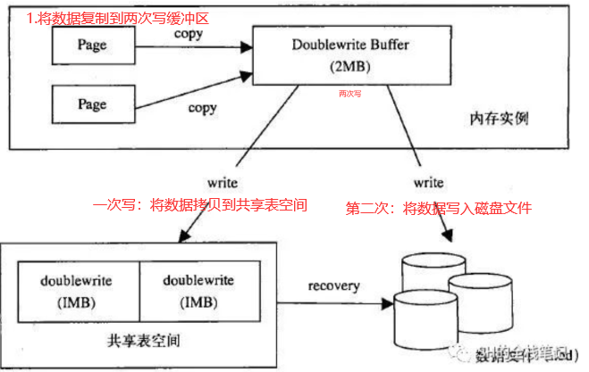

# 一、MYSQL

## **1.MYSQL的索引**

### 1.1 概述

```mysql
1)索引是存储引擎快速查找记录的一种数据结构，在存储引擎中实现;
2)使用索引的主要目的就是优化查询速度;
3)索引中存储对数据表中所有记录的引用指针,索引以文件的形式存储在磁盘中。
### 优势
# 1.提高语句查询效率，减少IO操作次数；
# 2.索引列会进行排序，使用分组和排序子句查询时，可以显著减少查询时间
### 缺点
# 1.索引文件需要占用物理空间
# 2.创建和维护索引比较耗时
# 3.索引需要动态维护，会降低数据更新效率
```

### 1.2 分类

```MYSQL
1.单列索引：
    普通索引:允许空值 & 重复值
    唯一索引:允许空值 & 不可重复
    主键索引:不允许空值 & 唯一
2.组合索引：在表中的多个字段上创建索引，遵循最左前缀原则；
## MyIsam引擎支持
3.全文索引：MyIsam引擎中使用，只能在 char,varchar,text 字段类型上使用。
4.空间索引：MySQL 在 5.7 之后的版本支持了空间索引
## Memory引擎支持
5.哈希索引：基于哈希表实现【无法用于排序、不支持部分索引匹配、不支持范围查找】
6.覆盖索引：可以避免二级索引的回表查询。【覆盖是指查询的字段都是索引字段】
```

### 1.3 索引内存模型

#### 1.3.1 哈希表

```mysql
以键值对存储数据的结构。
	key 用于存储索引列；
	value 就是某行的数据或者是它的磁盘地址。
## 底层结构：数组 + 链表实现
## 存在问题
# 无法用于排序、不支持部分索引匹配、不支持范围查找
```

#### 1.3.2 有序数组

```mysql
主要解决区间查询慢的问题，适用于存储不经常变动的数据,新增数据的成本太高。
## 底层主要通过二分查找来提高查询效率。
```

#### 1.3.3  B树

```mysql
思想 : 通过减少树的高度，来减少磁盘的访问次数，通过扩展树的分支来降低树的高度，从而提高查询效率。
说明：
	InnoDB 存储引擎一次IO会读取一页(默认16k)数据，二叉树一次IO有效数据量为只有16个字节，空间利用率极低，为最大化利用一次IO空间，考虑在一个节点尽可能多的存储元素。根据页大小 & 一次IO的字节数 （ 16k / 16 = 1000）==>每个节点可以存储1000个索引。这样一来，1百万条数据只需要2层就可存储（只需要2次操作就可以查询到全部数据）
### 存在问题
# 1.叶子节点无指针相连，范围查询时会增加磁盘的IO次数，查询效率低。【范围查找过程为:从根节点开始先查找左边界，再从根节点开始查找右边界】
# 2.如果data存储的是行记录，行所占空间会随着列数的增多而变大，因为页大小固定，此时，一个页中可存储的数据量会变少，树会变高，IO次数会增多，效率变低。
```

#### 1.3.4 B+ 树

```mysql
与B Tree有两点不同：
1）B+ Tree的非叶子节点不存放数据，只存放键值；B Tree叶子 & 非叶子节点都存放数据
2）B+ Tree的叶子节点之间通过双向指针相连，构成双向有序链表。
### 存在疑问：B+ Tree的数据都存在于叶子节点，只有遍历到叶子节点才能查出数据，而B Tree 不需要遍历到叶子节点就可以查询到数据，效率不是变慢了吗？
### 解答：B+ 树非叶子节点只存储键值，键所需存储空间比数据少的多，在页大小固定的情况下，每个节点就可以存储更多的索引，此时，索引树的高度会降低，磁盘IO操作变少，查询效率会有所提高。**
```

### **<font color = yellow> 1.4 MYSQL 索引是如何执行的</font>**

#### 1.4.1 聚簇索引（主键索引、一级索引）

```mysql
使用B+ Tree构建,叶子节点存储数据表的某一行数据。当表没有创建主键索引时,Innodb引擎会自动创建row_id作为数据表的主键索引。
```

**存储结构**


**索引查找执行流程：<font color = yellow>可以利用叶子节点之间构建的双向有序链表提高效率</font>**


#### 1.4.2 非聚簇索引（二级索引、辅助索引、普通索引）

```mysql
使用B+ Tree构建,叶子节点 & 非叶子节点均存储键值，需要进行‘回表’查询【可以通过覆盖索引来避免回表查询】。
```

**存储结构**


**查找流程：<font color = yellow>需要进行回表查询</font>**


### 1.5 索引建立规则 & 失效条件

#### 1.5.1 建立规则

```mysql
### 表选择：查询频次高且数据量大的表建立索引;
### 字段选择：从where子句、Order by的条件中提取;
### 合适的索引顺序：选择性（不重复记录/总记录）越高，查询效率越高;
```

#### 1.5.2 失效条件

```mysql
1.like语句：以 '%' 或者 '-'开头匹配的字段不会使用索引,以'%'结尾的会使用索引;
2.全部索引,但索引键之间不是 AND 操作;
3.部分索引,但违反最左前缀原则;
4.反向查询【<>,not in,doesn`t exists】;
5.索引列上进行函数操作、运算操作;
6.范围查询,右边索引失效
```

## **2.MYSQL事务**

### 2.1  概念 & 特性

```MYSQL 
1.事务是什么？
	1）一组数据操作，要么全部成功、要么全部失败。一部分操作失败时，会回滚所有操作。
	2）事务在引擎层实现。 Innodb 引擎支持、MyIsam不支持。
2.ACID特性
	1）原子性(Atomicity)：事务开始后所有操作，要么全部做完，要么全部不做。
	2）一致性(Consistency):事务开始前和结束后，数据库的完整性约束没有被破坏。
	3）隔离性(Isolation):同一时间，只允许一个事务请求同一数据，不同的事务之间彼此没有任何干扰。
	4) 持久性(Durability):事务完成后，事务对数据库的所有更新将被保存到数据库，不能回滚。
```

### 	2.2 并发问题

```mysql
1.脏读：事务 A 读取了事务 B 更新的数据，然后 B 进行了回滚，那么 A 读取到的数据是脏数据。
2.不可重复读(数据更新导致)：事务 A 多次读取同一数据，事务 B 在事务 A 多次读取的过程中，对数据作了更新并提交，导致事务 A 多次读取同一数据时，结果不一致。
3.幻读(数据增加、删除导致)：事务 A 将数据库中所有学生的成绩从具体分数改为 ABCDE 等级, 事务 B 就在这个时候插入了一条记录，事务 A 修改结束后发现还有一条记录没有改过来，就好像发生了幻觉一样，这就叫幻读。
```

### 2.3 隔离级别----解决并发问题

|                         事务隔离级别                         | 脏读  | 不可重复读 | 幻读  |
| :----------------------------------------------------------: | :---: | :--------: | :---: |
|                **读未提交(Read-Uncommited)**                 | **√** |   **√**    | **√** |
|                 **读提交（Read-Commited）**                  | **×** |   **√**    | **√** |
| **可重复读（Repeatable-Read）<font color = red >默认级别</font>** | **×** |   **×**    | **√** |
|                  **串行化（Serializable）**                  | **×** |   **×**    | **×** |

### 2.4 设置事务隔离级别

```mysql
### 1.查看事务隔离级别
    # 5.7.20之前
    show variables like 'transaction_isolation';
    # 5.7.20及之后
    show variables like 'tx_isolation';
### 2. 设置隔离级别
	# set [作用域] transaction isolation level [隔离级别]：设置全局隔离级别为‘读提交’
	set global transaction isolation level read committed; 
### 3.启动事务
	# 1）显式启动【一致性视图在执行第一个快照读时创建】
	start / begin transaction;    #开启事务,执行到第一条sql语句时，事务才真正启动。
	update student set name = '张三' where id = 2; #执行操作
	commit;                       #提交事务
	# 2）set autocommit = 0 : 关闭事务的自动提交，执行sql语句时会启动事务，直到commit / rollback
	# 3) set autocommit = 1 : 开启事务的自动提交，执行单个sql语句时会启动 & 提交事务；多个语句需要手动开启 & 提交事务。
	# 4）start transaction with consistent snapshot:立刻启动事务。
```

### 2.5 隔离级别的实现原理（MVCC + 行锁 + undo log ）

#### 2.5.1 MVCC 多版本并发控制

##### 1. 概述

```mysql
1.概念：MVCC 使得数据库读不会对数据加锁，普通的 SELECT 请求不会加锁，提高了数据库的并发处理能力；数据库写才会加锁。
2.说明：MVCC 只能实现 Repeatable Read & Read Committed 两种隔离级别. Read uncommitted 总是读取最新行，不符合当前事务版本的数据行; Serializable 会对所有读取的行加锁。
2.实现原理：在每行记录后面保存两个隐藏的列（trx_id,roll_ptr）来实现MVCC
    1） Innodb 的每个事务都有一个唯一的事务ID,记为 transaction_id,在事务开始时向 Innodb 引擎申请,按照时间先后严格递增。
    2） 依赖于 undo log,每行数据都存在多个版本。
    	a.每次事务更新数据会生成一个新的数据版本(trx_id),并将 transaction_id = trx_id;
    	b.将旧的数据版本保留在 undo log 中，而且通过 回滚指针roll_ptr 链接前一个版本。
```

##### 2. Undo Log

```mysql
### insert undo log
1) insert 操作产生的 undo log;
2) insert 操作没有历史版本，只对当前事务本身可见，对其他事务此记录不可见,insert undo log在事务提交后直接删除，不需要进行 purge 操作。
	# purge 操作：将数据库中已经 mark del 的数据删除，另外也会批量回收 undo pages
### update undo log
1) UPDATE 和 DELETE 操作产生的 Undo log;
2) update 可以视为 insert 新数据到原位置，delete 旧数据，undo log 暂时保留旧数据.
```

##### 3. Read-View（一致性视图）

```mysql
### 说明：
1) Innodb 在实现MVCC时用到的 一致性视图，用于支持 RC & RR 隔离级别的实现；
2) 不真实存在,通过 undo log 体现，作用是决定事务能够看到哪些数据。【主要包含当前系统中还未提交的读写事务】
3) 每个事务或语句都有自己的一致性视图。普通查询语句是一致性读，一致性读会根据 trx_id 和一致性视图确定数据版本的可见性。
```

###### 数据版本可见性解决方案

```mysql
### 说明：把系统中已提交的事务 ID 的最大值记为数组的低水位（low_id），已创建过的事务 ID + 1 记为高水位(up_id)。视图数组 & 高水位 组成当前事务的一致性视图（read-view）
### 可见性规则：
1) trx_id < low_id:表示生成该版本的事务在生成 read view 前已经提交，所以该版本可见，可以被当前事务访问;
2) trx_id > up_id：表示生成该版本的事务在生成 read view 后才生成，所以该版本不可见，不能被当前事务访问;
3) low_id <= trx_id <= up_id : 存在两种情况
	a) trx_id 在视图数组中，证明这个版本是由还未提交的事务生成的，不可见
	b) trx_id 不在视图数组中，证明这个版本是由已提交的事务生成的，可见	
### 注释：视图是否可见，主要看创建视图 & 提交事务的时机
```


## **3.MYSQL锁**


### 3.1 全局锁

**<font color = red>注释：</font><font color = yellow>InnoDB引擎中，可使用事务RR隔离级别代替</font>**

#### 3.1.1 概念 & 语法

```mysql
全局锁是对整个数据库实例加锁，让其处于只读状态。加全局锁后，DML & DDL 等操作将被阻塞。
### 实现(FTWRL)
Flush tables with read lock
### 解除只读状态
unlock tables
```

#### 3.1.2 应用场景

```mysql
全库逻辑备份：将数据库的所有表 select 出来存储为文本。 【FTWRL定时备份 + binLog恢复增量数据】
数据库处于只读状态，会存在两个问题：
	1）主库备份：备份期间数据不能写入，业务会受影响；
	2）从库备份：备份期间不能执行主库同步过来的 binlog,会导致主从延迟，业务会受影响。
```

#### 3.1.3 为什么要加锁？

```MYSQL
不加锁的话，会导致备份所得到的库，与开始备份的库，不是同一个逻辑时间点。【在备份的过程中，有新的数据插入、删除或更新，导致主从不一致】
```

#### 3.1.4 使用readonly = 1 的方式使全库只读是否可行？

```mysql
### sql 设置全库只读，不能使用
set global read_only = 1;
### 设置全库只读存在问题：
	1) 影响业务逻辑：在读写分离场景下，该语句可能会用于一些业务判断；
	2）异常时不释放状态：FTRWL 命令在异常发生时，会自动释放全局锁；set global read_only = 1 异常时，会一直保持只读状态。
	3）该命令对超级管理员无效。若在备份期间，超管更新数据，会导致数据不一致问题。
```

### 3.2 表级锁

#### 3.2.1 表锁

```mysql 
###  语法 
# 加锁
lock tables t1 read / write,t2 read / write;
# 释放锁
unlock tables;
```

#### 3.2.2 元数据锁（MDL）

```mysql
### 说明： 隐式使用，访问表时(执行语句时加锁,事务提交后释放)系统会加上，MYSQL5.5 版本引入;
### 主要作用： 防止DDL(修改表结构) & DML（CRUD表数据）并发的冲突。
### 实现逻辑：
	1.对 DML(增删改查) 操作，加MDL读锁;
	2.对 DDL 操作，加MDL写锁;
1)读读不互斥：可以多线程对一张表增删改查;
2)读写 & 写写互斥：保证对表结构操作时，只能有一个线程，其他线程阻塞。
```

### 3.3 行锁

```mysql
### 概念：行锁就是针对表中行记录的锁(锁定的是索引),可能会出现死锁。
### 说明：
	1)在存储引擎中实现;
	2)事务A先更新一行，同时事务B也要更新同一行，则事务B必须等待事务A操作完成后才能进行更新。
```

#### 3.3.1 两段锁协议

```mysql
### 两段锁协议：分为加锁 & 释放锁阶段，所有的lock操作都在unlock之后。
### 说明：
	1）根据两段锁协议，对于高并发的行记录操作应该尽可能安排到最后面，以减少行锁的等待时间，提高系统并发性能。
	2）释放锁发生在事务提交之后。
```

#### 3.3.2 Gap锁& Next key锁

```mysql
1.next Key锁:同时锁住记录(数据)，并且锁住记录前面的Gap; --- 解决幻读的问题
2.Gap 锁:不锁记录，仅仅记录前面的Gap;  ---- 防止同一事务的两次当前读，出现幻读的情况。
3.Record 锁:锁数据，不锁Gap;
** next Key = Gap + Record ** 
```

#### 3.3.3 死锁


```mysql
### 概念：不同线程出现循环资源等待，涉及的线程都在等待其他线程释放资源，会导致这几个线程进入无线等待的状态，成为死锁。
### 产生原因：一个线程访问了表A的某一行记录r1,然后访问表B的记录r2;另一个线程B访问表B的记录r2,又企图访问表A的记录r1,这时线程A & 线程B会相互等待对方释放资源,形成死锁。
```

#### 3.3.4 如何解决死锁？

##### 1. 加入等待时间

```mysql
### 设置超时时间参数
set global innodb_lock_wait_timeout = 500;
### 思想:直接进入等待，直到超时。
### 存在问题：超时时间无法确定
```

##### 2. 检测死锁，主动回滚事务

```mysql
### 设置开启死锁检测
set global innodb_deadlock_detect = on;
### 思想：循环依赖检测，判断是否存在死锁
### 存在问题：在检测死锁期间，会消耗大量的CPU资源。
```

##### 3.解决热点行更新问题

```mysql
通过控制服务端的并发度（限流），来减少死锁检测的CPU压力。
```

## **4.MYSQL引擎**

### 4.1 四个特性

#### 4.1.1 插入缓存

```mysql
### 作用：减少IO交互，提高插入性能
### 使用条件：
	非聚集索引 & 非唯一索引 
	原因：避免读取索引页，如果是唯一索引，在插入时需要判断记录是否唯一。
### 实现原理：对于满足插入条件的记录，每一次的插入不是在索引页中
	1.先判断插入的辅助索引页是否在buffer pool中，如果在直接插入;
	2.若不在，先放入插入缓存，在按照"一定频率"进行合并操作【将多个插入操作合并为一个操作，减少随机IO带来的性能消耗】，再写回磁盘。
	"一定频率"：
		① 辅助索引页没有可用空间(空间小于1/32 页大小),强制合并;
		② master thread 每 1s/每 10s 合并一次;
```

#### 4.1.2 二次写



```mysql
### 作用：提高数据可靠性
### 实现原理：对缓冲池脏页进行刷新时,
	1.先将脏页复制到内存中的doublewrite buffer中;
	2.再将doublewrite buffer中的页先写入磁盘的'共享表空间',再写入'磁盘文件'中
### 写失效 & 部分写失效
	写失效：数据还在缓冲池中时，服务器宕机【'解决方案'：通过redo log恢复】;
	部分写失效：数据从缓冲池向磁盘刷新时，服务器宕机【'解决方案'：从共享表空间中找到备份并覆盖原来的数据,再利用redo log 恢复】
```

#### 4.1.3 自适应哈希索引

```mysql
### 作用：提高访问速度
### 实现原理：Innodb监控对所有索引的查询，对热点访问的页建立哈希索引，提高访问速度【不支持范围查询，不支持排序】
```

#### 4.1.4 预读

```mysql
### 作用：提高访问性能
### 实现原理：提前将下一次可能要读取的数据页放入缓冲池。
```

### 4.2  缓冲池


```mysql
1.查询请求：查询的数据缓冲池中没有，去磁盘中查找，并将匹配的数据放入缓存池中；
2.修改请求：MySQL 不会直接去修改磁盘，先修改已经在缓冲池页中的数据，然后将数据刷回磁盘。
```

#### 4.2.1 缓存池的作用

```mysql
由于CPU的处理速度和磁盘的IO速度之间差距太大，为提高整体效率，InnoDB向操作系统[本质：申请的一段连续的内存空间]，作为缓冲池。
```

#### 4.2.2 缓存池的结构

```mysql
内部主要通过链表实现：
    Free List：存储未被使用的页节点，若FreeList不够用，需要从LRU/FLU List上淘汰一定的节点；
    LRU List：存储新读取的数据页
    FLU List: 存储脏页（被修改过，还未刷新到磁盘上的页）
	Quick List: 存储带有Hint的SQL语句用到的数据页，SQL语句结束就淘汰对应的页。
```

#### 4.2.2 存在问题：缓冲池污染 & 预读失效

```mysql
1.缓冲池污染
    概念:当SQL语句要批量扫描大量数据时（只访问一次），可能会把缓冲池中所有页都替换出去，会导致大量热数据页被换出，MySQL性能急剧下降。
    解决方案：新老生代改进版LRU+“老生代停留时间窗口”T 机制
2.预读失效
    概念：预读（Read-Ahead）时,提前将页放入缓冲池，但最终Mysql并没有从预读页中读取数据；
    解决思路：
        让预读失败的页，停留在缓冲池LRU里的时间尽可能短
        让真正被读取的页，挪到缓冲池LRU的头部【保证真正被读取的热数据留在缓冲池的时间尽可能长】
```

## **5.MYSQL日志**

### 5.1 事务日志 redo log<font color = red>（引擎层面）</font>

#### 5.1.1 为什么需要redo log?

```mysql
### 存在问题：如果每一次更新都要写入磁盘，会带来严重的性能问题。
	1.Innodb 是以页为单位进行磁盘交互的,一个事务有可能只修改了一个数据页中的几个字节,这时将整页刷到磁盘，比较浪费资源;
	2.一个事务可能涉及修改多个物理上不连续的数据页,随机IO写入性能太差。
### Innodb 采用write-ahead log(日志先行)的策略更新数据,先写redo log,再写磁盘
	1.有记录更新时,Innodb 先把记录写到 redo log 中，并更新内存中(redo log buffer)数据页（更新完成）;
	2.后台线程会把操作记录异步更新到磁盘的数据页 redo log file。
### redo log 的优势在于：将全局的随机IO,变换为局部的顺序写,从而提高效率。
```

#### 5.1.2 redo log的写入过程


```mysql
### Redo log 包含两部分：内存中的Redo log buffer & 磁盘中的 redo log file
### DML语句执行过程：
	1.先将更新记录写入 redo log buffer;
	2.再将redo log buffer的记录,在后续一次性写入redo log file中。
	## 说明：用户空间下的缓冲区数据无法直接写入磁盘，需要通过内核空间缓冲区(OS Buffer)
	redo log buffer ---> OS Buffer ----> redo log file
```

**redo log file的不同写入时机**

```mysql
### 设置写入时机
set global innodb_flush_log_at_trx_commit = 0(延迟写)/1(实时写,实时刷新)/2(实时写,延时刷新)
```


**redo log file的结构**


#### 5.1.3 redo log 的两阶段提交(Prepare & Commit)

**两阶段提交就是让 redo log 和 binlog 表示事务的提交状态的逻辑保持一致。**


```mysql
例子: update T set c=c+1 where ID=2;
假设表的当前 ID=2 的行，字段 c 的值是 0，再假设执行 update 语句过程中在写完第一个日志后，第二个日志还没有写完的期间发生了 crash，会出现什么情况呢？

### 先写 redo log 后写 binlog
假设在 redo log 写完，binlog 还没有写完的时候，MySQL 进程异常重启。由于我们前面说过的，redo log 写完之后，系统即使崩溃，仍然能够把数据恢复回来，所以恢复后这一行 c 的值是 1。但是由于 binlog 没写完就 crash 了，这时候 binlog 里面就没有记录这个语句。因此，之后备份日志的时候，存起来的 binlog 里面就没有这条语句。然后你会发现，如果需要用这个 binlog 来恢复临时库的话，由于这个语句的 binlog 丢失，这个临时库就会少了这一次更新，恢复出来的这一行 c 的值就是 0，与原库的值不同。
### 先写 binlog 后写 redo log
如果在 binlog 写完之后 crash，由于 redo log 还没写，崩溃恢复以后这个事务无效，所以这一行 c 的值是 0。但是 binlog 里面已经记录了“把 c 从 0 改成 1”这个日志。所以，在之后用 binlog 来恢复的时候就多了一个事务出来，恢复出来的这一行 c 的值就是 1，与原库的值不同。
```

### 5.2 归档 日志 binLog<font color = red>（Server层面）</font>

#### 5.2.1  bin log 日志格式

```mysql
### 三种格式：STATMENT、ROW & MIXED
1.STATMENT：每一条会修改数据的 sql 语句会记录到 binlog 中;
2.ROW：不记录 sql 的上下文信息，仅需记录哪条数据被修改。记两条，更新前和更新后都有;
3.MIXED：前两种模式的混合，一般的复制使用 STATEMENT 模式保存 binlog ，对于 STATEMENT 模式无法复制的操作使用 ROW 模式保存 binlog。
```

#### 5.2.2 bin log 适合做crash-save吗？

```mysql
### 通过加入checkpoint实现,数据库故障重启后,binlog checkpoint之后的sql都会重放一遍。【可以做，但是不适合做】
### 原因：
	binlog 是追加写,crash不能判定binlog中哪些内容已经写入磁盘，哪些未被写入，导致重复写入，出现 duplicate key;
	redolog 是循环写,从checkpoint - write pos 间的内容都是未写入磁盘的。
```

#### 5.2.3 bin log 应用场景

```mysql
### 1.主从复制：在master 端开启binlog,将其发送到各个slave端,slave重放binlog 实现主从数据的一致性。
### 2.数据恢复：使用mysqlbinlog工具来恢复数据。
```

### 5.3 binLog & redo Log

```mysql
1.redo log 是 Innodb 引擎特有的;binlog 是 MySQL 的 Server 层实现的，所有引擎都可以使用。
2.redo log 是物理日志，记录的是在某个数据页上做了什么修改;binlog 是逻辑日志，记录的是这个语句的原始逻辑，比如 **"给 ID=2 这一行的 age 字段加 1"**。
3.redo log 是循环写的，空间固定会用完；binlog 是可以追加写入的。追加写是指 binlog 文件写到一定大小后会切换到下一个，并不会覆盖以前的日志。
```

## **6.SQL优化**

### 6.1 Explain

**<font color = red>作用:查看SQL语句的执行计划</font>**

```mysql
1.是否使用了索引;
2.是否做了全表扫描;
3.是否进行了回表查询;
```

**explain关键字段**


**1) id & select_type**

```mysql
### 说明：查询的类型，主要用于区别普通查询、联合查询、子查询等复杂查询。
```


**2）TYPE **

```mysql
### 说明：访问类型（重要指标）,一般得保证查询至少达到range级别，最好能达到const。
```

| TYPE      | 说明                                                         |
| :-------- | ------------------------------------------------------------ |
| All       | 最坏情况，全表扫描                                           |
| Index     | 扫描索引树，通常比All速度快                                  |
| **range** | **使用一个索引来检索给定范围的行，范围扫描通常出现在in()、between、>、<、>=等范围操作中。** |
| ref       | 不使用唯一索引，而是使用普通索引、唯一性索引的部分前缀和某个值比较，可能会找到多个符合条件的行 |
| eq_ref    | primary key 或 unique key 索引的所有部分被连接使用 ，最多只会返回一条符合条件的记录。这可能是在 const 之外最好的联接类型了 |
| **const** | **表示通过索引一次就找到了, const用于比较primary key或者unique索引。因为只匹配一行数据，所以很快。** |
| system    | 表中只有一条数据. 这个类型是特殊的 `const` 类型              |

**3）possible_keys & key & key_len**

```mysql
1.possible_keys：查询过程中，可能会用到得的索引;
2.key:Mysql当前查询时，真正用到的索引;
3.key_len:表示索引中使用的字节数，可通过该列计算查询中使用的索引的长度，key_len显示的值为索引字段的最大可能长度，并非实际使用长度【根据表定义计算】
```

**4）rows:表示mysql估计要读取 & 检测的行数，衡量标准，越少越好<font color = yellow>（不是结果集里的行数）</font>**

**5）Extra **

| 类型            | 说明                                                         |
| --------------- | ------------------------------------------------------------ |
| Using temporary | 查询时使用临时表，一般出现在排序、分组和多表join的情况。<font color = yellow>(效率不高，建议优化)</font> |
| Using index     | "覆盖索引扫描"，查询索引树即可找到所需数据，不用扫描表数据文件。<font color = yellow>(性能不错)</font> |
| Using filesort  | 表示 MySQL 需额外的排序操作, 不能通过索引顺序达到排序效果。<font color = yellow>(比较消耗CPU资源，建议优化)</font> |
| Using where     | 使用了WHERE从句来限制哪些行将与下一张表匹配或者是返回给用户。<font color = yellow>(将存储引擎数据返回服务层以后，再应用Where条件过滤)</font> |

## **7.主从复制**

### 7.1 概述

```mysql
### 概念
	将一个主库 master 服务器的数据同步到多台从库 slave 上,保持主从一致。
### 主要作用
	1.数据分布和备份;
	2.负载均衡：读写分离将读负载到多台从库中;
	3.高可用性和故障切换：利用主从复制实现;
	4.提高数据库的并发性能。
### 实现原理
	在主库上记录二进制日志（binLog），在备库上重放日志（relay_log），实现异步数据复制。
### 复制方式
	1.基于行的复制【物理复制】;
	2.基于语句的复制【逻辑复制】;---SQL语句,binlog 
### 衡量标准 QPS & TPS
	TPS(Transactions Per Second)：服务器每秒处理的事务数;
	QPS(Queries Per Second):服务器每秒能够查询的次数,是服务器在规定时间内处理流量多少的衡量标准.
```

### 7.2 复制原理详解


```mysql
### 复制步骤
1.将 Master主库上的数据更改记录(insert,update,delete),按顺序写入二进制日志(binlog)中【提交事务之前，按照事务的提交顺序将更新记录写入日志中，然后提交事务】;
2.slave从库连接 Master主库,Master 主库创建与 slave从库数量相等的 binlog dump 线程;
3.当 Master主库的 binlog发生变化时,binlog dump 线程会通知所有的 slave从库，将相应的 binlog内容推送到 slave从库中;
4.slave从库的 I/O 线程将接收的 binlog内容，写入本地的中继日志(relay-log);
5.slave从库的 SQL线程读取I/O线程写入的relay-log,对 slave从库进行更新【单线程,实现数据更新】。
```

### 7.3 存在问题及解决方案

#### 7.3.1 高并发时，同步延时问题

```mysql
### 发生原因
	高并发时,主库的 binlog是多线程写入的,而从库的 SQL线程进行数据更新时是单线程串行执行的，导致从库 SQL线程处理速度跟不上主库的写入速度【生产者比消费者快，消息积压，数据同步延时】
### 解决方案：并行复制【多线程复制multi-threaded slave】（Mysql5.6开始支持）
	从库开启多个 SQL线程，并行读取relay log中不同库的日志,然后重放。【实现库级别的并行】
```

#### 7.3.2 主机宕机，数据丢失问题


```mysql
### 发生原因
	主库突然宕机,此时主库的 binlog(更新记录)还未同步到从库，从而出现主库更新的数据未同步到从库，导致数据丢失。
### 解决方案：半同步复制【semi-sync】
	1.异步复制（mysql默认）：主库将事件写入 binlog后立即将结果返回客户端，不关心从库是否已经获取和处理日志;
	2.全同步复制：当主库执行完一个事务，且等待所有从库都执行了该事务才将结果返回给客户端。【性能低】;
	3.半同步复制（semi_sync）:主库执行完提交事务后，不会立刻返回结果，而是等待至少一个从库接收 binlog并写到本地relay log中【会发送给主库确认ack标记】,主库接收到至少一个从库的ack响应才返回给客户端结果【会产生一个TCP/IP RTT延时，最好在低延时网络中使用】
### 相关命令
	1.查看是否开启半同步复制：show variables like "have_dynamic_loading";
### 注意
	半同步复制时,当主库等待超时，会还原为异步复制，当至少有一个从库响应ack时，主库会恢复半同步复制。
```

## **8.高频面试题**

### 8.1主键自增问题

#### 8.1.1 自增主键为何不用varchar?

```mysql
UUID是 32个字符+4个'-'组成，长度为36,虽然UUID可以保证唯一性，但是有两个致命的缺点：
	1)UUID不是自增的，插入可能会导致页分裂，树高度增加，性能下降。
    MYSQL中索引的数据结构是B+树，这种数据结构的特点是索引树上的节点数据有序，如果使用UUID作为主键，每次插入数据时，因为无法保证每次产生的UUID有序，所以会出现新的UUID插入到索引树的中间去，频繁导致页分裂，使得性能下降。
    2)太占用内存。
    ① 字符串需要从前向后比较，字符串越长，性能就越差；
    ② 字符串比较占用内存，数据页的大小是固定的，主键越长，能存储的数量就越少，最终会导致索引树的高度越大，在索引搜索时发生磁盘IO的次数就越多，导致性能下降。
```

#### 8.1.2 自增ID用完了怎么处理？

**<font color = yellow>分两种情况讨论</font>**

> **1）声明了自增主键：报主键冲突错误**
>
> ```mysql
> 1）将主键类型修改为 bigint 类型,8 个字节（ 2 ^ 64 - 1位）。
> 2）一般情况下，数据量达到500万时就应该考虑分库分表。
> ```
>
> **2）未声明自增主键：新数据会覆盖旧数据**
>
> ```mysql 
> Innodb会自动创建一个不可见的、长度为6个字节的row_id(bigint unsigned类型);
> Innodb会维护了一个全局的dictsys.row_id,未定义主键的表都共享该row_id,插入一条数据，都会把row_id当成主键id,然后 +1。
> 
> 如果全局row_id一直涨，涨到 2 ^ 48 - 1时，这个时候再+1, row_id 的低48位都为0，在插入新一行数据时，拿到的row_id就为0，再插入时会覆盖之前的值。
> ```

------

# 二、Java基础

## 1.HashMap & ConcurrentHashMap

### **1.1 底层结构**

```java
"Map 相关参数"：
{
    //1.初始化容量：16
    static final int DEFAULT_INITIAL_CAPACITY = 1 << 4; 
    //2.最大容量：1073741824
    static final int MAXIMUM_CAPACITY = 1 << 30;
    //3.加载因子(扩容因子)：默认0.75
    static final float DEFAULT_LOAD_FACTOR = 0.75f;
    //4.当链表长度大于此值且容量大于 64 时，转换为红黑树结构
	static final int TREEIFY_THRESHOLD = 8;
    static final int MIN_TREEIFY_CAPACITY = 64;
    //5.转换链表的临界值，当元素小于此值时，会将红黑树结构转换成链表结构
    static final int UNTREEIFY_THRESHOLD = 6;
}
HashMap底层结构（JDK 1.7 & 1.8）
/**JDK 1.7版本：数组 + 链表**/
/**JDK 1.8版本：数组 + 链表 & 红黑树 **/
ConcurrentHashMap底层结构【JDK 1.7 & 1.8】
/**
JDK 1.7 : 
	1.实现原理：分段锁(Segment,继承于ReentrantLock) + HashEntry + 链表;
	2.参数说明：Segment
		1) 一个静态内部类;
		2) 默认为16个，即默认并发度为16;
		3) 由 volatile 修饰,保证多线程环境下的数据可见性。
	3.缺点：查询遍历链表的效率太低
JKD 1.8 : CAS + Synchronized + Node + 红黑树
	说明：
		1）为保证序列化时的兼容,内部仍然具有Segment的定义;
		2) 使用lazy-load形式来避免初始化开销;
	1.实现原理：CAS + Synchronized + volatile 
		1）使用volatile保证数据的可见性;
		2）使用CAS操作,在特定场景下进行无锁并发操作,提高并发性能;
		3）使用CAS + synchronized将锁粒度控制在table元素级别。
	2.sizeCtl参数：用于表初始化和调整大小
*/
```


### 1.3底层实现

#### 1.3.1 put()

```java 
1)调用 putVal() 添加元素;
2)判断 table 数组是否为空 || 长度为0：
     若为空：调用 resize()初始化数组;
	 若不为空：根据 key 计算 hash值【hashCode ^ hashCode >>> 16】,计算元素在 table 的下标 index = hash & (n-1),执行步骤 3);
3)判断 index 是否存在数据：
    index 位置不存在数据:构造Node节点,存入table[index];
    index 位置存在数据：执行步骤 4);
4)判断当前节点的key与待插入节点的key是否相等：
    若相等：更新该节点的value,并返回旧value;
	若不相等：执行步骤 5);
5)判断当前节点是否为红黑树节点：
    若是：执行步骤 6);
	若否：执行步骤 7);
6)调用 putTreeVal()方法将节点插入红黑树,判断节点数是否大于扩容阈值:
	若大于：调用 resize() 扩容 & 迁移元素;
7)遍历链表,根据key判断 更新 OR 插入节点,插入后判断节点数量是否大于建树阈值：
    若大于：将链表转为红黑树;
8)操作完成后,modCount+1,结束。
```


#### 1.3.2 resize()

```java
思想：重写规划长度和阈值，如果长度发生了变化，部分数据节点也要重新排列
重新规划长度：
    1)如果当前容量oldCap > 0 & 达到最大值，将阈值设为Integer的最大值，return终止扩容；
    2)如果未达到最大容量，当oldCap << 1 不超过最大容量时,就扩大2倍；
    3)如果都不满足且当前扩容阈值 oldThr > 0,使用当前扩容阈值作为新容量；
    4)否则将新容量置为初始容量16,新扩容阈值置为12。
重写排列数据节点：
    1)如果节点为null：不进行处理;
    2)如果节点不为null & 没有next节点，通过[节点的hash & (新容量-1)]计算出节点在table数组中的下标;
    3)如果节点为TreeNode类型，调用split方法处理，如果节点数hc达到6，调用untreeify方法转回链表;
    4)如果是链表节点，需要将链表拆分为[hash值超出旧容量 & hash值未超出旧容量]的链表，对于hash & oldCap == 0 的部分不做处理，否则将节点放在新下标的位置。[新下标 = 旧下标 + 旧容量]
```

### 1.4 HashMap线程不安全

```Java
1.数据丢失【JDK 1.7 & 1.8均存在】:
	①并发赋值被覆盖：两个线程同时修改同一个key,后一个的修改会覆盖前一个的修改;
	②已遍历区间新增元素丢失：在transfer迁移过程中，其他线程在已遍历区间的哈希槽中新增数据，遍历完成后，table数组引用指向newTable,新增元素丢失;
	③新表被覆盖:resize完成后，table = newTable,后续元素会在newTable上插入。如果多个线程同时resize,因为newTable是线程私有的局部变量，后面线程的newTable可能会覆盖之前线程的newTable,导致前一个线程在newTable上插入的元素被覆盖。
2.死循环【JDK 1.7存在,1.8不存在该问题】
     resize() 扩容时调用transfer方法转移元素时使用头插法，由于原table共享，若多个线程对next指针进行并发修改，其中某个线程还没有将table = newTable时，时间片用完，多线程就会陷入死循环。
```

## 2.HashMap & HashTable & ConcurrentHashMap

```java 
1.HashMap
	1) 实现了 Map接口;
	2) 允许键 和 值 为 null;
	3) 不允许重复键,允许重复值;
	4) 线程不安全。
2.HashTable
	1) 实现了Map接口;
	2) 不允许 键或值 为 null;
	3) 使用 synchronized 方法,实现线程安全;
3.ConcurrentHashMap：用于本地缓存。
	1) 满足高效 & 线程安全;
	2) 不允许 键 为 null;
	3) 通过分段锁Segment实现高并发 & 线程安全	
        原理：将Map分为N个Segment,对每一个Segment加锁
```

## **3. String & Stringbuilder & Stringbuffer**

```java
相同点：底层实现都是字符数组char[] values;
1.是否可变长： String 不可变[final 修饰],StringBuilder & StringBuffer 可变长;
2.线程安全性:  String 是常量[final 修饰]线程安全;StringBuffer 线程安全[synchronized 关键字修饰方法];StringBuilder 线程不安全[未用 synchronized 关键字修饰];
3.性能方面： StringBuilder > StringBuffer > String;

/**扩展：
	1.final & finally & finalize
		1)final 修饰类不可被继承,修饰属性不可变,修饰方法不可重写;
		2)finally 异常处理语句结构，表示总是执行;
		3)finalize 是 Object类的一个方法,在垃圾收集器执行时调用此方法回收对象。
*/
```

## 4. 接口与抽象类


```java
//1.概念
	接口：是一个抽象类型，是抽象方法的集合;【通过实现其抽象方法来实现该接口】
	抽象类：体现数据抽象的思想，是实现多态的一种机制【通过重写其方法来继承该抽象类】
//2.区别
    1.变量：
        接口的所有变量默认为final（ public static final varName）;
      	抽象类中可包含非 final 变量;
    2.方法：
        接口的所有方法默认为 public abstract,实现接口必须重写其全部抽象方法;
	    抽象类中可包含非抽象方法【自己实现的方法，继承它的子类可以忽略该方法】 & 修饰符可以是 public、protected、private;
    3.接口和抽象类都不能被实例化;
    4.JDK 1.8 之后,接口 & 抽象类都可以包含 static 方法,JDK 1.8之前接口中不能有 static 方法;
    5.一个类只能继承一个抽象类,可以实现多个接口;
//3.应用场景
  	1. 抽象类是对类本质的抽象(表达"is a"关系,如果B类是A,则A用抽象类); 接口是对行为的抽象(表达"like a"关系,如果B和A有某种关系,则A用接口);
	2.如果需要拥有自己的成员变量 和 非抽象方法,则用抽象类;接口中只能存在 static final 变量(一般不在接口中定义成员变量);
	3.为接口添加任何方法（抽象的），所有实现了这个接口的类，也必须实现新增的方法，否则会出现编译错误;对于抽象类，如果添加了非抽象方法，其子类却可以坐享其成，不必担心编译会出问题。
```

## 5.ArrayList & LinkedList 

```java
1. 底层实现：
    ArrayList 实现了 List & RandomAccess接口,且继承了AbstractList抽象类;底层是基于数组实现 & 支持动态扩容; 
    LinkedList 实现了 List & Deque 接口,且继承了AbstractSequentialList抽象类;底层基于双向链表实现。
2.关键参数:
	ArrayList:
        1)数据域为： transient Object[] elementData,size(实际大小)
        2)writeObject() & readObject() 完成序列化和反序列化。
    /**
    	疑问1：ArrayList通过实现Seralizable接口实现序列化，为什么数据域elementData 又不能序列化?
    	大概思路：
        1）ArrayList的扩容机制是：在添加元素时,发现数组容量已满，会重新开辟原始容量1.5倍的内存空间 & 将原始数组的元素复制到新分配的内存地址上，从而实现动态扩容;
        2) 这样一来,elementData数组是无法被填满的,闲置空间会随着元素数量增加,序列化时会耗费大量的时间来处理闲置空间。
    */
     LinkedList：
         transient int size, Node<E> first, Node<E> last;    
3.优势：
    ArrayList 支持随机访问[原因：实现了RandomAccess接口，通过索引方式访问],但插入和删除速度慢,适用于存储数据基本不变动的场景;
    LinkedList 插入和删除速度快，但不支持随机访问,适用于更新频繁的场景;内存利用率高 
```

## 6.浅拷贝 & 深拷贝

### 5.1 浅拷贝

**说明：对基本数据类型进行值传递，对引用数据类型进行引用地址的拷贝；**

```json
所复制对象的所有变量都含有与原来的对象相同的值，而所有的对其他对象的引用仍然指向原来的对象。
对象的"浅拷贝"会对“主”对象进行拷贝，但不会复制主对象里面的对象("引用的对象"-"会在主对象与其副本之间共享")
```


### 5.2 深拷贝

**说明：对基本数据类型进行值传递，对引用数据类型，创建一个新对象，并复制其内容。**

```json
深拷贝是一个整个独立的对象拷贝，深拷贝会拷贝所有的属性,并拷贝属性指向的动态分配的内存。当对象和它所引用的对象一起拷贝时即发生深拷贝。"深拷贝会把要复制的对象及其所引用的对象都复制一遍"。
```


------

# 三、并发编程

## 1.Java 锁

### 1.1谈谈Java锁

```java
锁的出现：并发编程中，当多个线程对同一个共享变量进行读写操作时，会产生数据不一致的问题，可以通过锁来解决；
锁的分类：锁可以按照不同的标准分为以下几类
	1)可重入锁 & 不可重入锁:同一线程在外层方法中获得锁，进入内层方法时会自动获取锁;
	2)乐观锁 & 悲观锁 ： 线程在处理共享数据时先不加锁，更新数据时判断是否需要加锁;
	3)独占锁 & 共享锁：锁一次是否只能被一个线程持有，若是：为独占锁（synchronized & ReentrantLock），否则为共享锁;
	4)自旋锁 & 适应性自旋锁
 		自旋锁：尝试获取锁的线程不会立即阻塞，会采用循环的方式重新尝试获取(默认自旋10次)；
         适应性自旋锁：自旋时间不固定，由前一次的自旋时间和锁的拥有者决定。如果在同一个锁上，通过自旋刚刚成功获取过锁且持有锁的线程正在运行，JVM会认为这次自旋很有可能成功，进而允许自旋持续更新，否则，直接放弃自旋，避免浪费资源。(经验值自旋)
```

#### 1.1.1 公平锁 & 非公平锁

```java
1.公平锁
    锁的获取顺序按照请求的绝对时间顺序（遵循FIFO原则），获取锁时会判断当前节点的是否有前驱节点，等待其释放锁后，才能获取锁。
    优势：所有的线程都能得到资源，不会饿死在队列中。
	缺点：系统吞吐量会下降很多，队列中除了第一个线程，其他线程都会阻塞,CPU唤醒阻塞线程的开销很大。
2.非公平锁
    多个线程获取锁时，会直接去尝试获取，获取不到时，再去等待队列。
    优势：减少CPU唤醒线程的开销，提高系统的吞吐量
    缺点：会导致队列中间的线程长时间获取不到锁，导致饿死。
```

#### 1.1.2 读写锁

```java
	维护一个读锁和写锁，通过分离读写操作来提高并发性，其实现依赖AQS(抽象队列同步器)，其读写状态就是同步器的同步状态【int变量的高16、低16位分别表示读和写线程状态】
	1.锁降级问题：保持当前写锁，再次获取读锁，随后再释放先前拥有的写锁。
    /*
    疑问:为什么不直接释放写锁，获取读锁？
    	保证数据的可见性【如果先释放写锁，假设此时另一个线程A获得写锁并修改了数据，当前线程无法感知线程A的数据更新】
    */
```

#### 1.1.3 锁升级

```java 
升级过程：无锁 --> 偏向锁 --> 轻量级锁 --> 重量级锁
    1.无锁(01 & 是否为偏向锁 = 0):未对资源进行锁定，所有线程都能访问并修改同一资源【修改操作在循环内执行，线程会不断尝试修改共享资源】，但只有一个线程能够修改成功；
    2.偏向锁(01 & 是否为偏向锁 = 1):同一段代码同时被一个线程访问，该线程会自动获取锁，降低获取锁的代价【不存在多线程竞争问题,JDK 6之后默认启用】【CAS实现】
    3.轻量级锁(00):当前锁为偏向锁 & 被另一个线程访问时，会升级为轻量级锁，另一个线程会通过自旋的方式尝试获取锁，不会阻塞，从而提高性能；【底层实现：CAS + 自旋】
    4.重量级锁(10):若当前只有一个线程等待，则该线程通过自旋等待，当自旋超过一定次数 || 此时有另一线程请求锁时，轻量级锁升级为重量级锁。
```

### 1.2 ReentrantLock & Synchronized

#### 1.2.1 谈谈Synchronized

```java
性质：一种互斥锁 & Java的关键字
1.修饰范围：
	1)实例方法：作用于当前对象实例加锁，进入同步代码前要获得当前实例对象的锁;
	2)静态方法：作用于当前类对象加锁，进入同步代码前要获得当前类对象的锁;
	3)代码块：指定加锁对象，对给定对象加锁，进入同步代码块前要获得给定对象的锁。
2.底层原理:
	1)代码块： synchronized 同步代码块使用 monitorenter & monitorexit 指令;
	2)方法： synchronized 同步方法使用 ACC_SYNCHRONIZED 标识，指明该方法是一个同步方法，JVM通过该标识辨别一个方法是否声明为同步方法，执行同步操作。
	/**
		无论锁定方法/代码块,对应的锁都是一个对象,对象由三部分组成【对象头、实例数据、对齐填充】
		对象头：Mark Word(记录对象的Hash,GC分代年龄,锁标志,偏向线程ID) + 类型指针
		每个对象都会有一个与之对应的monitor对象（记录当前持有锁的线程 & 等待锁的线程队列）
	*/
3.JDK 1.6的优化
     JDK 1.6 之前是重量级锁,线程进入同步代码块/方法时,monitor对象存储当前线程ID,设置Mark Word的monitor对象地址,并将阻塞的线程加入阻塞队列。加锁的依赖底层操作系统的mutex相关指令,存在用户态和内核态的切换,性能损耗明显。
	JDK 1.6之后引入偏向锁和轻量级锁在JVM层面实现加锁逻辑,通过自旋锁、适应性自旋锁、锁消除、锁粗化等技术来减少锁操作的开销。
```

#### 1.2.2谈谈ReentrantLock


```java 
1)底层通过AQS实现，使用共享资源volatile State作为同步状态变量; 
2)ReentrantLock通过调用AQS的getState、setState、CompareAndSetState三个方法来管理State同步状态，从而实现公平锁 & 非公平锁的lock & unlock;
3)实现Lock接口，并构造了三个内部类[继承自AQS的Sync类、继承自Sync的FairSync & NonfairSync,分别实现公平锁 & 非公平锁。
```

- **公平锁实现**

  ```Java
  1.获取状态state：
  	若state == 0:判断同步队列是否存在线程(节点)：
          若不存在，通过CAS 更新state状态[0-->1],并将当前线程设置为锁的所有者,返回true;
          若存在,返回false。
  	若state != 0:判断锁的所有者是不是当前线程：
          若是，则更新state状态[state + 1],返回true;
          若否，返回false。
  ```

  

- **非公平锁实现**

  ```java
  1)调用CAS设置state的值(0 --> 1)：
      设置成功：执行 setExclusiveOwnerThread() 方法将当前线程设置为锁的所有者；
      设置失败：代表锁被占用,执行 2);
  2)调用 acquire(1)方法：
      重写 tryAcquire(),内部调用 nonfairTryAcquire()-->执行 3);
  3)调用getState方法获取state的值( nonfairTryAcquire() 内部逻辑)：
      若state == 0:调用CAS设置state的值，并执行 setExclusiveOwnerThread()方法将当前线程设置为锁的所有者；
      若state != 0:判断占用锁的线程是否为当前线程：
      	若是：将 state + 1 并返回 true;
  	    若否：否则返回false,将线程加入同步队列等待。 
  ```
  
  

#### 1.2.3 比较Synchronized & ReentrantLock

```java
1)两者都是可重入锁，自己可以再次获取自己的内部锁；
2)synchronized 依赖于JVM;ReentrantLock依赖于API(JDK),需要通过lock & unlock方法配合try/finally语句块完成。
3)ReentrantLock 比 synchronized增加了一些高级功能：
    等待可中断：通过lock.lockInterruptibly()来实现【正在等待的线程可以选择放弃等待】；
    可实现公平锁；而 synchronized 是非公平的【原因：所有收到锁请求的线程⾸先⾃旋，如果通过⾃旋也没有获取锁将被放⼊ ContentionList，该做法对于已经进⼊队列的线程不公平。】
    可实现选择性通知（锁可以绑定多个条件）：线程对象可以注册到指定的Condition中，实现选择性的线程通知，在调度上更加灵活；
    
** 性能不是区分 synchronized & ReentrantLock的标准：JDK 1.6之前 synchronized 的吞吐量会随着线程数的增加而急剧下降，JDK 1.6之后，性能基本持平。**
```

#### 1.2.4 JDK 1.8中为什么使用synchronized 替换 可重入锁ReentrantLock?

```java
1.JDK 1.6中，对 synchronized 锁的实现引入了大量的优化 & 锁有多种状态,会从无锁->偏向锁->轻量级锁->重量级锁一步步转换。
2.减少内存开销。使用 ReentrantLock获得同步支持时，每个节点都需要通过继承 AQS 来获得同步支持，但并不是每个节点都需要获得同步支持的，只有链表（红黑树）的头节点需要同步，带来了巨大的内存浪费。
```

#### 1.2.5 JDK 1.6对synchronized的优化

```java 
1.适应性自旋锁
    自旋思想：让一个线程在请求一个共享数据的锁时执行忙循环（自旋）一段时间，如果在这段时间内能获得锁，可以避免进入阻塞状态。
    自适应自旋：若锁一直被其他线程占有，一直自旋会带来巨大CPU消耗,自适应时,锁自旋的次数不固定【由前一次在同一个锁上的自旋时间及锁的拥有者的状态决定】。
2.锁消除
    通过JIT的逃逸分析来消除一些没有在当前同步块以外被其他线程共享的数据的锁的保护【消除一些不可能存在竞争的锁】。
3.锁粗化
    将多个连续的锁扩展成一个范围更大的锁。
4.偏向锁【可重入】
    在无线程竞争的情况下避免在锁获取过程中执行不必要的CAS原子指令，减少锁申请的操作。
5.轻量级锁
    当存在锁竞争的情况下，执行 CAS 指令失败的线程将调用操作系统互斥锁进入到阻塞状态，当锁被释放的时候被唤醒。
```

## 2.AQS【FIFO队列 + State】

### 2.1 是什么？底层数据结构？如何使用？

```Java
1.概念：AQS(AbstractQueueSynchronizer,抽象队列同步器),是实现锁的框架。内部使用一个 volatile int state 变量作为共享资源,并通过CAS完成State的更新;
2.底层结构：AQS通过一个双向链表(FIFO队列CLH)实现,竞争资源的线程被封装在链表的Node节点。
    节点有四种状态:
		CANCELLED :线程已取消  1;
		SIGNAL：线程需要唤醒  -1;
		CONDITION：线程正在等待 -2;
		PROPAGATE：后继节点会传播唤醒操作，仅存在于共享模式  -3。
3.使用方式：在静态内部类中被继承（ReentrantLock、CountDownLatch、ReentrantReadWriteLock、Semaphore）并实现它的方法【 getState()、setState()、compareAndSetState()】来安全地管理同步状态。
```

### 2.2 AQS  &  锁

```java 
1.同步器是实现锁的关键，在锁的实现中聚合同步器，利用同步器实现锁的语义;
2.同步器面向锁的实现者，简化了锁的实现方式，屏蔽了同步状态管理、线程排队，等待与唤醒等底层操作;锁面向使用者，定义了使用者与锁交互的接口，隐藏实现细节。
```

### 2.3 独占模式 & 共享模式

```java
独占模式：同一时刻，锁只能被一个线程占用，其他线程只能等到持有锁的线程释放锁后才能获取锁【 acquire() & release() 获取、释放锁】
共享模式：同一时刻，锁可以被多个线程获取【 acquireShared() & releaseShared() 获取和释放锁】
```

### 2.4 源码分析

#### 2.4.1 独占获取锁

```Java
1.调用 tryAcquire() 安全地获取线程同步状态，获取失败的线程会被构造为同步节点并通过 addWaiter()加入同步队列尾部，并在队列中以自旋的方式获取锁;
2.调用 acquireQueued()：将获取失败的线程构造为同步节点并通过 addWaiter()加入同步队列尾部，并在同步队列中以死循环的形式（自旋）获取锁。（如果获取不到则阻塞【被阻塞线程的唤醒主要依靠前驱节点的出队或中断实现】，节点移出队列或停止自旋的条件是前驱节点是头结点 & 成功获取同步状态。）
/**
为什么只有前驱节点是头结点时才能尝试获取同步状态？
    1.维护同步队列的FIFO原则。节点和节点在循环检查过程中基本不通信，而是简单判断自己的前驱是否为头节点，使得节点的释放规则符合FIFO原则。
    2.便于对过早通知的处理。【过早通知：前驱节点不是头节点的线程由于中断被唤醒】
*/
```


#### 2.4.2 独占锁释放

```Java
1.同步器调用 tryRelease()释放同步状态;
2.调用 unparkSuccessor() 唤醒头结点的后继节点，使得后继节点重新尝试获得同步状态。
```


#### 2.4.3 共享锁获取

```java
1.调用 tryAcquireShared()尝试获取同步状态,返回值为int,不小于0表示可以获取同步状态;
2.可以获取时，调用 doAcquireShared()以自旋的方式获取同步状态，自旋过程中，当 tryAcquireShared>=0时退出自旋，成功获取。
```


#### 2.4.4 共享锁释放

```Java
1.调用 tryReleaseShared()确保同步状态的安全释放；
2.调用 doReleaseShared()释放同步状态，并唤醒后续处理等待状态的节点。
```


## 3.CAS

### 2.1  CAS实现原理？ABA问题及解决方案

```java
//1.实现原理
CAS底层是利用LOCK指令 & cmpxchg汇编指令来保证原子性的,LOCK指令会锁定内存总线,其他CPU的内存操作将会被阻塞。
本质都是调用 compareAndSwapInt(obj,offset,expect,update):如果obj的 value 和 except相等，就将其更新为update,若CAS未成功，就自旋CAS。
//2.ABA 问题及解决方案
ABA问题就是：线程读取时变量x的值为a,此时，另一个线程将变量x的值先变为b,又变回a,之后第一个线程对变量x进行CAS操作成功。
解决方案：atomic 包中的 AtomicStampedReference 通过添加版本号解决该问题。
```

### 2.2  源码分析（AtomicInteger）

1. **AtomicInteger.java，上层封装，由程序员直接进行调用。** 

   ```java
   //关键字段
   public class AtomicInteger extends Number implements java.io.Serializable {
   
       //Unsafe对象
       private static final Unsafe unsafe = Unsafe.getUnsafe();
       //地址偏移量：向对于对象首地址的地址偏移量
       private static final long valueOffset;
       
       //valueOffset赋值具体实现
       static {
           try {
               valueOffset = unsafe.objectFieldOffset
                   (AtomicInteger.class.getDeclaredField("value"));
           } catch (Exception ex) { throw new Error(ex); }
       }
       // 目标值
       private volatile int value;
       
       /*更新操作：
       	this:当前AtomicInteger对象,通过实例对象可以获得该对象在堆中的首地址，配合valueOffset可以获取value字段
       	valueOffset:偏移量
       	1：表示在当前值的基础上增加的值
       */
       public final int incrementAndGet() {
           return unsafe.getAndAddInt(this, valueOffset, 1) + 1;
       }
   }
   ```

2. **Unsafe.java，通过JNI（Java Native Interface，Java本地接口）对本地C代码“unsafe.cpp”进行调用。**

   ```java
   /*
       AtomicInteger实例对象 var1
       地址偏移量 var2 
       预期值 var4
       更新值 var5
   */
   public final int getAndAddInt(Object var1, long var2, int var4) {
       int var5;
       do {
           var5 = this.getIntVolatile(var1, var2);
       } while(!this.compareAndSwapInt(var1, var2, var5, var5 + var4));
       //compareAndSwapInt(var1, var2, var5, var5 + var4) 是本地方法，JVM通过JNI调用本地C程序实现CAS
       return var5;
   }
   ```

3. **unsafe.cpp，C++文件，内嵌汇编指令“cmpxchg指令”。** 

4. **汇编指令之“cmpxchg指令”，即compare and exchange，完成比较 · 并交换。**

##  4.多线程

### 4.1三种实现方式

```Java
1）继承Thread类，并重写其run()方法   
public class testThread extends Thread{
    @Override
    public void run(){
        //具体实现
    }
}
"使用":new TestThread().start();
2）实现Runnable接口,并重写其run()方法
public class testThread implements Runnable{
    @Override
    public void run(){
        //具体实现
    }
}
"使用":作为Thread的参数使用，new Thread(new TestThread1()).start();
3）实现Callable接口，并重写其call()方法【有返回值】
class TestThread2 implements Callable{
    @Override
    public Object call() throws Exception {
        System.out.println("实现Callable接口......");
        return null;
    }
}
"使用"：new FutureTask<Object>(new TestThread2()).run();
```

### 4.2为什么使用多线程

```json
程序中有很多操作时非常耗时的【数据库的读写、IO操作等】，如果使用单线程，程序就必须等这些操作完成后才能执行其他操作。使用多线程可以将耗时任务放在后台继续执行，同时执行其他操作，提高系统的性能及CPU的利用率。
```

### 4.3什么时候使用多线程

```Java
/**注意:多线程可以更加充分地利用CPU的资源,不会增加CPU的处理性能*/
是否使用多线程很大程度上取决于应用程序的类型;
多线程的应用场景：
    1）IO密集型任务：IO操作比较耗时，当程序在等待资源的过程中，可以使用多线程来执行其他操作，提高系统性能；
    2）并行任务：C/S架构中，服务器端可以通过并行任务来处理用户的请求，提高响应速度；
    3）多CPU系统中，可以使用多线程提高CPU的利用率；
```

### 4.4  线程间通信方式

```Java
Java并发采用'共享内存模型'进行线程通信,主要有以下几种：
    1.volatile 关键字：告知程序对任何变量的读需要从主内存中获取，写必须同步刷回主内存【store & write】,保证所有线程对变量访问的可见性。
    2.synchronized 关键字：确保多个线程在同一时刻只能处于一个同步方法/代码块中,保证线程对变量访问的原子性、可见性及有序性。
    3.等待通知机制：一个线程A调用了对象的 wait()进入等待状态，另一个线程B调用了对象的 notify/notifyAll方法，线程A收到通知后结束阻塞并执行后续操作。【wait & notify/notifyAll如同开关，完成等待方和通知方的交互】
    4.管道IO：线程间数据传输，媒介为内存。管道流默认使用一个1KB的循环缓冲数组。【输出流向缓冲区写入数据，输入流从缓冲区中读数据】【当数据空间满时，输出流线程阻塞；数组首次为空时，输入流线程阻塞。】
    5.ThreadLocal线程共享变量。为每个线程创建单独的副本，该副本线程私有，互相之间不影响。
```

### 4.5 ThreadLocal

#### 4.5.1 概述

```Java
1.线程共享变量，用于一个线程内跨类 & 跨方法传递数据;
2.含有静态内部类：ThreadLocalMap<Key:ThreadLocal对象,Value:Entry对象【只有一个Object类的value值,继承于弱引用】>
3.ThreadLocal线程共享，ThreadLocalMap线程私有。
```

#### 4.5.2 存在问题

```java 
1.线程复用产生脏数据：由于线程池会重用Thread对象，因此与Thread绑定的ThreadLocal也会被重用。【若没有调用remove清理线程相关的ThreadLocal信息，下一个线程没有调用set设置初始值就可能get到重用的线程信息】
2.存在内存泄漏：ThreadLocal是弱引用，Entry的value是强引用，当ThreadLocal被GC后，value依旧不会被释放【需要及时调用remove进行清理。】
```

#### 4.5.3 源码分析

```java 
//1.set方法
① 获取当前线程，获取当前线程对应的ThreadLocalMap类型的对象map;
	② map 存在：直接设置值，key是当前ThreadLocal对象，value是传入参数；
	③ map 不存在：通过 createMap()为当前线程创建一个ThreadLocalMap对象再设置值.
// 2.get方法
① 获取当前线程，获取当前线程对应的ThreadLocalMap类型的对象map;
	② map 存在：以当前ThreadLocal对象作为key 获取 Entry类型的对象 e ,如果 e 存在就返回其 value属性;
	③ map 不存在 || e 不存在：调用 setInitialValue()先为当前线程创建一个ThreadLocalMap对象然后返回默认的初始值null。
// 3.remove方法
①获取当前线程，获取当前线程对应的ThreadLocalMap类型的对象map;
	② 若 map 存在 ： 以当前ThreadLocal对象为key，解除key 与 对应value的关系。
```

## 5.线程池

### 5.1 优势

```java
1.JVM在HotSpot线程模式下，Java线程会一对一映射为内核线程，每次创建 & 回收线程都会去内核创建和回收，耗时且耗费资源,通过重复利用已创建的线程可以减少创建 & 销毁带来的消耗;
2.提高响应速度：任务达到时，不需要等待线程创建;
3.提高线程的可管理性：线程池统一分配，调优和监控线程;
4.实现任务线程队列的缓冲策略 & 拒绝机制。
```

### 5.2 核心参数

```java
七个：核心线程数、最大线程数、非核心线程的最大存活时间、空闲存活时间单位、工作队列、创建线程的工厂、饱和策略。
```

### 5.3 线程池类型

```Java
newCachedThreadPool:可缓存线程池【核心线程数为0，最大线程数为 Integer 的最大值，空闲存活时间为60s,无容量的同步队列】
newFixedThreadPool:固定工作线程数量线程池【核心与最大相等，无空闲存活时间，无界队列】
newScheduleThreadPool:定长定时周期线程池【最大线程数为 Integer 的最大值，无空闲存活时间，延迟队列】
newSingleThreadExecutor：单线程线程池【核心线程数 & 最大线程数 = 1，无空闲存活时间，无界队列】
newWorkStealingPool：创建持有足够线程的线程池支持给定的并行度，通过多个队列减少竞争【JDK 8 引入】
```

### 5.4  阻塞队列<存储等待执行的任务>

```Java
ArrayBlockingQueue：一个由数组结构组成的有界阻塞队列。
LinkedBlockingQueue：一个由链表结构组成的有界阻塞队列。
SynchronousQueue：一个不存储元素的阻塞队列，即直接提交给线程不保持它们。
PriorityBlockingQueue：一个支持优先级排序的无界阻塞队列。
DelayQueue：一个使用优先级队列实现的无界阻塞队列，只有在延迟期满时才能从中提取元素。
LinkedTransferQueue：一个由链表结构组成的无界阻塞队列。与SynchronousQueue类似，还含有非阻塞方法。
LinkedBlockingDeque：一个由链表结构组成的双向阻塞队列。
```

### 5.5  饱和策略

```java
AbortPolicy: 抛出异常(默认策略)
DiscardPolicy: 抛弃新提交任务
DiscardOldestPolicy: 抛弃队列中最老任务，将当前任务加入任务队列
CallerRunsPolicy: 将任务交于线程池调用的线程处理
```

### 5.6  创建线程池的方式

```java
1.通过Executors类提供的方法: (缺陷：一直创建线程,会导致资源耗尽)
	ExecutorService service = Executors.newCachedThreadPool();
2.通过ThreadPoolExecutor类自定义
    new ThreadPoolExecutor(10,10000,60, TimeUnit.SECONDS,new LinkedBlockingDeque<>());
```

### 5.7  线程池执行规则


```java
1.当线程数小于核心线程数时：创建线程;
2.当线程数大于等于核心线程数 & 任务队列未满时：将任务放入任务队列；
3.当线程数大于等于核心线程数 & 任务队列已满时：
	若线程数小于最大线程数，创建线程；
	若线程数等于最大线程数，抛出异常，拒绝任务<根据创建时的拒绝策略>。
```

# 四、JVM

# 五、设计模式

## **5.1 单例模式**

```java 
○ 饿汉式：在类加载时就初始化创建单例对象，线程安全，但不管是否使⽤都创建对象可能会浪费内存。
    public class HungrySingleton {

        private HungrySingleton(){}
        private static HungrySingleton instance = new HungrySingleton();

        public static HungrySingleton getInstance(){
            return instance;
        }
    }
○ 懒汉式：外部调用时才会加载，线程不安全，可以加锁保证安全性，但效率较低。
    public class lazySingleton {

        private lazySingleton(){}
        private static lazySingleton instance;

        public static lazySingleton getInstance(){
            if(instance == null){
                instance = new lazySingleton(); 
            }
            return instance;
        }
    }
○ 双重检测锁：使用volatile及多重检查来减小锁范围，提升效率
    public class DoubleCheckingSingleton {
        private DoubleCheckingSingleton(){}

        private volatile static DoubleCheckingSingleton instance;

        public static DoubleCheckingSingleton getInstance(){
            if(instance == null){
                synchronized (DoubleCheckingSingleton.class){
                    if(instance == null){
                        instance = new DoubleCheckingSingleton();
                    }
                }
            }
            return instance;
        }
    }
○ 静态内部类：解决饿汉的内存浪费和懒汉的线程不安全问题
    public class StaticSingleton {
        private StaticSingleton(){}


        public static StaticSingleton getInstance(){
            return StaticClass.instance;
        }

        private static StaticClass {
            private static final StaticSingleton instance = new StaticSingleton();
        }
    }

○ 枚举：Effective Java提倡方式，避免线程安全问题 & 防止反序列化重新创建新的对象 & 防止反射破解单例
    public enum EnumSingleton {
    INSTANCEOF;
}
```

## **5.2 职责链模式**

```java 
/**
 * 责任链模式（职责链模式）：
  优势：
     * 1.降低对象之间的耦合度
     * 2.增强系统的可扩展性
     * 3.增强对象指派职责的灵活性
     * 4.简化对象之间的连接
     * 5.责任分担
 *结构：
 *  抽象处理者Handler : 处理请求的接口，包含抽象处理方法和后继连接
 *  具体处理者Concrete Handler ：实现抽象处理者的处理方法，判断能否处理本次请求，如果可以处理请求则处理，否则将该请求转给它的后继者
 *  客户类 Client ： 创建处理链，并向链头的具体处理者提交请求，不关心处理细节。
 */
```

## **5.3  代理模式**

## **5.4  工厂模式**

## **5.5  模板模式**

```java
AQS使用模板设计模式实现
```

# 六、Spring

## **6.1 IOC & AOP**

### **6.1.1 IOC**

#### 1.概述

```java 
1.说明：将原本在程序中手动创建对象的控制权，交由Spring框架管理。其底层是使用ConcurrentHashMap存储的键值对，key为字符串，value为BeanDefination对象。
2.作用：解决对象管理 和 对象依赖的问题，将原本需要手动new的对象，交由Spring的IOC容器管理。
3.IOC容器：可以理解为一个对象工厂,我们将对象交给工厂管理【创建 & 关联】,需要使用时从工厂里面获取。
/**
疑问:本来可以new的对象,为什么交由Spring IOC 容器管理？
	实现对象的统一管理 && 降低对象间的耦合度。
*/
```

#### 2.容器初始化过程

```java 
1.Resource资源（BeanDefinition）定位
    ① 设置加载器：调用父容器的构造方法为容器设置好Bean资源加载器；
    ② 资源定位：调用父类的 setConfigLocation()设置Bean配置信息的定位路径。
2.BeanDefinition的载入和解析【refresh方法 & loadBeanDefinition方法】
    ① 创建容器：调用父类 AbstractApplicationContext 的 refresh() 启动IOC容器；
    ② 资源 加载 & 解析：容器创建后，通过 loadBeanDefinition() 加载并解析Bean资源【通过子类XMLBeanDefinitionReader解析配置文件路径、读取配置文件内容，并通过XML解析器将Bean配置信息转换为XML文档对象，并按照Spring Bean的定义规则对文档对象进行解析。】
3.BeanDefinition注册【实质：IOC容器将解析的Bean信息存放在ConcurrentHashMap中，key为字符串，值为BeanDefinition，注册过程中使用synchronized保证线程安全。】
    
// 做完以上三步,Bean被定义到了IOC 容器中,但未被初始化、未完成依赖注入。
```

#### 3. 控制反转 & 依赖注入

```
控制反转：将原有的掌控权交给别人;更多表现为一种思想。【比如将本来由自己手动new的对象，交由IOC容器管理】
依赖注入：对象无需自行创建 & 管理其依赖关系,依赖关系被[自动注入]到需要他们的对象中去;更多表现为控制反转的实现方式。
```

#### 4.Bean的生命周期

```java
1.IOC容器初始化过程中：完成Bean资源的定位、加载读取配置并解析，最后将解析的Bean【BeanDefinition】存入HashMap中;
2.IOC容器初始化完成后：完成Bean实例的创建 和 依赖注入【注入对象的依赖的各种属性】;
3.Bean注入完成达到可用状态：使用Bean,使用完后调用 destroy()销毁Bean。
```

#### 5.创建Bean的方式

```java
//Spring提供了四种方式：
1.注解
2.XML
3.JavaConfig
4.基于Goovy DSL配置
```

#### 6.依赖注入

```java 
/**
注入方式：
	1.构造方法注入
	2.setter方法注入
	3.接口注入
	4.注解自动注入:
		@Autowired：自动按类型注入、如果有多个匹配则按照Bean的ID查找，查找不到会报错；
		@Qualifier：在自动类型注入的基础上再按照Bean的ID注入,注入变量时搭配@Autowired使用
		@Resource：直接按照Bean的id属性注入，只能注入bean类型
		@Value：注入基本数据类型 & String类型
*/
```

#### **<font color= skyBlue>7.Spring如何解决循环依赖？</font>**

```Java 
循环依赖：对象A依赖对象B,而对象B又依赖A【对象A、B互相依赖】
解决方案：三级缓存【三个Map】
    1.说明:
   		一级缓存 (singletonObjects)：存放日常实际获取Bean对象;
    	二级缓存（earlySingletonObjects<beanName,Bean>）: 存放已经实例化,但未进行属性注入Bean对象,由三级缓存放入;
    	三级缓存（singletonFactories<beanName,ObjectFactory>）: 存放对象工厂。
	2.执行过程：
         1）A 对象实例化后 & 属性注入前,放入三级缓存;
		2) A 属性注入时,发现依赖 B 对象,实例化 B 对象,进行属性注入时获取三级缓存中的 A 对象,从三级缓存的ObjectFactory中得到对应的Bean(对象A) ,注入完成后将 A 对象从三级缓存移动到二级缓存;
		3) 等到 A 对象完成属性注入,完全初始化后,将其移动到一级缓存。
```

### **6.1.2 AOP：面向切面编程**

#### 1.概述

```java
1.基于动态代理实现的，为减少代码冗余、降低模块间耦合度，利于系统可扩展和可维护性;
2.解决了 重复性的非业务代码抽取问题。
3.面向切面编程：就是在方法前后增加非业务代码。
```

#### 2.初始化流程

```java 
1.注册自动代理器Creator,当做一个系统组件Bean；
2.解析配置元素，决定代理的模式【JDk 、CGLib】
3.将Creator放在Spring容器中，Spring实例化时，启动该代理器。
```

## 6.2 SpringMVC 

### 6.2.1  概述

```java 
核心组件:
	1) 前端控制器 DispatcherServlet:接收请求,响应结果(json/String/Model页面);
	2) 处理器映射器 HandlerMapping:根据URL去查找处理器，一般通过XML配置/注解查找;
	3) 处理器 Handler: 常用的controller控制器;
	4) 处理器适配器 HandlerAdapter: 可以将处理器包装为适配器;
	5) 视图解析器 ViewResovler: 进行视图解析,返回view对象。
```

### 6.2.2 工作原理 & 运行流程


```Java
运行流程:
	1.用户发送请求到前端控制器(DispatcherServlet);
	2.前端控制器调用处理器映射器(HandlerMapping)去查找具体的处理器(Handler);
	3.处理器映射器找到处理器或拦截器后向前端控制器返回执行链(HandlerExecutionChain);
	4.前端控制器调用处理器适配器(HandlerAdapter)去执行处理器(Handler);
	5.处理器适配器执行处理器Handler(Controller);
	6.处理器执行完业务流程后向适配器返回ModelAndView;
	7.适配器向前端控制器返回ModelAndView;
	8.前端控制器将ModelAndView交给视图解析器(ViewResolver)去视图解析;
	9.视图解析器向前端控制器返回解析后的视图View;
	10.前端控制器对视图进行渲染产生视图如html;
	11.前端控制器将产生的视图html通过http返回给前端用户。
```

### 6.2.3 拦截器  & 过滤器

```java
1.过滤器是基于函数的回调，而拦截器是基于 Java 反射机制的;
2.过滤器可以修改 request，而拦截器则不能;
3.过滤器需要在 servlet 容器中实现，拦截器可以适用于 JavaEE、JavaSE 等各种环境;
4.拦截器可以调用 IOC 容器中的各种依赖，而过滤器不能;
5.过滤器只能在请求的前后使用，而拦截器可以详细到每个方法
```

## 6.2 Spring 事务

```java

```

# 七、计算机网络

# 八、Redis缓存

## 8.1  为什么Redis这么快？

```java
两个误区：
    § 误区1：高性能的服务器一定是多线程的？
    § 误区2：多线程（CPU上下文切换）一定比单线程效率高？
原因：
    § 读写速度：CPU > 内存 >硬盘
    1）redis将所有的数据全部存放在内存中;
    2) redis是单线程的，可避免多线程进行上下文切换耗时，对于内存系统来说，没有上下文切换的效率是最高的。
**CPU不是redis的性能瓶颈，redis的瓶颈是由机器内存和网络带宽决定的**
```

## 8.2 持久化机制

**为什么需要持久化？**

```Java
Redis是内存数据库,如果不能将内存中的数据保存到磁盘中,服务器进程退出后,内存中的数据会丢失。
```

### 8.2.1 RDB（Redis DataBase）

```java
1.一种快照存储持久化方式，就是Redis将某一时刻的内存数据保存到硬盘的文件中【默认是dump.rdb文件】，当Redis服务器启动时，会重新加载dump.rdb文件中的数据到内存中。
2.开启RDB的三种方式：
    //1) save命令同步保存数据
    使用save命令持久化时,服务器会阻塞save命令之后的其他请求，直至数据同步完成。
    //2) bgsave命令异步保存数据
    使用bgsave命令异步持久化时，Redis主进程会forks一个子进程来同步数据，同步完成后退出。主进程仍然可以处理其他请求。
    //3) 配置
    # 900s内至少达到一条写命令
	save 900 1
    
    # 是否压缩rdb文件
    rdbcompression yes

    # rdb文件的名称
    dbfilename redis-6379.rdb

    # rdb文件保存目录
    dir ~/redis/
    
3.优势 & 缺点
    § 优势
        1) 文件恢复速度较快；
        2) rdb文件比较紧凑，适用于数据备份；
        3) rdb数据备份是在子进程中完成的，对服务器性能影响小。
    § 劣势
        1) 如果服务器宕机时，没有达到触发数据备份的条件，会出现部分数据丢失。
        2) 使用save命令会造成服务器阻塞；
        3）使用bgsave命令在forks子进程时，如果数据量太大，forks过程也会阻塞并forks子进程会耗费内存。
```

### 8.2.2 AOF（Append Only File）

```Java
1.与RDB存储某时刻的快照不同，AOF会记录客户端对服务器的每一次写操作，并将这些操作以Redis协议的形式追加保存到后缀为.aof的文件末尾，在Redis服务器重启时，会重新加载并运行aof的命令，从而恢复数据。
2.开启AOF持久化方式--配置文件
    #1.开启aof机制
        Appendonly yes

    #2.aof文件名
        Appendfilename "appendonly.aof"

    #3.设置写入策略
        Appendfsync always【每个写操作都保存到aof文件中。比较安全，性能较低】
        Appendfsync everysec【默认策略--每秒写入一次。最多可能丢失1s的数据】
        Appendfsync no【Redis不负责写入aof,交由操作系统处理。速度较快，但不安全】
    
    #4.默认不重写aof文件
        No-appendfsync-no-rewrite no
        #可通过bgwriteaof命令让服务器对aof文件重写，Redis主进程会forks一个子进程来处理

    重写好处:
        1)压缩aof文件，减少磁盘占用量
        2)压缩aof命令为最小命令集，加快数据恢复的速度
    #5.aof文件保存目录
    	dir ~/redis/

    #6.aof损坏文件恢复
    	如果Redis服务器宕机，aof文件会出现格式问题，导致Redis重启时会拒绝载入该文件，可通过以下命令修复文件并恢复数据。
   		Redis-check-aof -fix file.aof----->重启Redis服务器
            
3.优势 & 缺点
    § 优势：只是追加日志文件，对服务器性能影响小，速度比rdb快，消耗内存较少。
    § 劣势：aof文件占用内存太大，恢复数据的速度慢。
			
```

## 8.3 分布式相关

### 8.3.1 缓存穿透

```java
1.当用户查询一个数据，发现redis内存数据（缓存）中不存在，于是向持久性数据库查询，数据库中也不存在，此时查询失败。【当用户数量很大的时候，缓存都未命中，此时持久层数据库的压力很大，相当于缓存被穿透了。】
2.解决方案
    1）布隆过滤器：将所有可能查询的参数以hash形式存储，在控制层进行校验，不符合的丢弃。避免对底层存储系统造成查询压力。
    2）缓存空对象：当存储层不命中后，将返回的空对象也存储在缓存中并设置过期时间，之后再访问同样的数据时直接从缓存中获取，保护存储层的数据源。【需要大量存储空间，影响缓存性能】
```

### 8.3.2 缓存击穿

```java
1.当热点数据中的某个key在缓存中失效时，大量对该数据的并发请求，会直接请求数据库服务器，导致数据库瞬间负载过大。
2.解决方案：
    1）设置热点数据永不过期；
    2）加互斥锁：在数据库访问时，利用互斥锁来保证同一时刻只有一个线程可以查询底层数据库的同一个数据，一旦查询到数据就将其缓存到Redis中，避免其他大量的请求同时穿过Redis访问数据库。
```

### 8.3.3 缓存雪崩

```

```


# 九、MQ消息队列

## 9.1 概述

```java
1.用Erlang语言编写的，实现了AMQP（高级消息队列协议）的开源消息中间件;
2.AMQP
    1）三层协议
        Module Layer：最高层协议（定义客户端调用的命令，客户端使用这些命令实现业务逻辑）
        Session Layer：中间层协议（将客户端命令发送给服务器，将服务器应答返回客户端，提供可靠性同步和错误处理机制）
        Transport Layer：最底层协议（传输二进制流，提供帧处理、信道复用、错误检测和数据表示等）
    2）三大组件
        交换机Exchange：消息代理器将消息路由到队列的组件;
        队列Queue：存储消息，位于硬盘或内存中;
        绑定Binding：一套规则，为交换机绑定队列（告知交换机应将消息投递给哪个队列）
 3.为什么使用MQ?
      1）异步处理：提高系统响应效率;
      2) 应用解耦：一个系统不会影响另一个系统的正常使用;
      3) 流量削峰：为防止高流量压垮系统,在请求到达系统之前,先加入MQ。
 4.存在问题：
      1）系统可用性降低：如果MQ挂掉，整套系统将崩溃;
	  2) 系统复杂性较高;
      3) 存在数据一致性问题。
```

## 9.2 延迟队列


## 9.3 常见面试题

### 9.3.1 如何保证高可用？

### 9.3.2 如何保证消息的顺序性？

### 9.3.3 如何保证消息不被重复消费？

### 9.3.4 如何解决消息过期失效问题？

### 9.3.5 如何解决消息堆积问题？


